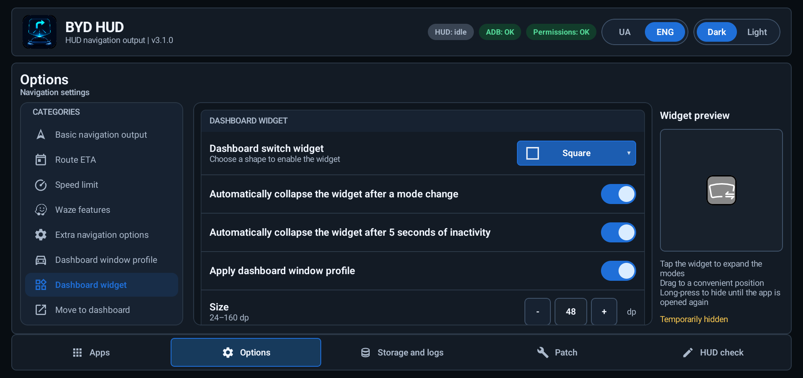
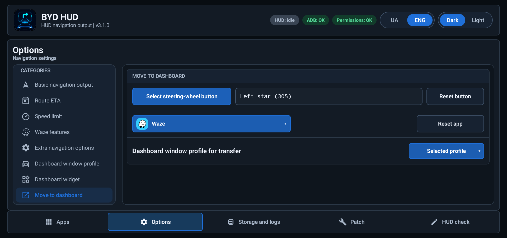
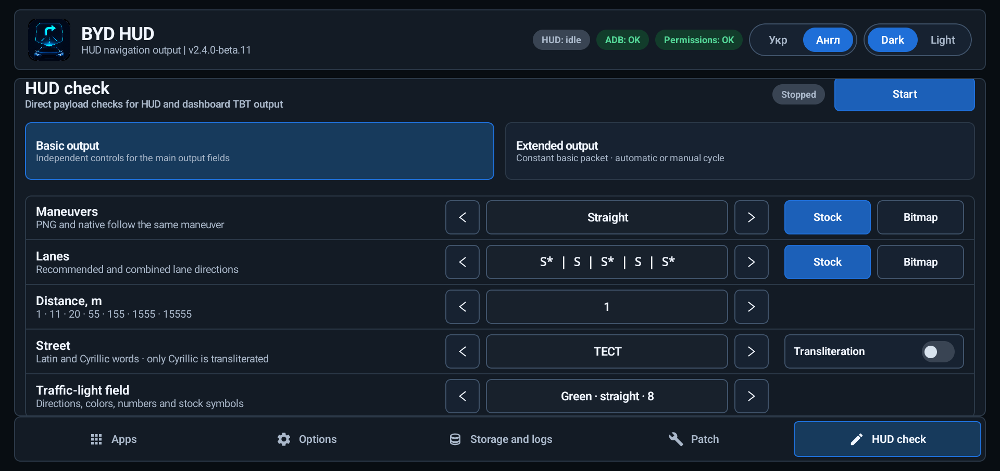
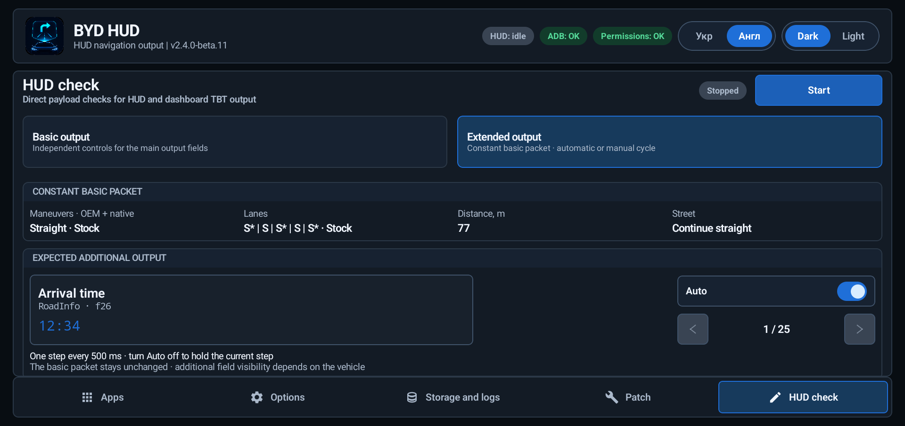

# BYD HUD

**English** | [Українська](README.uk.md)


BYD HUD connects an active Google Maps or Waze route to the navigation fields already available in compatible Chinese-market BYD vehicles. The map stays in the navigator; maneuver, distance, street, lanes, alerts, and optional trip metrics are sent separately to the HUD.

The app also controls navigator projection on the instrument cluster, keeps diagnostic logs by day, downloads verified navigator builds, and can locally patch compatible navigators to work with BYD HUD.

- **Version:** v3.2.3
- **Interface languages:** Ukrainian, English and Russian; update notes follow the selected language, with English as the fallback for missing translations.
- **Supported navigators:** Google Maps and Waze
- **Tested platform:** Android 12 / DiLink 5.0
- **Get started:** [download the latest release](https://github.com/sunlixWhyNotAvailable/byd-hud/releases/latest) and follow [Installation](#installation)
- **Need help:** read [Troubleshooting](#troubleshooting), then [report a problem](#report-a-problem) with the relevant day archive

> **AI disclosure:** Generative AI tools are used in this project for code and diagnostic-log analysis, implementation, testing, and documentation.

BYD HUD is not an Android Auto replacement. Google Maps and Waze remain responsible for route search and selection; the optional Waze custom route screen applies only after navigation starts.

## What BYD HUD does

BYD HUD takes active route guidance from a supported navigator and sends the useful parts to the vehicle:

- current maneuver and native turn arrow;
- distance to the maneuver;
- street name or text direction;
- recommended lanes when the source provides them;
- Waze alerts when the active Waze session provides them;
- optional ETA, remaining time, and remaining distance;
- optional projection of the navigator to the instrument cluster.

Google Maps and Waze remain responsible for the map and route. BYD HUD only coordinates the navigation data, HUD output, dashboard projection, diagnostics, and optional local navigator patching.

## Features

| Area | What it provides |
| --- | --- |
| Navigation output | Maneuver image, native arrow, distance, street or cue, lanes, and optional route metrics |
| Direct channels | Navigation guidance received directly from a compatible patched Google Maps or Waze build |
| Dashboard control | Move a running navigator between displays, choose its screen mode, and tune the projection window |
| Dashboard widget | A movable shortcut for IPC OFF, TBT, MINI and FULL, with optional saved window profiles |
| Navigator downloads | Download and validate the fixed navigator assets currently offered in the `Apps` tab |
| Navigator patcher | Inspect and locally patch compatible Google Maps or Waze packages for direct-channel support |
| Storage and logs | Record diagnostics and performance data, manage logs by day, and share only the selected data |
| Updates | Stable releases by default, with an optional beta channel |
| HUD check | Test stock and bitmap navigation output, text, distances, traffic lights and additional vehicle display fields without a navigator |

While BYD HUD is running, switching tabs or returning from another app restores the selected tab and its scroll position. Each Options category keeps its own position too. Exit, Shutdown, or a full app restart starts a fresh UI session.

<p align="center"></p>

## Navigation channels

BYD HUD receives navigation guidance directly from a compatible navigator. Accessibility and notification access do not substitute for a compatible navigator build.

| Navigator | Direct-channel data | Main limitations |
| --- | --- | --- |
| Google Maps ReVanced | Maneuvers, distance, street, lanes when supplied, ETA, remaining time, and remaining distance | Requires a compatible patched ReVanced package |
| Waze | Maneuvers, distance, street, lanes, alerts, and route metrics | Requires a compatible project-patched build for complete output |

By default, the navigator screen stays unchanged while guidance is sent to BYD HUD in the background. With `Start with custom surface` enabled, Waze still handles search and route selection on its normal screen, then opens a separate route screen after navigation starts. If that screen cannot open, normal HUD guidance continues. Google Maps always keeps its normal screen.

### Current navigator compatibility

| Navigator use | Package | Currently supported build |
| --- | --- | --- |
| Waze direct output and patching | `com.waze` | stock `4.95.0.3` or project-patched `5.20.0.1` |
| Google Maps direct output and fixed download | `app.revanced.android.apps.maps` | Google Maps ReVanced `26.30.09.950492155` |

The patcher verifies that the selected package is intact and structurally compatible. A project or repository signer is not required, and a matching version label alone is not sufficient.

### Direct-channel switching

- Guidance appears when the compatible navigator starts supplying route data.
- If updates stop, outdated guidance is cleared until fresh data is available.
- The `HUD` status is active only while navigation guidance is actually being sent. Selecting a navigator without starting navigation leaves it in the idle state.

## Using the Apps tab

The `Apps` tab is the normal starting screen after initial setup.

The notice at the top groups supported builds into compact navigator sections, with a separate bordered row for each version. Each `Download` action retrieves the offered build from the project release, shows progress, and checks the completed file's integrity and compatibility. A failed operation shows `Error`, which opens its reason, and `Retry` in the same row. Waiting for connectivity keeps the download active. `Install` opens the Android installer. `Installed` stays active: it can reinstall a retained APK, or download it first for installation on the next press. After removing the navigator, the action becomes `Install` if its validated APK remains, otherwise `Download`. A compatible installation is updated normally; uninstall is requested only after explicit confirmation when Android cannot safely update the installed app.

1. Find Google Maps or Waze under `Supported navigation apps`.
2. Enable `HUD` before or after launching the navigator.
3. Start a route in the navigator.
4. Use `Send to dashboard` or `Send to main` only while the app is running.
5. Enable `Log` only when you need extended logs for a specific app session. Basic daily event and navigation logs are recorded independently.

The same tab also lists other applications that can be moved between displays, but navigation parsing and HUD output are limited to supported navigators.

### Status pills

| Status | Meaning |
| --- | --- |
| `HUD: running` | Navigation guidance is currently reaching the vehicle HUD |
| `HUD: idle` | No navigation guidance is currently being delivered to the vehicle HUD |
| `HUD: failed` | An attempted required HUD delivery failed; ADB and permission states remain separate |
| `ADB: OK` | Required app settings and permissions are present; this is not a live ADB connection indicator |
| `ADB: not granted` | One or more required app settings or permissions are missing |
| `Permissions: OK` | Required app permissions and services are ready |
| `Permissions: missing` | One or more app permissions or services must be restored |

## Navigation output options

The `Options` tab controls what BYD HUD sends. Changing a switch affects the next outgoing HUD state; it does not change the map inside the navigator.

Use the rounded `?` beside Basic, ETA, speed-limit and Waze controls to open a schematic Preview. Its controls change only the illustration, not your saved settings or the HUD. Samples follow the application's language, street format and selected colors. Experimental ETA/Waze locations use separate HUD regions. Some screenshots below show an earlier interface layout.

The 82 help illustrations use compressed WebP (quality 60) at their original 2172×724 resolution to reduce the APK size. Their positions and language variants are preserved; this compression does not affect navigation images sent to the HUD.

### Basic navigation output

| Setting | Default | When enabled | When disabled |
| --- | --- | --- | --- |
| `PNG output` | On | Shows the rendered maneuver or alert image | Hides the rendered image field |
| `Native output` | On | Shows the vehicle's native turn arrow | Hides the native arrow field |
| `Lane output` | On | Shows recommended lanes when available | Hides lane guidance |
| `Distance output` | On | Shows distance to the current maneuver | Sends zero; affected native HUDs show `现在` instead of an empty field |
| `Small distance clamp` | Off | Replaces positive distances below 11 m with 11 m | Keeps the original distance; this control is inactive while Distance output is off, without clearing its saved value |
| `Street output` | On | Shows the current road or street text | Hides street text |
| `Text transliteration` | Off | Optionally converts Ukrainian or other writing systems to Latin characters for vehicle displays that cannot show them correctly | Sends the navigator text unchanged |
| `Text direction output` | On | Uses a cue such as `Continue straight` when no street text is available | Does not substitute a cue for a missing street name |

The street name takes priority over a text direction. If neither is available, the previous text is cleared.

Transliteration offers `Ukrainian` for Ukrainian road names and `Universal` for other writing systems. It changes only the text sent to the vehicle, not the text inside the navigator.

<p align="center"></p>

### Route metrics

| Setting | Default | Behavior |
| --- | --- | --- |
| `ETA output mode (time/distance)` | Off | Selects `Off`, `Next stop`, or `Entire route`; Waze uses the final destination for the entire route and falls back per field to an available next-stop value |
| `ETA output field` | Street | Uses the street field or a separate Experimental block on the right of the HUD |
| `ETA format in street field` | Prepend | Prepend adds a bracketed block before the street; Replace shows only the selected metrics |
| `Wait for the full street text to display` | On | Keeps overflowing street-field ETA text unchanged for its estimated first pass; applies only the latest pending ETA update, while a street change takes effect immediately |
| `Show ETA` | Off | Shows the expected arrival time in the selected output field |
| `Show remaining time` | Off | Shows remaining travel time in the selected output field |
| `Show remaining distance` | Off | Shows remaining route distance in the selected output field |
| Metric text colors | White | Independent arrival, remaining-time and remaining-distance colors for Experimental output |

The three value switches are disabled while the mode is `Off`, but their saved values are preserved. Format, wait and color settings remain visible when unavailable: format and wait require Street output and an active ETA mode; wait supports both Prepend and Replace. Each color requires Experimental output and its enabled metric.

Full-text waiting affects only the native SOME/IP street field. Short text updates immediately; maneuver, distance, lanes and separate bitmap regions remain live while long ETA text finishes its first pass. Changing the underlying street bypasses waiting even in Replace mode, where the street is hidden. Turning waiting off releases the latest text. The interval is an approximate Sea Lion 07 calibration, not feedback from the display or a timing guarantee on other firmware. Instrument/AMap and Experimental ETA output are unchanged. See the [implementation and verification record](docs/eta-first-pass-wait.md).

Prepend adds enabled, available metrics before the street or cue:

```text
[18:45 | 25 min | 8.4 km] Main Street
```

Replace shows `18:45 | 25 min | 8.4 km` without the street or brackets. Unavailable values are omitted, not replaced with zeroes. Experimental output leaves the street unchanged and shows the metrics separately. Its layout has been calibrated on Sea Lion 07 EV; live output on other vehicles still needs validation, with no automatic fallback to the street field.

Available metrics depend on the navigator's current estimate. For both Google Maps and Waze, BYD HUD keeps supplied arrival and remaining time unchanged. If only one is available, it calculates the other at minute precision; if neither is available, both stay hidden. A hidden arrival-time setting can still provide the input for visible remaining time. This applies to both street formats and Experimental output, without changing the navigator's own data.

Missing values are completed separately for each destination. On a multi-stop route, `Entire route` uses the final destination; if an individual whole-route value is unavailable, BYD HUD uses the corresponding available next-stop value. The existing first-pass text waiting still applies to ETA-only changes in the street field.

<p align="center"></p>

### Speed limit

| Setting | Default | Behavior |
| --- | --- | --- |
| `Speed limit output mode` | Off | Selects `Off`, `In maneuver field`, `In lane field`, `In a free field`, or `Composite` |
| `Overlay in "In a free field" mode` | Off | When both fields are occupied, optionally allows a timed replacement of the maneuver or lane field |
| `Display time when overlapping` | 5 seconds | Sets the temporary replacement time from 1 to 10 seconds for non-composite output over an occupied field |
| `Composite output field` | Maneuver only | Selects `Maneuver only`, `Lanes only`, `Free or maneuver`, or `Free or lanes` |
| `Sign size in maneuver field` | 64 px | Sets the composite sign size in the maneuver image from 1 to 103 px |
| `Sign size in lane field` | 36 px | Sets the composite sign size in the lane image from 1 to 36 px |

An alert in shared-field mode occupies the maneuver field with the same priority as a route maneuver. A standalone sign in a genuinely free field remains visible until the direct source changes or clears it; the timer applies only when non-composite output replaces an occupied maneuver, alert, or lane field. Composite mode draws the sign into the selected maneuver or lane image without discarding its existing guidance and does not use the replacement timer. This feature requires a current compatible project-patched Google Maps or Waze build.

<p align="center"></p>

### Additional navigation behavior

| Setting | Default | Behavior |
| --- | --- | --- |
| `Create a TBT card even for an active navigator session without HUD output` | On | Publishes direct guidance to the dashboard TBT card independently of windshield-HUD selection; the HUD-selected navigator has priority, otherwise the most recently started route is used |
| `Switch to the TBT card when HUD output starts` | On | Attempts to show the dashboard TBT card when HUD output starts; if the card cannot be shown, navigation output continues |

<p align="center"></p>

### Waze functions

| Setting | Default | Behavior |
| --- | --- | --- |
| `Show Waze alerts` | On | Enables available Waze warnings on the HUD |
| `Waze alert output field` | Maneuver | Maneuver shows the closer known maneuver or warning; a warning uses its own image, distance and text, keeps lanes and hides the native arrow. Experimental shows warning icon and distance separately, without replacing route guidance |
| Warning distance color | Yellow | Sets the distance text color for enabled Experimental warnings; remains visible but disabled in other modes |
| `Start with custom surface` | Off | Opens a separate route screen when a Waze route starts; Back returns to the normal Waze screen for the rest of that route |

<p align="center"></p>

Set the custom-surface option before starting a route; changing it during navigation does not replace the current route screen. If the screen fails to open, normal HUD guidance continues and it can be tried again on the next route. Returning to Waze after switching to another app restores the route screen; ending the route closes it. The Waze alert switch controls windshield-HUD alerts only, not warnings on the route screen.

You can start a Waze route before opening BYD HUD and enable `HUD` before or after starting navigation, including while Waze is on the dashboard.

## Dashboard projection

`Send to dashboard` moves a running application to the instrument cluster. `Send to main` returns it to the center display.

After returning an application, BYD HUD keeps the projection ready for reuse and draws black inside its virtual display to replace the application's remaining image. The black window is removed before the next transfer, which reuses valid projection resources and confirms the application's visible placement. A brief earlier frame may appear before the application redraws. Full BYD HUD shutdown releases the retained projection.

Full and Partial each offer a `Screen format method`: Native uses the stock layout command; Alternative uses AutoContainer. Full defaults to Native and Partial to Alternative. Prefer Native; select Alternative if Native does not work on your vehicle. Native needs no layout cleanup after `Send to main`, leaving the black projection area. Alternative releases its AutoContainer connection when the app returns or leaves that method. Return does not automatically select TBT. The existing automatic TBT option still applies when navigation starts, including from Full; the widget's TBT and IPC OFF buttons explicitly change the layout.

Find the screen mode and geometry controls under `Options → Dashboard window profile`.

| Setting | Default | Behavior |
| --- | --- | --- |
| `Dashboard screen mode` | Full | Selects `None`, `Partial`, or `Full` presentation after the navigator reaches the dashboard |
| `Screen format method` | Full Native; Partial Alternative | Saves an independent choice for each mode; applies on the next transfer or MINI/FULL action |
| `Width` | Full 100%; Partial 30% | Changes the projected window width live from 20% to 100% |
| `Height` | Full 75%; Partial 75% | Changes the projected window height live from 20% to 100% |
| `Horizontal offset` | Full 50%; Partial 99% | Positions the window in the remaining horizontal space: 0% left, 50% centered, 100% right |
| `Scale` | Full 100%; Partial 50% | Changes the navigator content scale inside the window from 20% to 150% |

The navigator must already be running and dashboard control requires authorized ADB access. `None` only moves the navigator and leaves the current cluster layout unchanged; its method and geometry controls are hidden. `Partial` and `Full` keep independent width, height, offset, and scale values, so tuning one mode does not change the other. Releasing a slider applies it immediately only when the matching mode is active; otherwise the value is saved for the next move. Choosing a mode or method alone does not switch the dashboard. The widget always uses the chosen method for MINI/FULL; `Apply dashboard window profile` controls geometry only. Return releases the method actually used, even if the saved choice has since changed. If changing the presentation fails, the navigator stays on the dashboard and a message explains the failure; no automatic method fallback is performed. Use `Send to main` to return it. During a Waze custom-surface route, the route screen follows Waze between displays.

<p align="center"></p>

<!-- Photo slot: docs/screenshots/en/dashboard.jpg
Use a landscape photo showing the real instrument cluster. Place it here.
Suggested markup:
<p align="center"></p>
-->

> Use dashboard controls only while parked. Some stock cluster layouts add dark top and bottom overlays; BYD HUD can resize the window but cannot remove firmware-owned overlays.

### Dashboard widget

Open `Options → Dashboard widget` and choose Square or Circle to enable the floating widget. Allow `Display over other apps` when prompted. The widget remains available over other applications and its own settings page; the fixed sample shows its appearance while you edit it.

Tap to expand the four mode pictures: IPC OFF, TBT, MINI and FULL. Tap the cross to collapse, drag to reposition, or long-press to hide it temporarily. Opening BYD HUD brings an enabled widget back, collapsed. Off disables the widget without changing the dashboard mode. When there is not enough space at a screen edge, the menu opens toward available space while the anchor stays in place.

| Setting | Default | Choices |
| --- | --- | --- |
| Widget shape | Off | Off, Square, Circle |
| Size | 32 dp | 24–160 dp, step 1 |
| Widget opening direction | Down | Up, Right, Down, Left |
| Automatically collapse after a mode change | On | Turn off to keep the menu open |
| Automatically collapse after inactivity | On | Collapses an expanded widget after five seconds without interaction |
| Apply dashboard window profile | On | MINI/FULL apply the matching saved profile to an existing BYD HUD projection |
| Corner rounding | 0 dp | Square only; 0 to half of the selected widget size |
| Transparency | 0% | 0% visible, 100% invisible |
| Color | Blue `#2F86F6` | Presets or synchronized HEX/RGB entry |
| Border size and color | 2 dp, black `#000000` | 0–16 dp; 0 removes the border; presets or synchronized HEX/RGB entry |

Mode buttons require authorized ADB. They request a presentation change without moving, launching or returning a navigator. With profile application off, or without an existing BYD HUD projection, only a mode change is requested. Widget profile selection does not change the screen mode saved for the next `Send to dashboard` action. The buttons are shortcuts, not indicators of the currently active mode.

Appearance and position survive restarts. Automatic startup follows `Boot runtime service`; a temporarily hidden widget stays hidden until BYD HUD is opened. `Shutdown` also removes the widget until the app is opened again. Hiding it removes its touch area rather than leaving an invisible overlay.

<p align="center"></p>

### Steering-wheel transfer shortcut

Open `Options → Dashboard transfer settings` and press `+ Create profile`. Learn a button, choose `Single`, `Hold` or `Double`, select an installed application and choose `Current profile`, `Partial only` or `Full only`. `Current profile` uses the dashboard mode saved at the time you use the shortcut. Save is available after choosing a button and app, provided another profile does not already use the same button and press type.

Press Save to keep your changes or Cancel to discard them. The pencil edits a saved profile; Delete asks for confirmation. Profiles survive restarts, and existing shortcuts are preserved when updating the app.

The selected application must already be running and dashboard transfer requires authorized ADB. Each new press checks its current window and display: an application on the main display moves to the dashboard with the selected profile; one on the dashboard or another display returns to the main display. The Apps tab offers the same return action when the navigator has been moved to another display. If no running window can be confirmed, nothing is moved or launched. Repeated presses during a transfer are ignored, not queued. A failed transfer is reported with a message.

Button learning and interception require the enabled Accessibility service. BYD HUD consumes an assigned button's delivered press/release events even if the gesture has no matching profile, the selected app is closed, or a transfer cannot be performed. Unmatched clicks are not forwarded to ordinary applications. This cannot cancel an action already handled by vehicle firmware or another Accessibility service. Delete all profiles for that button to stop BYD HUD consuming it. Splitting gestures of one button across independent key-mapping apps is not coordinated: a Double action here can also cause two Single actions in another app.

Single acts after you release the button and the double-press interval expires, even when only Single is assigned. Double acts after the second short press. For the star, microphone and previous/next track buttons, a delivered known stock long-press signal triggers Hold immediately. Otherwise Hold uses the system's long-press interval measured from the initial ordinary press; panorama and wheel buttons use this timer too. When both forms arrive for one press, only one Hold action runs. Recognition happens before profile selection: an unmatched Double does not become two Singles, and Hold does not trigger Single on release. Firmware must deliver a usable signal to Accessibility; this change does not bypass firmware suppression of track-button signals. Supported buttons and gestures still need testing on a vehicle.

<p align="center"></p>

## Navigator patcher

The `Patch` tab is optional. It can add a BYD HUD direct channel to a supported compatible Waze or Google Maps ReVanced package without uploading the APK anywhere.

<p align="center"></p>

### Supported input

- an installed `com.waze` or `app.revanced.android.apps.maps` package;
- a downloaded `.apk` file;
- compatible `.apkm` or `.apks` split-package archives;
- an APK-only `.xapk` archive.

Official Google Maps package `com.google.android.apps.maps`, bundles with OBB expansion data, and unsupported package layouts are rejected. The currently recognized patch inputs are Waze `4.95.0.3` / `5.20.0.1` and Google Maps ReVanced `25.16.03.747108139` / `26.30.09.950492155`.

### How patching works

1. Select the installed navigator or optionally choose a downloaded version.
2. Press `Check` to verify that the package is intact and its files and app layout match a supported build.
3. Review the component status pills. Waze reports the direct channel, lanes, stability, and alerts separately. Google Maps reports the direct channel, Google services dialog handling, audio, and PiP separately.
4. Press `Patch` and confirm the warning.
5. BYD HUD repeats all compatibility checks, changes only recognized app parts, signs the complete package set with a key generated on this tablet, and asks Android to install it.

For Waze, the direct channel and lanes are mandatory; stability and alert support remain optional. Google Maps Direct, Google services dialog handling, Audio, and PiP can be selected separately. PiP disables navigation picture-in-picture without disabling dashboard resizing. Waze alert support is currently limited to the compatible Waze 5.20.0.1 build.

`Check` and `Patch` use persistent progress cards that stay visible while you switch tabs. Waze and Google Maps can be checked or prepared at the same time, while Android installation remains one-at-a-time. Patch cards stack with archive/share progress instead of covering one another. `Stop` is available only while the current operation can still be cancelled safely; use `Close` to dismiss a finished, cancelled, or failed card.

### Signing and app data

- A persistent signing key is created locally inside BYD HUD.
- A later compatible patch signed by the same key can normally update in place.
- An incompatible existing signer can require uninstalling the navigator first, which removes that navigator's local data.
- Clearing BYD HUD data or uninstalling BYD HUD also removes its local signing key.
- Compatibility is determined from the selected app itself, not from where the file was downloaded. Android still enforces signature continuity when updating an installed app.
- A compatible patched APK may be shared, but Android can require uninstall/reinstall when its signer differs from the installed copy.

Back up important navigator data and sign in to its account before patching. The patcher never sends selected APKs to a server. The separate download actions on the `Apps` tab retrieve only the fixed, pinned navigator assets currently offered there; patching a user-selected source still operates locally.

## Runtime and maintenance options

| Setting | Default | Purpose |
| --- | --- | --- |
| `Boot runtime service` | On | Starts BYD HUD automatically after supported tablet restarts and app updates |
| `Save diagnostic screenshots and extended logs` | Off | Records additional navigation evidence; use it only while diagnosing because it consumes more storage |
| `Check for updates` | On | Checks the stable GitHub release channel |
| `New version hint widget` | On | Shows a ten-second update hint while BYD HUD is in the background; the gear configures its appearance |
| `Take part in beta-testing` | Off | Includes prereleases, which may be unstable or broken |

`ADB permissions` runs the permission setup when needed. `Background apps` opens the BYD system page where BYD HUD should be excluded from background blocking. `Shutdown` stops HUD output and background operation.

Turning off `Boot runtime service` disables automatic startup, not navigation you have started yourself. You can open BYD HUD and use navigation output or HUD check with this option off.

With automatic update checks enabled, BYD HUD checks shortly after startup, including an allowed background startup. An available update uses the normal offer while BYD HUD is visible, or a ten-second hint while it is in the background. Tap the hint to open Options and the known update offer; the red cross closes it. Dismissing the offer or leaving the app does not replay a cached hint. A later scheduled check may offer the same newer version again. You can also check manually whenever needed, including after a failed check.

The hint's gear opens an appearance editor with a full-size sample: transparency, corner rounding, border width/color and size. Settings persist; defaults are 0% transparency, 18 dp corners, a 1 dp blue border and 100% size. With compatible versions of BYD Extend and BYD Collector, hints share the top-left area in arrival order. They use additional columns and temporarily shrink if necessary, then reclaim space when a hint closes. Moving or resizing never renews their ten-second lifetimes. Older independent hints cannot participate until those apps are updated. Without overlay permission, the ordinary in-app update offer remains available.

<p align="center"></p>

## Storage, logs, and privacy

BYD HUD stores navigation evidence in day folders so one trip can be shared without exposing unrelated days.

### Storage and logs tab

- shows the storage-limit draft immediately while the slider moves and applies it only after `OK`;
- groups navigation logs, snapshots, screenshots, and optional logcat by day;
- shows the available navigation-log folder locations;
- shares or deletes only the selected days;
- shows file count, archive size, and a sensitive-data warning before creating a ZIP;
- uses one stateful `Start Logcat` / `Stop Logcat` button for explicit system-log recording;
- provides `Export configuration` for a diagnostic archive containing available HUD/dashboard settings, display placement, permission and service details, navigation-output state, firmware, audio and system-condition information.

`Share logs` and sorting stay at the top of `Logs`; its inset day cards scroll independently so the footer remains reachable. The footer contains `Start Logcat` / `Stop Logcat`, `Export configuration`, and `Delete selected`. Available folder paths are shown in `Navigation logs folder` below. Configuration export does not require selected days.

Export reads available diagnostics without changing vehicle modes or repairing permissions. It includes complete relevant navigation/cluster APKs and splits, including CarSettingsPlugins, BYD transport implementations, framework code and selected configuration. Generic platform libraries and unrelated camera, ADAS, account and settings packages are retained as metadata rather than copied wholesale. An already authorized ADB connection provides wider access; without it, readable local files and the basic report remain available.

The transparent corner card shows the phase, elapsed time and current path; file counts appear only in `Details`. The file inventory and failure reasons are in `manifest.json`. Preparation can be cancelled or left running while switching tabs. The exporter checks source sizes and identity while copying, writes a ZIP once, and does not calculate payload SHA-256 hashes or reread the whole archive.

Large ZIPs are split into volumes of at most 1 GB (1,000,000,000 bytes). `Share` directly opens Android sharing, with one attachment for one file or a batch for multiple volumes. Configuration exports never use Sentry. Completed exports expire 15 minutes after creation finishes; the full deadline is persisted and shown in the card and Details. Share, retry and Close do not extend it. Close hides the card, so a new export is needed to share again. Cleanup runs independently of HUD, catches up after restart, and includes old owned archives. If Android suspends the app or the car is off, overdue deletion happens at the next allowed execution. A recipient that has not opened a queued volume before expiry may be unable to read it.

Text diagnostics and configuration values are redacted and network addresses masked. Firmware binaries are copied unchanged and may contain vendor-embedded data. Unrelated apps and private app data are not collected. Review the warning and share only with a trusted recipient; nothing is uploaded without your choice.

<p align="center"></p>

Each configuration export and selected-day log share keeps its own progress card through preparation, sending and the result. Cards stack with Waze and Google Maps patch cards instead of overlapping them. During sending, `Close` hides that card without cancelling the upload; progress does not reopen it, and the outcome is retained in diagnostics. Preparation supports cancellation. Another Sentry package can be prepared after the 30-second cooldown even while an earlier upload continues; each keeps its own result. Archive preparation remains one operation at a time.

`Share logs` offers two explicit destinations:

- `Another app` opens the normal Android share chooser;
- `Send to developer` opens an optional comment field; `OK` starts a single upload of the selected ZIP to Sentry.

A blank comment is omitted. A supplied comment accompanies the report, and its short form appears in the report title alongside the app version. Without a comment, the title uses the version and submission date/time. The generated title is available in the progress card's `Details`. Back from the comment dialog returns to the destination choice without uploading.

BYD HUD sends ZIPs smaller than 39 MB (39,000,000 bytes) through Sentry. BYD HUD checks the completed ZIP, without rejecting a selection based on its uncompressed source size. At or above the limit, choose `Another app` to share that same ready archive, or `Cancel` to delete it immediately and retain the selected days. The 30-second cooldown begins when `OK` admits preparation; it does not limit upload duration.

<p align="center"></p>

After the Android share chooser opens successfully or `Send to developer` finishes successfully, BYD HUD clears the submitted day selection only if the user has not changed or resubmitted it since that operation started. Failure or cancellation keeps the selection. An older upload never clears a newer selection.

With authorized ADB, Logcat records the full system log and additional performance diagnostics. Without ADB, it records only the logs and diagnostics available to the app. Configuration export does not request ADB access, repair permissions, or enable automatic reporting.

Logcat reads a continuous stream into one file until you stop it, rather than repeatedly reading overlapping snapshots. Full-system capture keeps all log buffers and before/after system metrics. If ADB disconnects, the result identifies the reduced app-visible fallback and any known interruption or loss. There is no separate recording-size limit, so long recordings use more storage; the normal log-folder retention settings still apply.

BYD HUD does not automatically send crash reports, performance traces, screenshots, screen recordings, or navigation logs to the Sentry service. Read the complete policy in [PRIVACY.md](PRIVACY.md).

## HUD check

The `HUD check` tab tests the vehicle's supported navigation displays without an active route in Google Maps or Waze. Choose an output mode and press `Start`; use it while parked, not as a navigation source.

- `Basic output` has independent previous/next controls for maneuvers, lanes, distances, street names and traffic-light samples. Maneuver and lane controls each offer `Stock` or `Bitmap`: Stock asks the vehicle to draw its own symbols, while Bitmap sends an image rendered by BYD HUD. The native maneuver arrow always uses the vehicle's symbols. Distances cycle through `1 / 11 / 20 / 55 / 155 / 1555 / 15555` metres. Street samples include Latin and Cyrillic words; the local transliteration switch converts Cyrillic to Latin without changing the selected word or normal navigation settings.
- `Extended output` keeps a stock straight-ahead maneuver, stock lanes, `77 m` and `Continue straight` on screen while cycling through additional fields such as ETA, speed limits, maps, cameras and traffic lights. `Auto` changes the selected example every 500 ms; turning it off holds the current example and enables previous/next controls. The panel shows the expected content. Not every vehicle supports every field, and a successful send is not proof that the vehicle displayed it.

`Stop`, leaving the tab, putting BYD HUD in the background or switching between Basic and Extended ends the test and clears its output. Any still-active eligible navigation resumes. Starting again retains the selected example. Test choices do not alter the settings used by Waze or Google Maps. Authorized ADB enables the additional vehicle interface required for stock lanes and some other fields on supported cars; unavailable outputs do not prevent the others from being tested. The TBT card uses its own maneuver and text layout, not a copy of the HUD lane or bitmap image.

### Basic output

<p align="center"></p>

### Extended output

<p align="center"></p>

## Installation

### Requirements

- Android 10 or newer;
- a compatible Chinese-market BYD vehicle and DiLink system;
- permission to install APK files on the tablet;
- the `Navigation fusion` option enabled in the vehicle HUD settings for native maneuver arrows;
- BYD HUD excluded from BYD background-app blocking.

### First setup

1. Download the current APK from [GitHub Releases](https://github.com/sunlixWhyNotAvailable/byd-hud/releases/latest).
2. Install it on the vehicle tablet and open BYD HUD.
3. On the first launch, review the `Options` tab and grant the required base permissions.
4. Optionally authorize the ADB RSA prompt for dashboard control, public log storage, automatic permission repair, and richer diagnostics.
5. Open BYD system settings and set `Disable background Apps -> BYD HUD` to `Off`.
6. Return to `Apps`, enable `HUD` for Google Maps or Waze, and start navigation.
7. For a compatible navigator, the direct channel starts automatically when the navigator supplies an active route.

With authorized ADB access, the dashboard navigation card works with BYD HUD without additional setup. Without authorized ADB, compatible navigation can still reach the windshield HUD, but the dashboard navigation card and dashboard movement controls are unavailable on the tested firmware.

When `Lane output` is enabled and the navigator supplies lanes, BYD HUD publishes the guidance through all supported vehicle navigation outputs. Authorized ADB enables the additional vehicle lane interface needed by some vehicles; it does not turn the TBT maneuver card into a copy of the HUD lane image. Empty or ended guidance clears the previous lanes instead of leaving stale information on screen.

### What requires ADB

| Function | Without ADB | With authorized ADB |
| --- | --- | --- |
| Compatible direct navigator -> windshield HUD | Works | Works |
| Dashboard navigation card | Unavailable on tested firmware | Available automatically |
| App UI and navigation options | Works | Works |
| Automatic permission repair | Limited | Available |
| Public day-based log storage | Limited by Android permissions | Available |
| Dashboard projection controls | Unavailable on tested firmware | Available |
| Extended configuration diagnostics | Basic report | Enriched report |
| Background recovery if Android closes the app | May require reopening the app | Background and automatic-startup settings can restore operation |

## Troubleshooting

### HUD stays in `idle`

- Confirm that `HUD` is enabled for the correct navigator.
- Start an active route; selecting a navigator alone does not produce HUD data.
- Check that the installed navigator build supports the direct channel.
- Confirm that `Navigation fusion` is enabled in the vehicle HUD settings if only the native arrow is missing.

### HUD shows `failed`

- Open `Options` and run `ADB permissions` if ADB is available.
- Check the `ADB` and `Permissions` status pills separately.
- Confirm that BYD HUD is allowed to run in the background.

### Output blinks or alternates

Another HUD application may be sending navigation data at the same time. Stop the other HUD application and test again.

## Report a problem

Open a [GitHub issue](https://github.com/sunlixWhyNotAvailable/byd-hud/issues) and include:

- BYD HUD version;
- vehicle model, model year, DiLink version, and tablet firmware;
- navigator name and version;
- what you expected and what appeared on the tablet and HUD;
- the approximate local time of the problem;
- the selected day archive, configuration archive, or Sentry report identifier when relevant.

For a navigation-output problem:

1. Reproduce it with `Save diagnostic screenshots and extended logs` enabled when possible.
2. Open `Storage and logs` and select only the affected day.
3. Press `Share logs` and choose your messenger or `Send to developer`.
4. Disable detailed diagnostics after the test to reduce storage use.

For a permission, device, patcher, or startup problem, use `Storage and logs -> Logs -> Export configuration` instead.

> Navigation archives may contain coordinates, searched destinations, street names, notification text, screenshots, and device identifiers. Review the warning before sharing and use only the minimum required day.

## Known limitations

- Other HUD applications sending navigation data at the same time can cause blinking or instability.
- The patcher supports Google Maps ReVanced package `app.revanced.android.apps.maps`, not official package `com.google.android.apps.maps`.
- Waze route metrics depend on destination estimates supplied by the supported project-patched Waze `5.20.0.1` session; an unavailable whole-route field falls back to the corresponding next-stop value.
- Waze alerts still depend on Waze supplying an alert and are available only with the compatible Waze `5.20.0.1` build.
- The optional Waze custom route screen is experimental and requires a compatible navigator build. It opens only after navigation starts; if it cannot open, normal HUD guidance continues.
- Stock cluster firmware may add dark overlays to dashboard projection.
- Unsupported multi-file packages and XAPK files with OBB data cannot be patched.
- Native arrows require `Navigation fusion` in the vehicle HUD settings.
- Some firmware may stop the app unless background operation and automatic startup are configured with ADB.

## Contributions and acknowledgements

Issues and focused pull requests are welcome. Please describe the vehicle, firmware, navigator version, and a reproducible user-visible problem before proposing navigator-specific parsing changes.

- MaxTitan shared the original Waze direct-channel concept and reference material for sending Waze guidance to BYD vehicles.
- The OpenBYD project inspired part of the vehicle-integration approach used for broader dashboard-card and HUD compatibility. BYD HUD's implementation and behavior were verified independently on SL06 and SL07.
- The dashboard resize approach was inspired by [BYD Mate](https://github.com/AndyShaman/BYDMate).
- Олексій (Oleksiy) provided diagnostics and logs and performed testing, verification, and functional validation of BYD HUD on the BYD Sea Lion 06 EV.

## Tested devices

| Vehicle | Market | DiLink | Status |
| --- | --- | --- | --- |
| BYD Sea Lion 07 EV 2025 | China | 5.0 | Tested by the maintainer |
| BYD Sea Lion 07 EV 2024 | China | 5.0 | Tested by a project user |
| BYD Sea Lion 06 EV | China | 5.0 | Tested by a project user |

HUD output is known to work on the tested tablet firmware starting from version `2510`. Other models, regions, firmware versions, resolutions, and instrument clusters may behave differently.

## License and disclaimer

BYD HUD is licensed under the [GNU Affero General Public License v3.0](LICENSE).

Dashboard mode pictures retain their original BYD artwork ownership; see [third-party notices](THIRD_PARTY_NOTICES.md) for provenance.

This project is independent and is not affiliated with, endorsed by, or sponsored by BYD, DiLink, Waze, Google, Google Maps, or ABRP. All product names and trademarks belong to their respective owners.

Use the software at your own risk. Modifying or replacing navigator packages can remove local app data or cause unexpected behavior. Follow local laws, keep your attention on the road, and configure or diagnose the system only while parked.
