# BYD HUD

**English** | [Українська](README.uk.md)

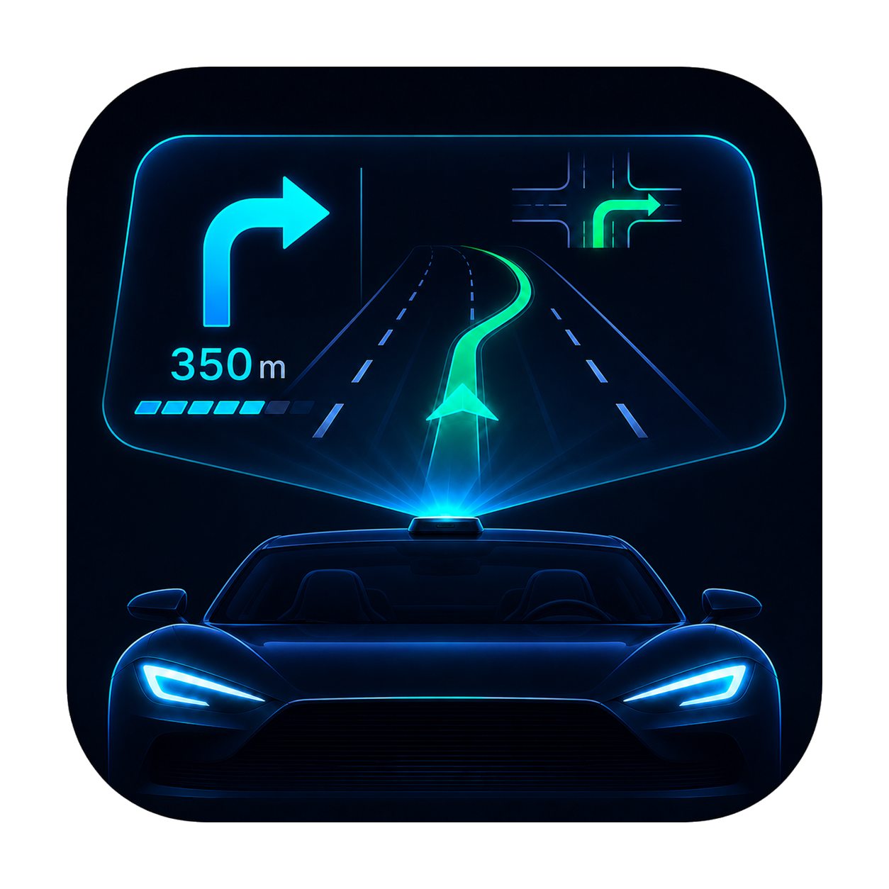

BYD HUD connects an active Google Maps or Waze route to the navigation fields already available in compatible Chinese-market BYD vehicles. The map stays in the navigator; maneuver, distance, street, lanes, alerts, and optional trip metrics are sent separately to the HUD.

The app also controls navigator projection on the instrument cluster, keeps day-based diagnostic logs, can download fixed verified navigator builds, and can locally prepare compatible navigator packages for a structured direct channel.

- **Supported navigators:** Google Maps and Waze
- **Tested platform:** Android 12 / DiLink 5.0
- **Get started:** [download the latest release](https://github.com/sunlixWhyNotAvailable/byd-hud/releases/latest) and follow [Installation](#installation)
- **Need help:** read [Troubleshooting](#troubleshooting), then [report a problem](#report-a-problem) with the relevant day archive

> **AI disclosure:** Generative AI tools are used in this project for code and diagnostic-log analysis, implementation, testing, and documentation.

BYD HUD is not an Android Auto replacement. Google Maps and Waze remain responsible for route search and selection; the optional Waze custom route screen applies only after navigation starts.

## What BYD HUD does

BYD HUD takes active route guidance from a supported navigator and sends the useful parts to the vehicle:

- current maneuver and native turn arrow;
- distance to the maneuver;
- street name or text direction;
- recommended lanes when the source provides them;
- Waze alerts when the active Waze session provides them;
- optional ETA, remaining time, and remaining distance;
- optional projection of the navigator to the instrument cluster.

Google Maps and Waze remain responsible for the map and route. BYD HUD only coordinates the navigation data, HUD output, dashboard projection, diagnostics, and optional local navigator patching.

## Features

| Area | What it provides |
| --- | --- |
| Navigation output | Maneuver image, native arrow, distance, street or cue, lanes, and optional route metrics |
| Direct channels | Structured low-latency data from a compatible patched Google Maps or Waze build |
| Dashboard control | Move a running navigator between displays, choose its screen mode, and tune the projection window |
| Navigator downloads | Download and validate the fixed navigator assets currently offered in the `Apps` tab |
| Navigator patcher | Inspect and locally patch compatible Google Maps or Waze packages for direct-channel support |
| Storage and logs | Record diagnostics and performance data, manage logs by day, and share only the selected data |
| Updates | Stable releases by default, with an optional beta channel |
| Manual testing | Send diagnostic navigation fields through the supported windshield-HUD and dashboard-card outputs |

<p align="center">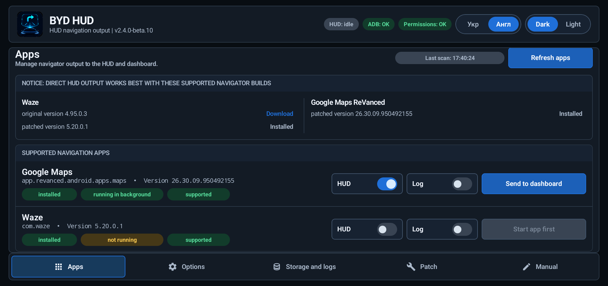</p>

## Navigation channels

BYD HUD uses a compatible direct channel for the selected navigator. Accessibility and notification access may still be used for diagnostics, but never supplies or controls HUD guidance.

| Navigator | Direct-channel data | Main limitations |
| --- | --- | --- |
| Google Maps ReVanced | Structured maneuver, distance, road, lanes when supplied, rendered maneuver image, ETA, remaining time, and remaining distance | Requires a compatible patched ReVanced package |
| Waze | Structured maneuver, distance, street, lanes, session alerts, and route metrics | Requires a compatible project-patched build for complete output |

By default, the direct channel leaves the navigator screen unchanged while navigation data is sent to BYD HUD in the background. With `Start with custom surface` enabled, Waze still handles search and route selection on its normal screen, then supplies the active route map and controls to a separate route screen after navigation starts. Normal Waze direct guidance remains available while that screen starts; if it is not ready within five seconds, BYD HUD keeps the guidance without ending the route. Google Maps always keeps its normal screen.

### Current navigator compatibility

| Navigator use | Package | Currently supported build |
| --- | --- | --- |
| Waze direct output and patching | `com.waze` | stock `4.95.0.3` or project-patched `5.20.0.1` |
| Google Maps direct output and fixed download | `app.revanced.android.apps.maps` | Google Maps ReVanced `26.30.09.950492155` |

The patcher verifies that the selected package is intact and structurally compatible. A project or repository signer is not required, and a matching version label alone is not sufficient.

### Direct-channel switching

- BYD HUD switches to a direct channel as soon as valid data arrives.
- If direct updates stop, stale guidance is cleared while the navigator-specific channel performs its own recovery.
- Accessibility, notifications, and screen content never replace or take ownership from the direct channel.
- The `HUD` status is active only while navigation guidance is actually being sent. Selecting a navigator without starting navigation leaves it in the idle state.

## Using the Apps tab

The `Apps` tab is the normal starting screen after initial setup.

The notice at the top lists the supported navigator builds. Each `Download` action retrieves one fixed asset from the project release, shows inline progress, verifies its SHA-256, package, version, version code, and signer, then offers the Android installer. An already compatible installation is updated normally; uninstall is requested only after explicit confirmation when Android cannot replace the installed signer or version safely.

1. Find Google Maps or Waze under `Supported navigation apps`.
2. Enable `HUD` before or after launching the navigator.
3. Start a route in the navigator.
4. Use `Send to dashboard` or `Send to main` only while the app is running.
5. Enable `Log` only when you need extended logs for a specific app session. Basic daily event and navigation logs are recorded independently.

The same tab also lists other applications that can be moved between displays, but navigation parsing and HUD output are limited to supported navigators.

### Status pills

| Status | Meaning |
| --- | --- |
| `HUD: running` | A navigation payload is currently reaching the vehicle HUD |
| `HUD: idle` | No navigation guidance is currently being delivered to the vehicle HUD |
| `HUD: failed` | An attempted required HUD delivery failed; ADB and permission states remain separate |
| `ADB: OK` | Required app settings and permissions are present; this is not a live ADB connection indicator |
| `ADB: not granted` | One or more required app settings or permissions are missing |
| `Permissions: OK` | Required app permissions and services are ready |
| `Permissions: missing` | One or more app permissions or services must be restored |

## Navigation output options

The `Options` tab controls what BYD HUD sends. Changing a switch affects the next outgoing HUD state; it does not change the map inside the navigator.

### Basic navigation output

| Setting | Default | When enabled | When disabled |
| --- | --- | --- | --- |
| `PNG output` | On | Shows the rendered maneuver or alert image | Hides the rendered image field |
| `Native output` | On | Shows the vehicle's native turn arrow | Hides the native arrow field |
| `Lane output` | On | Shows recommended lanes when available | Hides lane guidance |
| `Distance output` | On | Shows distance to the current maneuver | Hides maneuver distance |
| `Street output` | On | Shows the current road or street text | Hides street text |
| `Text transliteration` | Off | Optionally converts Ukrainian or other writing systems to Latin characters for vehicle displays that cannot show them correctly | Sends the navigator text unchanged |
| `Text direction output` | On | Uses a cue such as `Continue straight` when no street text is available | Does not substitute a cue for a missing street name |

Street text has priority over the text direction because both use the same vehicle field. If both are empty, BYD HUD sends a blank placeholder so text from the previous maneuver is not left on screen.

Transliteration offers `Ukrainian` for Ukrainian road names and `Universal` for other writing systems. It changes only the text sent to the vehicle, not the text inside the navigator.

<p align="center">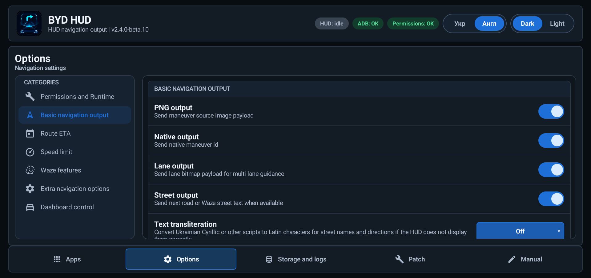</p>

### Route metrics

| Setting | Default | Behavior |
| --- | --- | --- |
| `ETA/time/distance output mode` | Off | Selects `Off`, `Next stop`, or `Entire route`; Waze uses the final destination for the entire route and falls back per field to an available next-stop value |
| `Show ETA` | Off | Adds the expected arrival time to the street field |
| `Show remaining time` | Off | Adds remaining travel time to the street field |
| `Show remaining distance` | Off | Adds remaining route distance to the street field |

The three value switches are disabled while the mode is `Off`, but their saved values are preserved.

Enabled metrics are added before the street or cue, for example:

```text
[ETA: 12:20 | 11 min | 5.1 km] Main Street
```

Google Maps direct supplies all three metrics. Project-patched Waze `5.20.0.1` supplies ETA, remaining time, and remaining distance for the next stop and the entire route. On a multi-stop route, `Entire route` uses the final destination; if an individual whole-route value is unavailable, BYD HUD uses the corresponding available next-stop value.

<p align="center">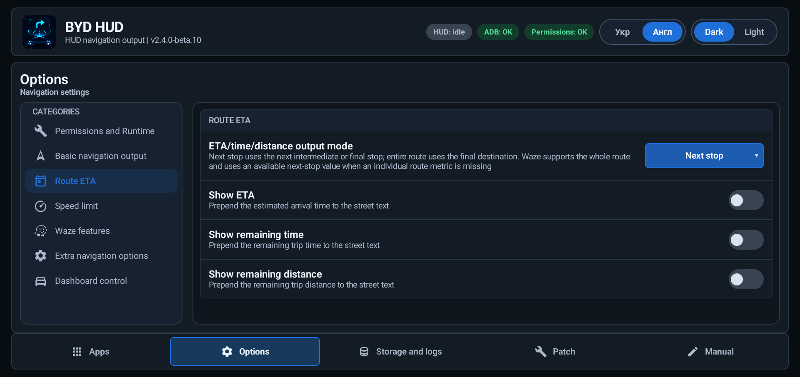</p>

### Speed limit

| Setting | Default | Behavior |
| --- | --- | --- |
| `Speed limit output mode` | Off | Selects `Off`, `In maneuver field`, `In lane field`, `In a free field`, or `Composite` |
| `Overlay in "In a free field" mode` | Off | When both fields are occupied, optionally allows a timed replacement of the maneuver or lane field |
| `Display time when overlapping` | 5 seconds | Sets the temporary replacement time from 1 to 10 seconds for non-composite output over an occupied field |
| `Composite output field` | Maneuver only | Selects `Maneuver only`, `Lanes only`, `Free or maneuver`, or `Free or lanes` |
| `Sign size in maneuver field` | 64 px | Sets the composite sign size in the maneuver image from 1 to 103 px |
| `Sign size in lane field` | 36 px | Sets the composite sign size in the lane image from 1 to 36 px |

An alert occupies the maneuver field with the same priority as a route maneuver. A standalone sign in a genuinely free field remains visible until the direct source changes or clears it; the timer applies only when non-composite output replaces an occupied maneuver, alert, or lane field. Composite mode draws the sign into the selected maneuver or lane image without discarding its existing guidance and does not use the replacement timer. This feature requires a current compatible project-patched Google Maps or Waze build.

<p align="center">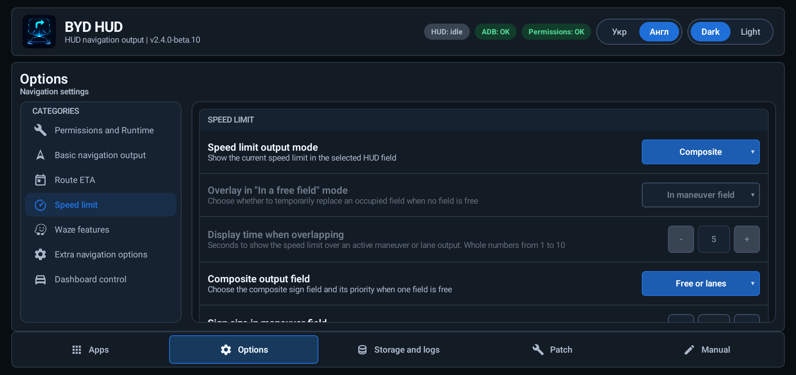</p>

### Additional navigation behavior

| Setting | Default | Behavior |
| --- | --- | --- |
| `Small distance clamp` | Off | Replaces positive distances below 11 m with 11 m to avoid invalid characters on affected HUD firmware |
| `Create a TBT card even for an active navigator session without HUD output` | On | Publishes direct guidance to the dashboard TBT card independently of windshield-HUD selection; the HUD-selected navigator has priority, otherwise the most recently started route is used |
| `Switch to the TBT card when HUD output starts` | On | Best-effort selects the dashboard TBT layout when direct HUD output starts; a layout-switch failure does not block TBT or windshield-HUD data |

<p align="center">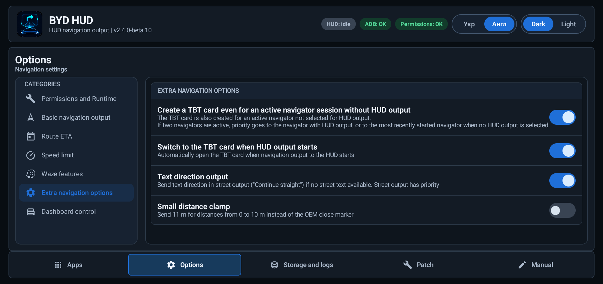</p>

### Waze functions

| Setting | Default | Behavior |
| --- | --- | --- |
| `Show Waze alerts` | On | Shows the closer known item when a route maneuver and Waze alert compete; an active alert uses its own image, distance, and text, keeps lane guidance, and hides the native route arrow |
| `Start with custom surface` | Off | Samples the setting when a Waze route starts, then opens Waze-rendered route content in a separate route screen; Back returns to the normal Waze screen for the rest of that route |

<p align="center">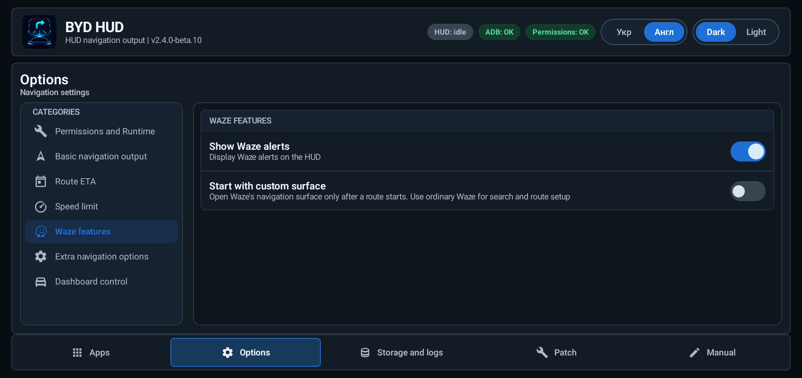</p>

The custom surface is route-scoped. Changing its switch during an active route does not replace the current route screen. A five-second readiness failure keeps standard Waze direct guidance active and waits for the next route before trying the surface again. Returning to Waze during the same route restores the surface; ending the route closes it. The Waze alert switch controls windshield-HUD alerts only; alerts supplied to the custom surface remain visible there.

Waze route recovery is independent from the `HUD` switch and dashboard placement. A route may start before BYD HUD opens or while windshield-HUD output is disabled, and a genuinely new route can start after the previous one ends. Delayed updates from the old route are ignored instead of reopening it.

## Dashboard projection

`Send to dashboard` moves a running application to the instrument cluster. `Send to main` returns it to the center display.

| Setting | Default | Behavior |
| --- | --- | --- |
| `Dashboard screen mode` | Full | Selects `None`, `Partial`, or `Full` presentation after the navigator reaches the dashboard |
| `Width` | Full 100%; Partial 30% | Changes the projected window width live from 20% to 100% |
| `Height` | Full 75%; Partial 75% | Changes the projected window height live from 20% to 100% |
| `Horizontal offset` | Full 50%; Partial 99% | Positions the window in the remaining horizontal space: 0% left, 50% centered, 100% right |
| `Scale` | Full 100%; Partial 50% | Changes the navigator content scale inside the window from 20% to 150% |

The navigator must already be running and dashboard control requires authorized ADB access. BYD HUD moves the navigator window and verifies its placement first. `None` only moves the navigator and leaves the current cluster layout unchanged; its geometry controls are hidden. `Partial` and `Full` keep independent width, height, offset, and scale values, so tuning one mode does not change the other. Releasing a slider applies it immediately only when the matching mode is active; otherwise the value is saved for the next move. Changing the selector alone sends no vehicle command. A failed presentation request leaves the navigator on the dashboard and reports the failure. Use `Send to main` to return it. During an active Waze custom-surface route, the route surface follows Waze so the BYD HUD settings screen is not moved by mistake.

<p align="center">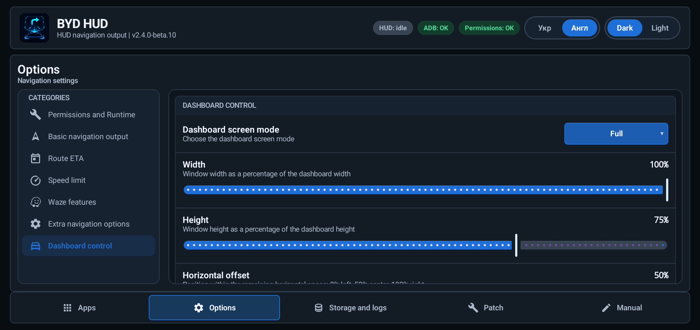</p>

<!-- Photo slot: docs/screenshots/en/dashboard.jpg
Use a landscape photo showing the real instrument cluster. Place it here.
Suggested markup:
<p align="center"></p>
-->

> Use dashboard controls only while parked. Some stock cluster layouts add dark top and bottom overlays; BYD HUD can resize the window but cannot remove firmware-owned overlays.

## Navigator patcher

The `Patch` tab is optional. It can add a BYD HUD direct channel to a supported compatible Waze or Google Maps ReVanced package without uploading the APK anywhere.

<p align="center">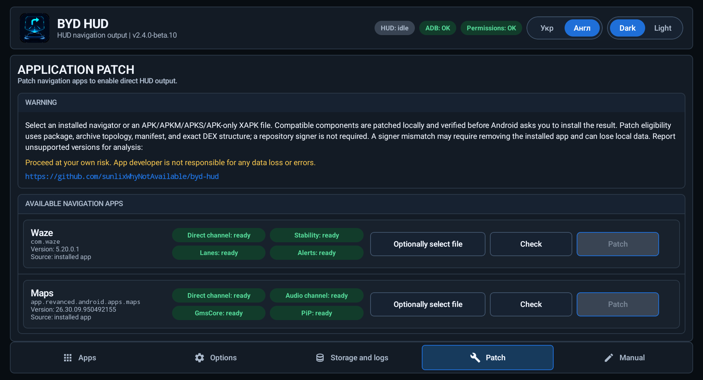</p>

### Supported input

- an installed `com.waze` or `app.revanced.android.apps.maps` package;
- a downloaded `.apk` file;
- compatible `.apkm` or `.apks` split-package archives;
- an APK-only `.xapk` archive.

Official Google Maps package `com.google.android.apps.maps`, bundles with OBB expansion data, and unsupported package layouts are rejected. The currently recognized patch inputs are Waze `4.95.0.3` / `5.20.0.1` and Google Maps ReVanced `25.16.03.747108139` / `26.30.09.950492155`.

### How patching works

1. Select the installed navigator or optionally choose a downloaded version.
2. Press `Check` to verify that the package is intact and its files and app layout match a supported build.
3. Review the component status pills. Waze reports the direct channel, lanes, stability, and alerts separately. Google Maps reports the direct channel, Google services dialog handling, audio, and PiP separately.
4. Press `Patch` and confirm the warning.
5. BYD HUD repeats all compatibility checks, changes only recognized app parts, signs the complete package set with a key generated on this tablet, and asks Android to install it.

For Waze, the direct channel and lanes are mandatory; stability and alert support remain optional. Google Maps Direct, Google services dialog handling, Audio, and PiP are independent components, so one component does not determine whether another works. PiP disables navigation picture-in-picture without disabling dashboard resizing. The Google Maps 26.30 Direct component obtains Google-rendered maneuver images without requiring its turn card to remain visible. Waze alert support is currently limited to the compatible Waze 5.20.0.1 build.

`Check` and `Patch` use persistent progress cards that stay visible while you switch tabs. Waze and Google Maps can be checked or prepared at the same time, while Android installation remains one-at-a-time. Patch cards stack with archive/share progress instead of covering one another. `Stop` is available only while the current operation can still be cancelled safely; use `Close` to dismiss a finished, cancelled, or failed card.

### Signing and app data

- A persistent signing key is created locally inside BYD HUD.
- A later compatible patch signed by the same key can normally update in place.
- An incompatible existing signer can require uninstalling the navigator first, which removes that navigator's local data.
- Clearing BYD HUD data or uninstalling BYD HUD also removes its local signing key.
- Compatibility is determined from the selected app itself, not from where the file was downloaded. Android still enforces signature continuity when updating an installed app.
- A compatible patched APK may be shared, but Android can require uninstall/reinstall when its signer differs from the installed copy.

Back up important navigator data and sign in to its account before patching. The patcher never sends selected APKs to a server. The separate download actions on the `Apps` tab retrieve only the fixed, pinned navigator assets currently offered there; patching a user-selected source still operates locally.

## Runtime and maintenance options

| Setting | Default | Purpose |
| --- | --- | --- |
| `Boot runtime service` | On | Restarts the BYD HUD runtime after supported boot and update events |
| `Save diagnostic screenshots and extended logs` | Off | Records additional navigation evidence; use it only while diagnosing because it consumes more storage |
| `Check for updates` | On | Checks the stable GitHub release channel |
| `Take part in beta-testing` | Off | Includes prereleases, which may be unstable or broken |

`ADB permissions` runs the permission setup when needed. `Background apps` opens the BYD system page where BYD HUD should be excluded from background blocking. `Shutdown` stops HUD output and the runtime cleanly.

<p align="center">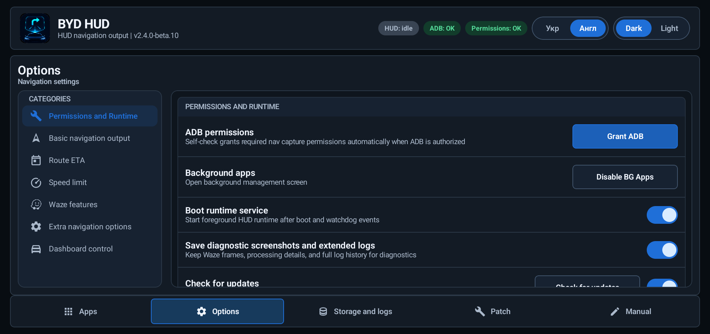</p>

## Storage, logs, and privacy

BYD HUD stores navigation evidence in day folders so one trip can be shared without exposing unrelated days.

### Storage and logs tab

- shows current log size and the configured size limit;
- groups navigation logs, snapshots, screenshots, and optional logcat by day;
- shows the private and public navigation-log folder locations;
- shares or deletes only the selected days;
- shows file count, archive size, and a sensitive-data warning before creating a ZIP;
- uses one stateful `Start Logcat` / `Stop Logcat` button for explicit system-log recording;
- provides `Share configuration` for a smaller diagnostic archive containing device, permission, network, patcher, and navigation-output details.

<p align="center">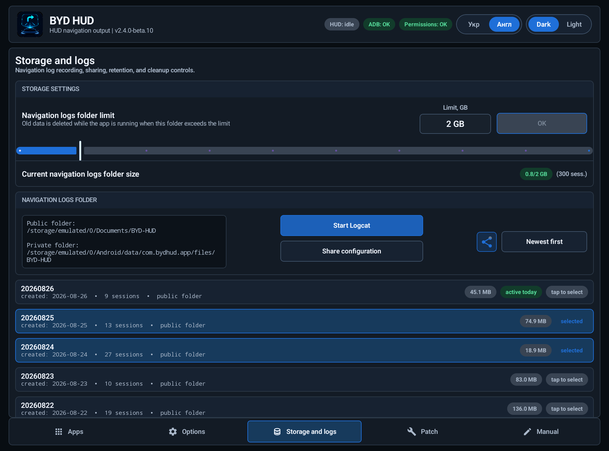</p>

Archive preparation uses a persistent progress card that remains visible across tabs and can be stopped safely. It stacks with Waze and Google Maps patch cards instead of overlapping them.

`Share selected` offers two explicit destinations:

- `Another app` opens the normal Android share chooser;
- `Send to developer` uploads the same selected ZIP to the Sentry service once.

<p align="center">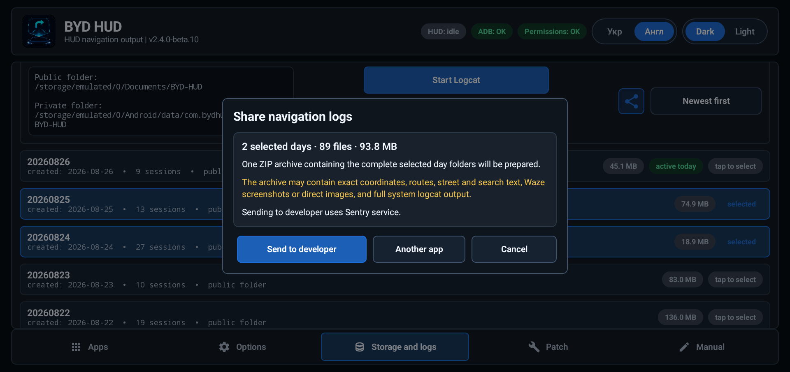</p>

After the Android share chooser opens successfully or `Send to developer` finishes successfully, BYD HUD clears exactly the day checkboxes captured for that archive. Archive, chooser, upload, or cancellation failure keeps the selection. Days selected while an upload is running remain selected.

With authorized ADB, starting Logcat records all system log buffers and captures the initial performance state; stopping it adds final frame and system metrics. Without ADB, the same stateful button records the buffers and diagnostics available to the app. There are no fixed-duration presets. Configuration sharing works without ADB; an already-authorized bridge only adds more read-only system diagnostics. Sharing does not request ADB access and does not enable telemetry.

BYD HUD does not automatically send crash reports, performance traces, screenshots, screen recordings, or navigation logs to the Sentry service. Read the complete policy in [PRIVACY.md](PRIVACY.md).

## Manual HUD testing

The `Manual` tab is a diagnostic tool. It does not require an active route in Google Maps or Waze. Enabling Manual mode publishes the selected text, distance, lane, PNG, and native-arrow test values through the same supported vehicle outputs as live navigation. Vehicle displays do not mirror every field: the dashboard TBT card carries its native maneuver and text state rather than copying the HUD lane or PNG image. Rapid edits are combined so only the latest state is shown. Disabling Manual mode clears its output and returns control to active live navigation. It should not be used as a navigation source.

<p align="center">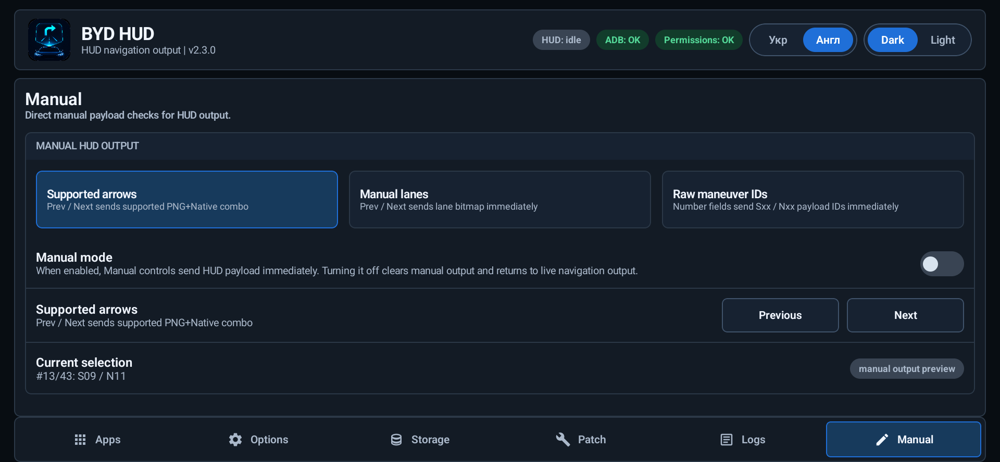</p>

## Installation

### Requirements

- Android 10 or newer;
- a compatible Chinese-market BYD vehicle and DiLink system;
- permission to install APK files on the tablet;
- the `Navigation fusion` option enabled in the vehicle HUD settings for native maneuver arrows;
- BYD HUD excluded from BYD background-app blocking.

### First setup

1. Download the current APK from [GitHub Releases](https://github.com/sunlixWhyNotAvailable/byd-hud/releases/latest).
2. Install it on the vehicle tablet and open BYD HUD.
3. On the first launch, review the `Options` tab and grant the required base permissions.
4. Optionally authorize the ADB RSA prompt for dashboard control, public log storage, automatic permission repair, and richer diagnostics.
5. Open BYD system settings and set `Disable background Apps -> BYD HUD` to `Off`.
6. Return to `Apps`, enable `HUD` for Google Maps or Waze, and start navigation.
7. For a compatible navigator, the direct channel starts automatically when the navigator supplies an active route.

When the existing ADB RSA key is authorized, dashboard-card integration starts automatically with the BYD HUD runtime; there is no additional setup or status indicator. Without authorized ADB, compatible direct navigation can still reach the windshield HUD, but the dashboard navigation card and dashboard movement controls are unavailable on the tested firmware.

When `Lane output` is enabled and the navigator supplies lanes, BYD HUD publishes the guidance through all supported vehicle navigation outputs. Authorized ADB enables the additional vehicle lane interface needed by some vehicles; it does not turn the TBT maneuver card into a copy of the HUD lane image. Empty or ended guidance clears the previous lanes instead of leaving stale information on screen.

### What requires ADB

| Function | Without ADB | With authorized ADB |
| --- | --- | --- |
| Compatible direct navigator -> windshield HUD | Works | Works |
| Dashboard navigation card | Unavailable on tested firmware | Available automatically |
| App UI and navigation options | Works | Works |
| Automatic permission repair | Limited | Available |
| Public day-based log storage | Limited by Android permissions | Available |
| Dashboard projection controls | Unavailable on tested firmware | Available |
| Extended configuration diagnostics | Basic report | Enriched report |
| Runtime recovery after the process is killed | May require reopening the app | Boot/runtime setup can restore it |

## Troubleshooting

### HUD stays in `idle`

- Confirm that `HUD` is enabled for the correct navigator.
- Start an active route; selecting a navigator alone does not produce HUD data.
- Check that the installed navigator build supports the direct channel.
- Confirm that `Navigation fusion` is enabled in the vehicle HUD settings if only the native arrow is missing.

### HUD shows `failed`

- Open `Options` and run `ADB permissions` if ADB is available.
- Check the `ADB` and `Permissions` status pills separately.
- Confirm that BYD HUD is allowed to run in the background.

### Output blinks or alternates

Another HUD application may be sending navigation data at the same time. Stop the other HUD application and test again.

## Report a problem

Open a [GitHub issue](https://github.com/sunlixWhyNotAvailable/byd-hud/issues) and include:

- BYD HUD version;
- vehicle model, model year, DiLink version, and tablet firmware;
- navigator name and version;
- what you expected and what appeared on the tablet and HUD;
- the approximate local time of the problem;
- the selected day archive, configuration archive, or Sentry report identifier when relevant.

For a navigation-output problem:

1. Reproduce it with `Save diagnostic screenshots and extended logs` enabled when possible.
2. Open `Storage and logs` and select only the affected day.
3. Press `Share selected` and choose your messenger or `Send to developer`.
4. Disable detailed diagnostics after the test to reduce storage use.

For a permission, device, patcher, or startup problem, use `Storage and logs -> Share configuration` instead.

> Navigation archives may contain coordinates, searched destinations, street names, notification text, screenshots, and device identifiers. Review the warning before sharing and use only the minimum required day.

## Known limitations

- Other HUD applications sending navigation data at the same time can cause blinking or instability.
- The patcher supports Google Maps ReVanced package `app.revanced.android.apps.maps`, not official package `com.google.android.apps.maps`.
- Waze route metrics depend on destination estimates supplied by the supported project-patched Waze `5.20.0.1` session; an unavailable whole-route field falls back to the corresponding next-stop value.
- Waze alerts still depend on Waze supplying an alert and are available only with the compatible Waze `5.20.0.1` build.
- Waze custom surface is an opt-in beta path. It requires a working Waze direct channel and is activated only after Waze reports active navigation; readiness failure keeps the normal direct guidance active after five seconds.
- Stock cluster firmware may add dark overlays to dashboard projection.
- Unsupported multi-file packages and XAPK files with OBB data cannot be patched.
- Native arrows require `Navigation fusion` in the vehicle HUD settings.
- Some firmware may kill the process without ADB-assisted background and boot setup.

## Contributions and acknowledgements

Issues and focused pull requests are welcome. Please describe the vehicle, firmware, navigator version, and a reproducible user-visible problem before proposing navigator-specific parsing changes.

- MaxTitan shared the original Waze direct-channel concept and reference material for sending Waze guidance to BYD vehicles.
- The OpenBYD project inspired part of the vehicle-integration approach used for broader dashboard-card and HUD compatibility. BYD HUD's implementation and behavior were verified independently on SL06 and SL07.
- The dashboard resize approach was inspired by [BYD Mate](https://github.com/AndyShaman/BYDMate).
- Олексій (Oleksiy) provided diagnostics and logs and performed testing, verification, and functional validation of BYD HUD on the BYD Sea Lion 06 EV.

## Tested devices

| Vehicle | Market | DiLink | Status |
| --- | --- | --- | --- |
| BYD Sea Lion 07 EV 2025 | China | 5.0 | Tested by the maintainer |
| BYD Sea Lion 07 EV 2024 | China | 5.0 | Tested by a project user |
| BYD Sea Lion 06 EV | China | 5.0 | Tested by a project user |

HUD output is known to work on the tested tablet firmware starting from version `2510`. Other models, regions, firmware versions, resolutions, and instrument clusters may behave differently.

## License and disclaimer

BYD HUD is licensed under the [GNU Affero General Public License v3.0](LICENSE).

This project is independent and is not affiliated with, endorsed by, or sponsored by BYD, DiLink, Waze, Google, Google Maps, or ABRP. All product names and trademarks belong to their respective owners.

Use the software at your own risk. Modifying or replacing navigator packages can remove local app data or cause unexpected behavior. Follow local laws, keep your attention on the road, and configure or diagnose the system only while parked.
