# BYD HUD

**English** | [Українська](README.uk.md)

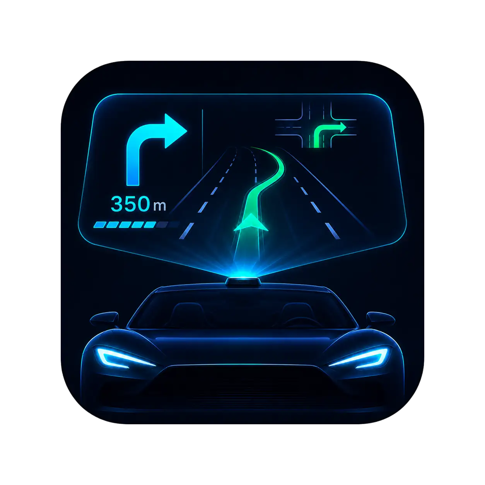

BYD HUD brings Google Maps and Waze guidance to the head-up display of compatible Chinese-market BYD vehicles: maneuvers, distances, street names, lanes, trip information and, with a compatible patched navigator, a live map. It can also move a running application to the instrument cluster.

Route search and selection remain in the navigator. The BYD HUD interface is available in English, Ukrainian and Russian.

[Download](https://github.com/sunlixWhyNotAvailable/byd-hud/releases/latest) · [Installation](#installation) · [Map setup](#map-display) · [Troubleshooting](#troubleshooting) · [Report a problem](#report-a-problem)

> **AI disclosure:** Generative AI tools are used for code and diagnostic-log analysis, implementation, testing, and documentation.

## Compatibility

You need Android 10 or newer, a compatible DiLink system and permission to install APKs. Vehicle firmware determines which HUD fields and dashboard layouts are available.

| Navigator | Available guidance |
| --- | --- |
| Compatible Google Maps ReVanced | Maneuvers, distance, street, lanes when supplied, arrival time and remaining trip time/distance |
| Compatible Waze | Maneuvers, distance, street, lanes, trip information, speed limits and alerts when supplied |

**Google Maps does not currently supply speed-limit data to BYD HUD.** Map display requires a compatible patched build with map-image support; an older Direct-only patch is not enough. Use the packages offered in `Apps` or the [built-in patcher](#navigator-patcher).

HUD output has been confirmed on Chinese-market Sea Lion 07 EV (2024/2025) and Sea Lion 06 EV with DiLink 5.0, including tested tablet firmware from `2510`. This does not guarantee every feature on those vehicles or support on other firmware. The help illustrations use particular vehicle layouts; your HUD may differ.

## Installation

Configure the app while parked.

1. Download the BYD HUD APK from [GitHub Releases](https://github.com/sunlixWhyNotAvailable/byd-hud/releases/latest), install it on the vehicle tablet and open it.
2. In `Options`, grant the requested permissions. Authorize the ADB RSA prompt if you want dashboard controls and additional setup/diagnostic functions.
3. In BYD system settings, set `Disable background Apps → BYD HUD` to `Off` so the system allows background operation.
4. Install a compatible navigator from `Apps`, or prepare one with the `Patch` tab. If Android requires replacing an existing navigator, read the data-loss warning before confirming.
5. In the vehicle's HUD settings, enable `Navigation fusion` for native turn arrows.
6. In `Apps`, enable `HUD` for your navigator, then start a route in that navigator.

You can enable HUD before or after starting a route. Simply opening a navigator without guidance does not produce navigation output.

| Function | Is authorized ADB needed? |
| --- | --- |
| Compatible navigator → windshield HUD | No, for basic supported output |
| Dashboard navigation card and moving apps between displays | Yes, on tested firmware |
| Some additional vehicle outputs, including stock lanes | Yes, depending on the vehicle |
| Automatic permission setup and richer diagnostics | Yes |

Accessibility and notification access do not replace a compatible navigator build. The steering-wheel shortcuts described below also require Accessibility.

<details>
<summary>Screenshot: Permissions and Runtime</summary>

<p align="center">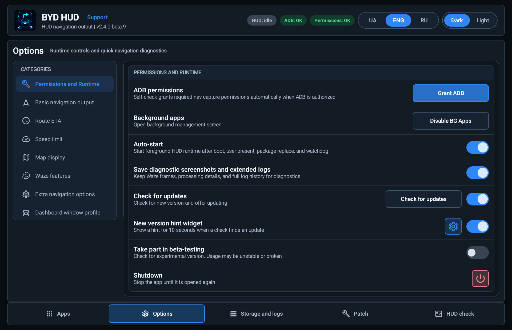</p>

</details>

## Everyday use

In `Apps`, select the navigator's `HUD` switch and start navigation. BYD HUD can continue working while the navigator is visible or after you switch applications, provided background operation is allowed.

The navigator download area offers `Download`, then `Install`. `Installed` can also be used to reinstall an offered package. The app checks downloaded files before installation. If an operation fails, open `Error` for the reason and use `Retry`.

`Send to dashboard` and `Send to main` move an already running application between displays. Other installed apps can be moved too, but only supported navigators provide HUD guidance.

<p align="center">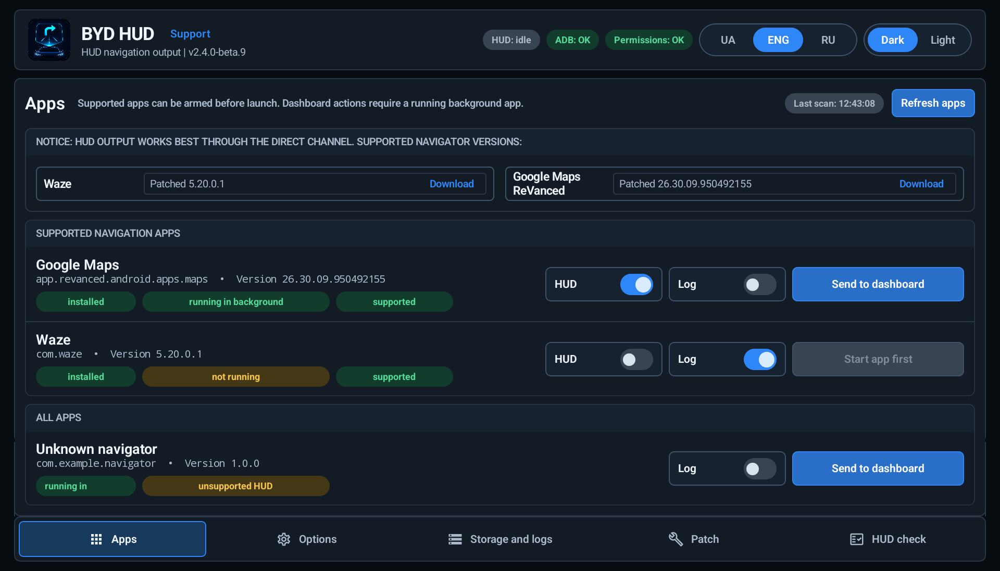</p>

| Indicator | Meaning |
| --- | --- |
| `HUD: running` | BYD HUD is sending navigation guidance; the vehicle still determines what appears |
| `HUD: idle` | No guidance is currently being sent |
| `HUD: failed` | A required output operation failed |
| `ADB: OK` | Required settings and permissions are present; this is not a live connection indicator |
| `Permissions: missing` | Open Options and restore the missing permissions or services |

## Customize the HUD

Open `Options` to choose the fields you want. The `?` buttons show illustrations without changing your saved settings or sending anything to the vehicle. Screenshots show the dark Preview interface; individual controls may differ from the installed release.

### Maneuvers, lanes and text

- `PNG output` displays a maneuver or alert image; `Native output` controls the vehicle's own turn arrow. They can be configured separately.
- Lane, distance and street output have separate switches. Lanes appear only when the navigator supplies them.
- `Text direction output` supplies a cue such as “Continue straight” when no street name is available.
- Use Ukrainian or Universal transliteration if the vehicle cannot display the original characters.
- `Small distance clamp` replaces positive distances below 11 m with 11 m. On some HUDs, disabling distance output shows the vehicle's “now” label instead of an empty field.

<p align="center">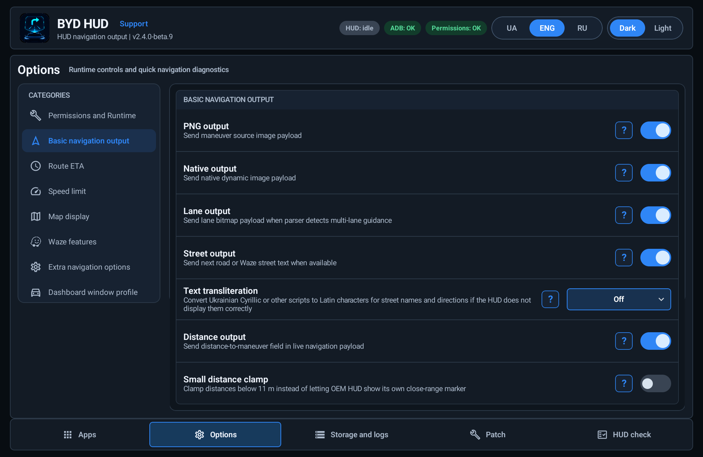</p>

### Arrival time and remaining journey

Choose `Next stop` or `Entire route` in the ETA options, then enable arrival time, remaining time and/or remaining distance. If a whole-route value is unavailable, an available next-stop value is used instead.

The street-field mode can prepend the values, for example `[18:45 | 25 min | 8.4 km] Main Street`, or replace the street text. The full-text wait option lets long text finish scrolling before an ETA-only update. Experimental output places the values in a separate HUD area with individual colors; support depends on the vehicle. Missing values remain hidden.

<details>
<summary>Screenshot: Route ETA</summary>

<p align="center">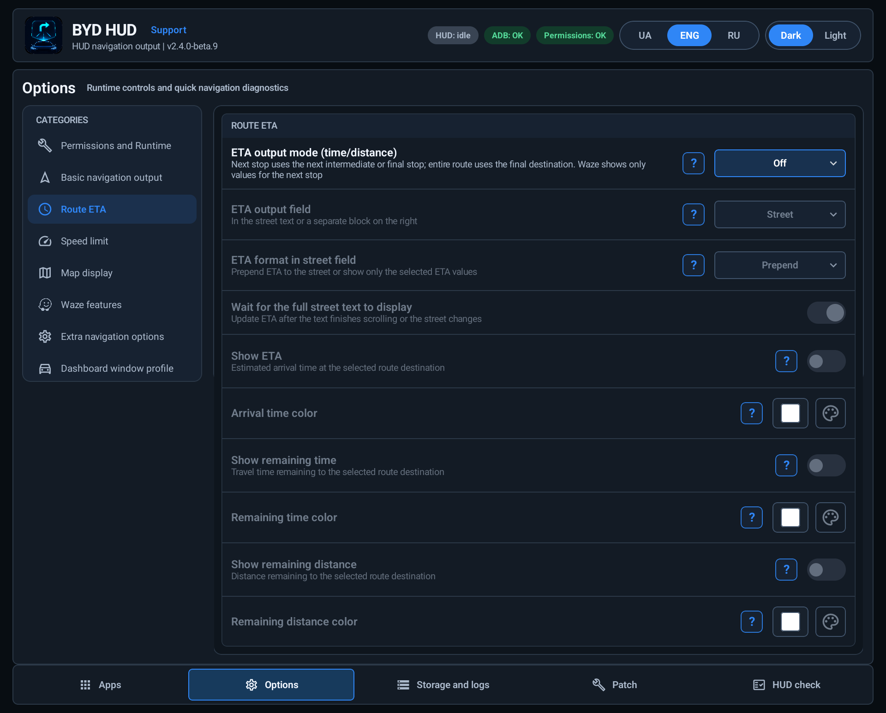</p>

</details>

### Speed limit

Choose where to display a speed limit supplied by the navigator:

| Mode | Result |
| --- | --- |
| Off | BYD HUD does not display a navigation speed limit |
| Native/ADAS | Requests the vehicle's native sign and checks whether the value was accepted |
| In maneuver / lane field | Uses the selected image field |
| In a free field | Uses an available field, with optional temporary replacement when both are occupied |
| Composite | Adds the sign to the maneuver or lane image |

For `Native/ADAS`, choose a fallback mode for cases where the native field cannot be updated. The optional change delay reduces rapid replacements of a sign detected by ADAS. Native output supports limits from 5 to 130 km/h in steps of 5, but the vehicle may delay or ignore an update. **BYD HUD does not clear the native sign when navigation ends or the navigator stops supplying a limit.**

Image-based modes offer sign size, field and overlap controls as applicable. Google Maps speed-limit data is currently unavailable; these settings do not create a limit when the navigator supplies none.

<details>
<summary>Screenshot: Speed limit</summary>

<p align="center">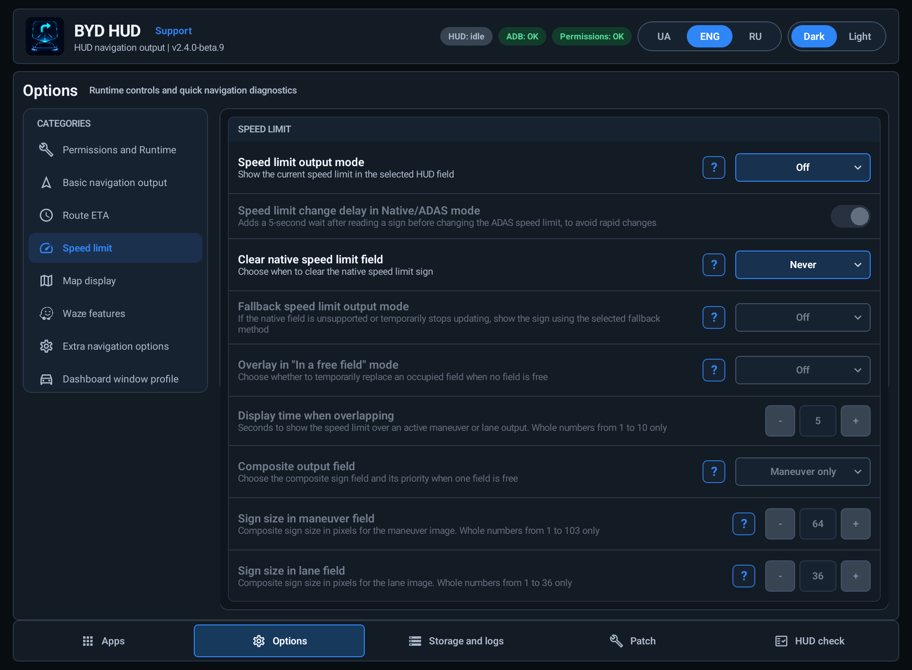</p>

</details>

### Map display

**Install a compatible patched navigator with map-image support first.** With the patcher, confirm that its `Map` component is ready. Direct navigation support alone does not include a map image.

| Mode | Use |
| --- | --- |
| Off | No map image |
| Native | The vehicle's separate map field; the help image uses Denza N9 as an example |
| Experimental | A map composed across image fields; the layout is based on Sea Lion 07 and can be adjusted |

Images update at up to five times per second while changing and slow to once per second when the displayed crop is unchanged. If fresh images stop arriving, the map disappears while other guidance continues. Native field availability and experimental image-field support depend on the vehicle.

#### Navigator image profiles

Enable Native or Experimental map display first; profile controls are disabled when map display is Off. Each source can have one saved profile. Use its edit button to change an existing profile, or its delete button to remove it with confirmation.

1. Press `+ Add profile` and choose Google Maps, Waze without Surface, or Waze with Surface. The list depends on installed navigators; the two Waze modes have separate profiles.
2. Press `Show map`, then open the selected navigator if needed. Calibration continues while BYD HUD is in the background.
3. Adjust the image's horizontal/vertical position and scale (20–300%) to place the useful part of the map inside the preview. These controls change the crop **inside** the HUD area, not the position of that area.
4. Press `Save` to keep the profile. Saving keeps the editor open and is available for a new profile or after changing a saved one. `Close` discards changes made since the last save. `Hide map` or closing the editor ends calibration and allows ordinary navigation output to resume.

| Profile setting | What it changes |
| --- | --- |
| Image left–right | Horizontal framing, −100 to +100%; minus moves the image right, plus moves it left |
| Image up–down | Vertical framing, −100 to +100%; minus moves the image up, plus moves it down |
| Image scale | Image size within the fixed HUD area, 20–300%; reduce it to fit more of the map or make large labels smaller |

Use the slider, enter a value directly, or use `−` / `+` for steps of 0.1 and `--` / `++` for steps of 1. Decimal points and commas are accepted; the keyboard's Done/checkmark finishes entry. During calibration, changes appear in the preview and on the HUD before saving. The saved-profile list shows each source's X, Y and scale.

The preview shows the crop sent to the HUD. It is black when no current image is available. Profiles are separate for the three navigator modes; saved values survive updates. Cropping is manual: it does not automatically locate the vehicle marker or compensate for different navigator zoom levels when opened and minimized.

#### Map and lane layout on the HUD

In Experimental mode, choose `Larger on the right` or `Custom` for the HUD layout. Six controls adjust horizontal position, vertical position and scale separately for the map area and lanes. These settings are shared across navigator profiles. Unlike image framing, horizontal minus moves the HUD area left and plus moves it right; vertical minus moves it up and plus moves it down. Lanes move within their own row.

The same decimal entry and 0.1 / 1 step buttons apply here. Editing a preset switches to Custom using its current positions and sizes. Layout changes are saved immediately; they do not use the image-profile editor's Save button.

`Live display` tests this layout with a sample image and navigation examples using your output settings; `Show map` inside a profile uses the actual navigator image. Live layout adjustments appear immediately. Live display continues when you leave the settings page or minimize BYD HUD. Use `Stop` to finish; switching out of Experimental, starting another HUD check or shutting down the service also ends it. Active ordinary navigation may resume afterward, so continued output does not necessarily mean the test is still running.

<details>
<summary>Screenshot: Map display</summary>

<p align="center">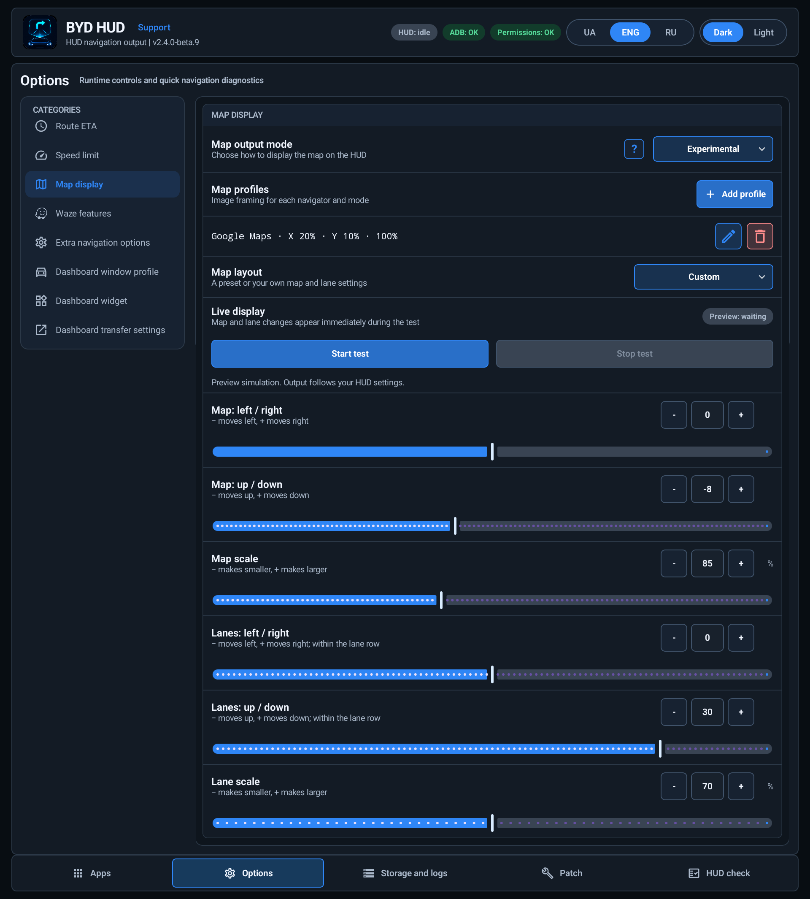</p>

</details>

<details>
<summary>Screenshot: Map image profile</summary>

<p align="center">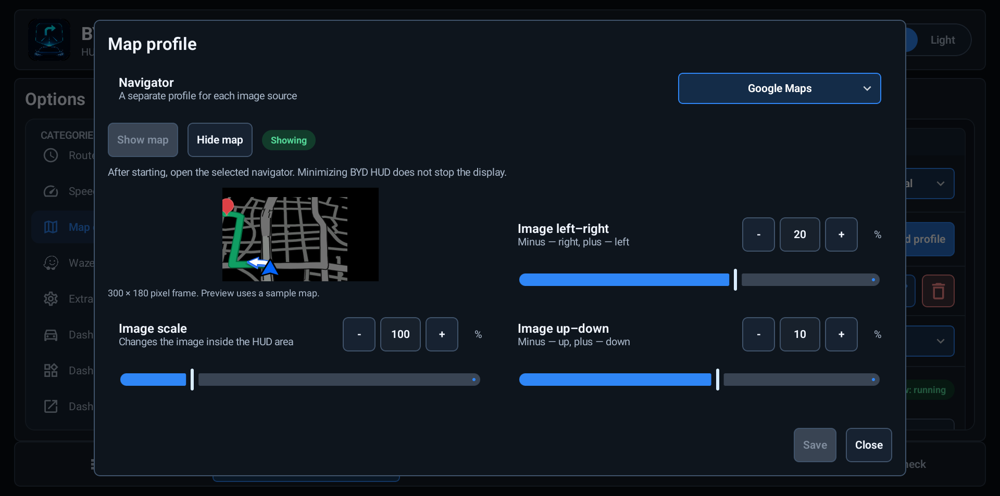</p>

</details>

### Waze alerts and route screen

Waze alerts can replace the maneuver field when the warning is closer, or use a separate Experimental area. Availability depends on the compatible Waze build and the alerts it supplies.

`Start with custom surface` opens an optional, experimental Waze route screen after navigation starts. Set it before starting the route. Search and route selection still use the normal Waze screen; Back returns there for the rest of the route. If the custom screen cannot open, normal HUD guidance continues.

<details>
<summary>Screenshot: Waze features</summary>

<p align="center">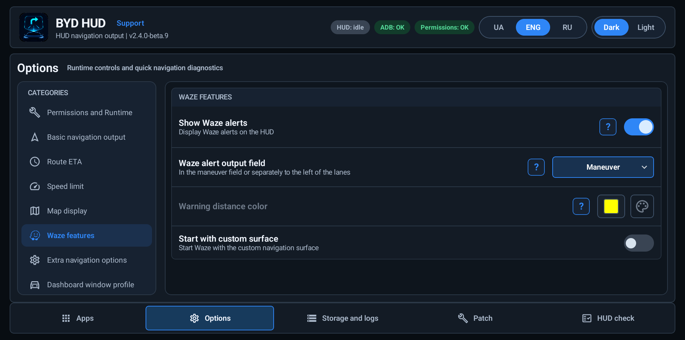</p>

</details>

## Dashboard projection

With authorized ADB, use `Send to dashboard` to move a running app to the instrument cluster and `Send to main` to return it.

In `Options → Dashboard window profile`, choose None, Partial or Full. None leaves the existing cluster layout unchanged. Partial and Full keep separate width, height, position and scale settings. Start with the Native screen-format method; try Alternative if Native does not work on your vehicle. Selecting a mode alone does not move the app.

### Partial and Full window profiles

Select the mode you want to configure, then adjust its settings. Repeat for the other mode if you use both. Changes are saved immediately; this page has no separate Save button.

| Setting | Effect |
| --- | --- |
| Screen format method | Native or Alternative, saved separately for each mode |
| Width / Height | 20–100% of the dashboard dimensions; defines the window size |
| Horizontal offset | Position within the remaining space: 0% left, 50% center, 100% right |
| Scale | 20–150%; changes the projected content inside the window |

Set the window area first, then adjust content scale for readable map labels and controls. Transfer shortcuts use these saved settings for their selected mode. The floating widget can also apply them when `Apply dashboard window profile` is enabled.

<details>
<summary>Screenshot: Partial window profile</summary>

<p align="center">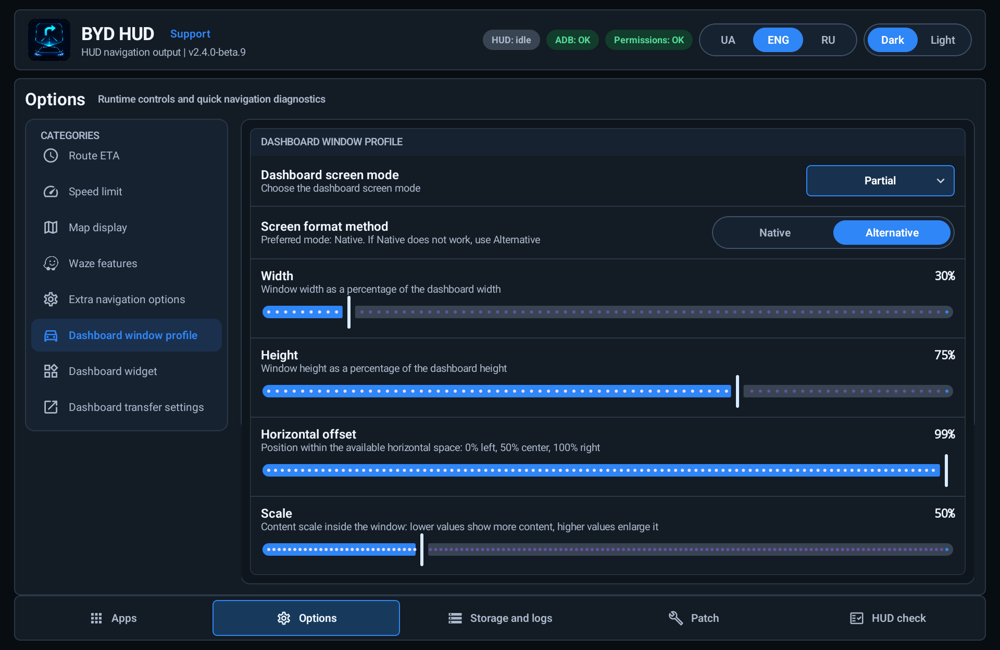</p>

</details>

<details>
<summary>Screenshot: Full window profile</summary>

<p align="center">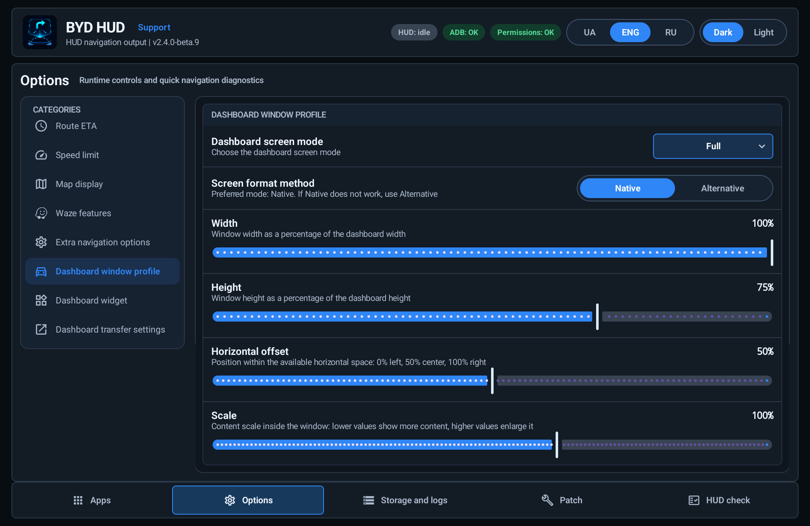</p>

</details>

A dark area may remain after returning the navigator; some firmware also adds dark borders that BYD HUD cannot remove. If a layout change fails, use `Send to main` to return the app.

The additional navigation options control the dashboard turn-by-turn (TBT) card independently: whether to create a card for an active navigator and whether to switch to it when HUD output starts.

<details>
<summary>Screenshot: Extra navigation options</summary>

<p align="center">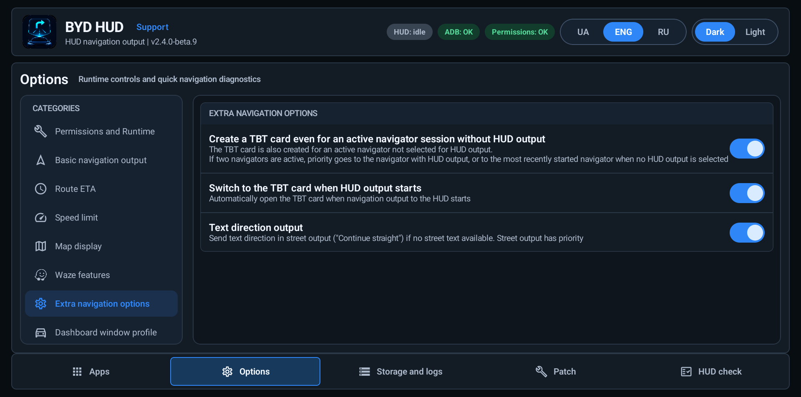</p>

</details>

### Floating widget

Enable Square or Circle in `Options → Dashboard widget` and grant permission to display over other apps. Tap the widget for IPC OFF, TBT, MINI and FULL; drag to move it or long-press to hide it temporarily. Opening BYD HUD restores an enabled hidden widget.

The buttons change the dashboard layout, not the running app or its display. MINI/FULL can apply the matching saved window profile. Size, appearance, opening direction and automatic collapse are configurable. ADB is required for mode changes.

<details>
<summary>Screenshot: Dashboard widget</summary>

<p align="center">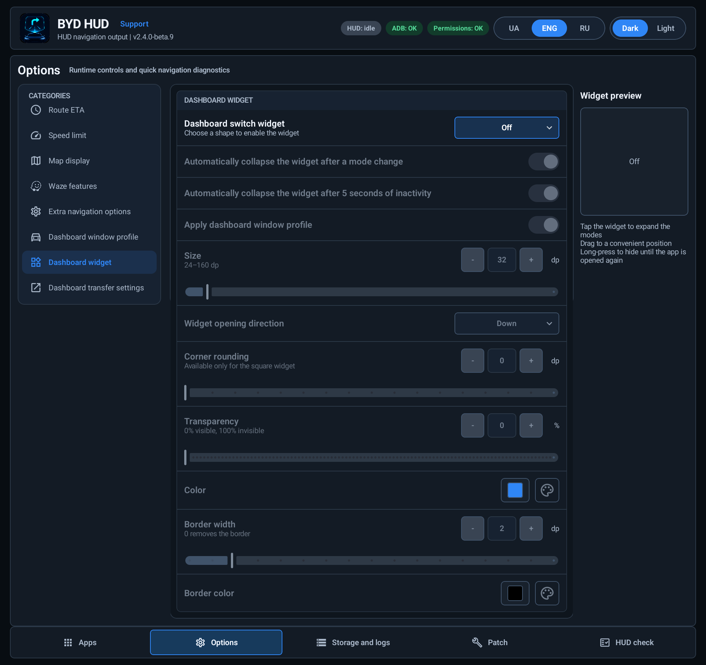</p>

</details>

### Steering-wheel shortcuts

In `Options → Dashboard transfer settings`, each profile connects a steering-wheel button and press type to an application and window mode.

1. Press `+ Create profile`, then `Select button`. Press the physical button when the learning dialog asks for it; its detected name appears in the editor.
2. Choose `Single`, `Hold` or `Double`. The same button can have a separate profile for each gesture.
3. Select the application to move. It must already be running when you use the shortcut; a closed app is not launched.
4. Select a dashboard transfer profile from the choices below, then press `Save`.

| Window choice | Effect |
| --- | --- |
| Current profile | Uses the mode selected in Dashboard window profile **when you press the button**, not a snapshot from when the shortcut was saved |
| Partial only | Uses the saved Partial window settings regardless of the currently selected mode |
| Full only | Uses the saved Full window settings regardless of the currently selected mode |

Width, height, horizontal offset and scale are configured in [the window profiles above](#partial-and-full-window-profiles). The shortcut moves the app from the main screen to the dashboard; using it again returns the app to the main screen.

Save requires a selected button and application. If the same button and press type already have a profile, the editor shows the conflict and disables Save. Choose a different gesture/button or edit the existing profile. `Cancel` leaves saved settings unchanged. Profiles can be edited or deleted from the list; the editor also offers Delete, with confirmation.

<details>
<summary>Screenshot: Transfer profile editor</summary>

<p align="center">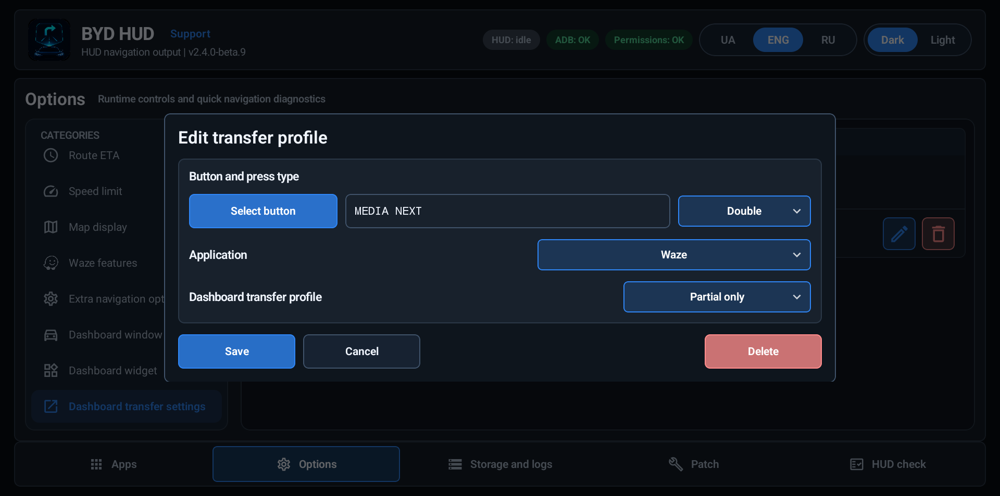</p>

</details>

<details>
<summary>Screenshot: Learning a steering-wheel button</summary>

<p align="center">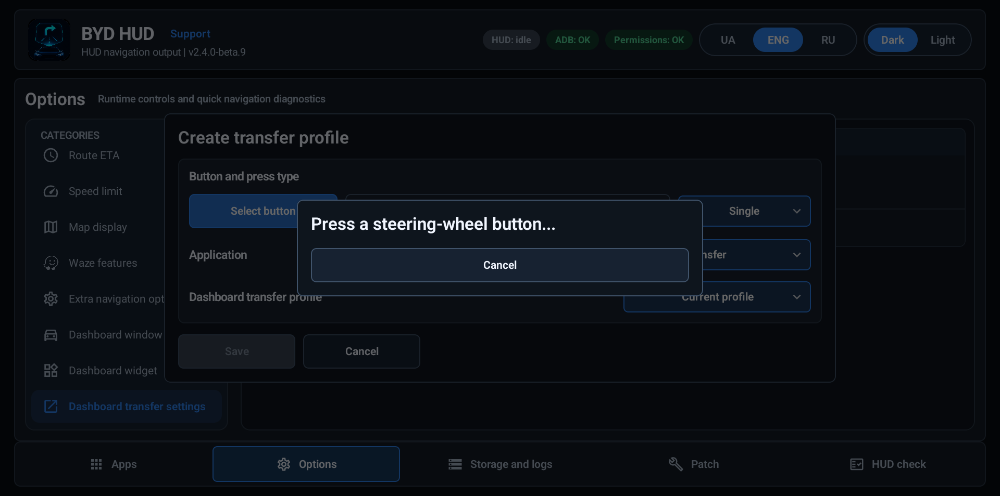</p>

</details>

Enable the Accessibility service for button learning and interception. **Assigning a button consumes its delivered presses, including gestures without a matching profile.** Delete all profiles for that button to release it. Vehicle firmware or another button-mapping app may still act on the same press; gestures split between different apps are not coordinated. Available buttons and gestures vary by vehicle.

<details>
<summary>Screenshot: Dashboard transfer settings</summary>

<p align="center">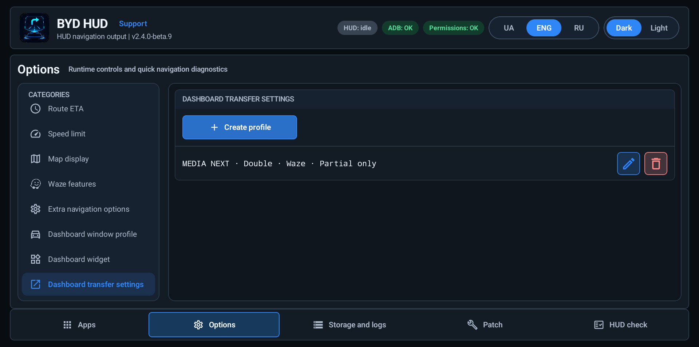</p>

</details>

## Navigator patcher

The optional `Patch` tab prepares supported navigator packages locally; APKs are not uploaded. Installing a ready package from `Apps` is the simpler option.

Supported inputs are installed compatible navigators, APK files, APKM/APKS archives and APK-only XAPK archives. XAPK files with OBB data and unsupported package layouts cannot be patched. Google Maps must be the ReVanced package `app.revanced.android.apps.maps`, not the official `com.google.android.apps.maps`.

| Navigator | Recognized versions | Map-image patch |
| --- | --- | --- |
| Waze | 4.95.0.3, 5.20.0.1 | 5.20.0.1 |
| Google Maps ReVanced | 25.16.03.747108139, 26.30.09.950492155 | 26.30.09.950492155 |

A matching version number alone does not guarantee compatibility; use `Check`.

1. Select the installed navigator or a downloaded package.
2. Press `Check` and review the component results.
3. Select the available optional components, press `Patch` and read the warning.
4. Wait for preparation, then confirm installation in Android.

Map support is attempted automatically when compatible; it has no separate checkbox. If the map component cannot be added, a verified Direct navigation patch can still be installed. Read the result: partial success does not mean all features are available. Older supported versions do not gain map capture. Progress remains available while you switch tabs.

**Back up important navigator data before replacing an app.** A different signing key may require uninstalling the existing navigator, removing its local data. Patches use a key stored inside BYD HUD; clearing BYD HUD data or uninstalling it removes that key and can affect future in-place updates.

Every check and patch attempt keeps a separate diagnostic report. The complete report history is included when sharing logs or exporting configuration, regardless of selected dates and logging switches.

<details>
<summary>Screenshot: Navigator patcher</summary>

<p align="center">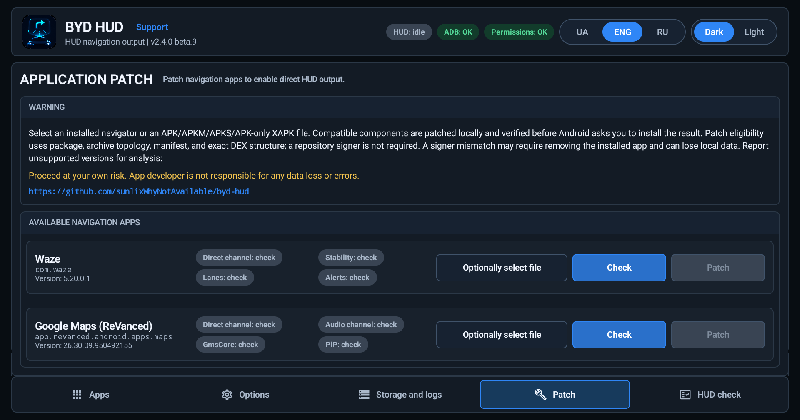</p>

</details>

## Startup and updates

`Boot runtime service` is on by default. Turning it off disables automatic startup; you can still open BYD HUD and use it manually. Keep the app excluded from BYD background blocking. `Shutdown` stops background operation and HUD output.

`Check for updates` is on by default and checks stable releases. Enable `Take part in beta-testing` to include prereleases. An optional update hint appears while BYD HUD is in the background; tap it to open the update offer. You can also check manually in Options.

### Update hint widget

In `Options → Permissions and Runtime`, enable `New version hint widget` and press the settings icon beside it. The editor provides a 1:1 preview and controls for transparency (0% visible, 100% invisible), corner rounding, border width and color, and widget size. A border width of 0 removes the border. Appearance changes are saved immediately; `Close` ends editing. This configures the update notification, separately from the dashboard-control widget.

<details>
<summary>Screenshot: Update hint widget settings</summary>

<p align="center">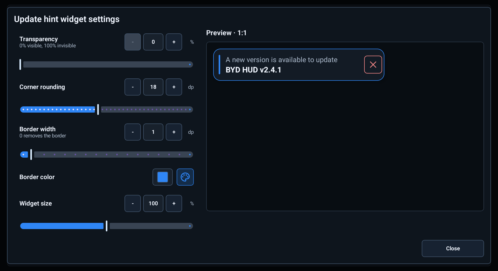</p>

</details>

## HUD check

Use `HUD check` while parked to find out which fields your vehicle displays:

- **Basic output:** choose maneuver, lane, distance, street and traffic-light examples. Stock uses vehicle symbols; Bitmap sends an image.
- **Extended output:** try additional fields such as ETA, speed limits, maps, cameras and traffic lights. Auto cycles examples; turn it off to select one manually.
- **Shanghai test:** with authorized ADB, simulates a route for the stock navigator. It changes GPS coordinates and is intended for diagnostics.

Basic and Extended stop when you leave the tab, minimize BYD HUD or press Stop. Their example choices do not change your normal navigation settings. Not every field is supported; an accepted send does not prove it appeared on the physical HUD.

For Shanghai, press its Start button, then use the initial 15 seconds to open the stock navigator and start guidance with HUD output. The full run is 4 minutes 55 seconds including the initial wait and continues while you use other apps. BYD HUD pauses its own HUD/TBT output during this test.

Shanghai always records Logcat. A recording already running before the test continues afterward; otherwise the test manages its own recording. HUD-check mode selection and the Logcat button stay locked until completion.

`Reset mock location` removes the current GPS simulation, **including one started by another app**. Automatic recovery after an interrupted BYD HUD session only cleans up its own simulation when you next open/enable BYD HUD. If cleanup fails, retry the reset. Returning to a real GPS fix may take time.

<details>
<summary>Screenshot: HUD check: Basic output</summary>

<p align="center">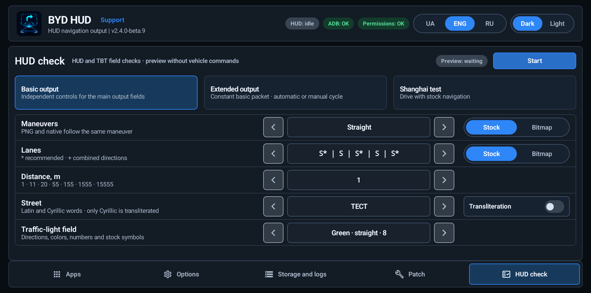</p>

</details>

<details>
<summary>Screenshot: HUD check: Extended output</summary>

<p align="center">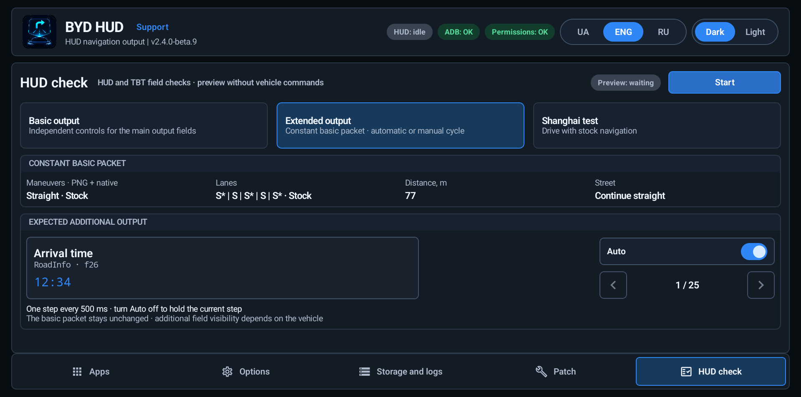</p>

</details>

<details>
<summary>Screenshot: HUD check: Shanghai test</summary>

<p align="center">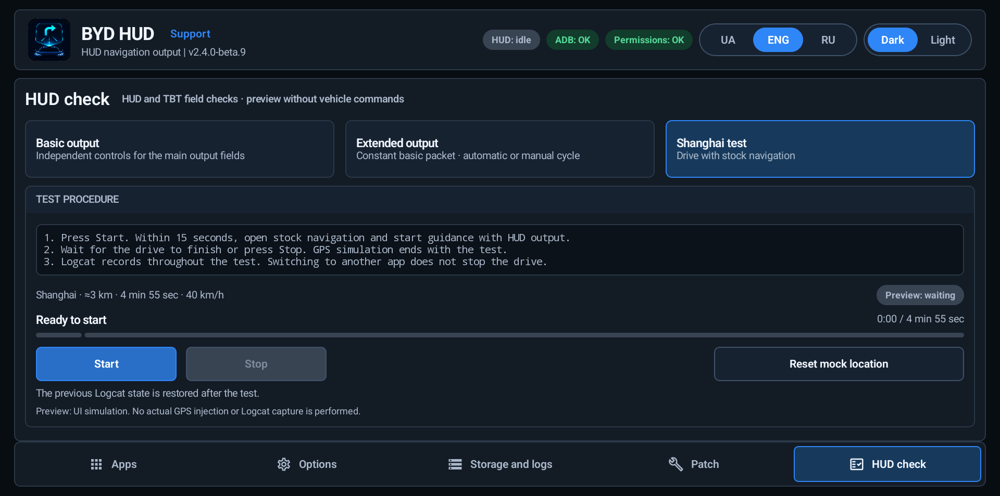</p>

</details>

## Logs and privacy

Basic navigation diagnostics are recorded locally by day. In `Storage and logs`, set storage limits, select days to share or delete, or use `Export configuration` for a device/setup report.

Enable `Save diagnostic screenshots and extended logs` only when needed. It can save screenshots and unique cropped map images sent to the HUD. Full source map frames and repeated identical crops are not saved by map capture; with detailed logging off, it saves no map images. Manual Logcat is separate and can consume substantial storage during long recordings.

`Share logs` offers Android sharing through `Another app`, or an explicit upload through `Send to developer`, with an optional comment. Archives too large for developer upload can be shared through another app. Nothing is uploaded automatically.

**Selected days limit navigation logs, but the entire patcher-report history is always included.** Configuration exports also include that history and available vehicle software/configuration needed for diagnosis. Configuration archives can be large, are split when needed, and their temporary sharing files expire after 15 minutes; send all volumes promptly.

Archives may contain coordinates, destinations, street names, screenshots and device information. Review the sharing warning and use a trusted recipient. See [Privacy](PRIVACY.md) for details.

<p align="center">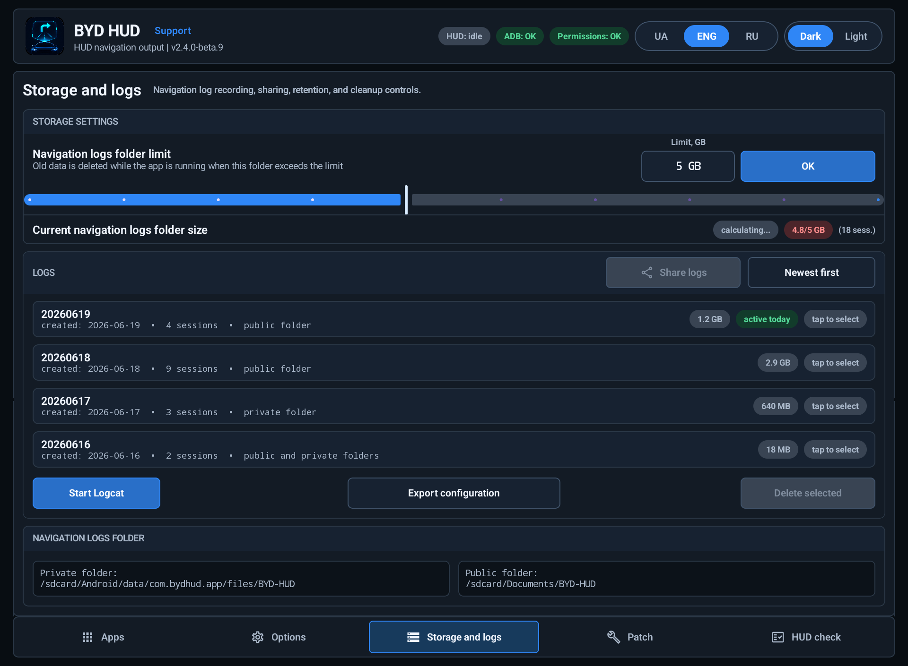</p>

## Troubleshooting

| Problem | What to check |
| --- | --- |
| HUD stays idle | Enable HUD for the correct navigator, use a compatible build and start an active route |
| HUD reports a failure | Check permissions, run `ADB permissions` when available and allow background operation |
| Only the native arrow is missing | Enable `Navigation fusion` in the vehicle HUD settings |
| Guidance works but there is no map | Confirm the navigator includes map support, select a map mode and check the image profile; an older Direct-only patch is insufficient |
| Map is off-center or too large | Adjust the navigator image profile; use the layout controls separately to move the HUD area |
| Output remains after a calibration test stops | An active route may have resumed normal HUD output; stop the route or disable its HUD switch to check |
| Output blinks or alternates | Stop other apps that send navigation data to the HUD |
| GPS remains at a simulated location | End the Shanghai test or use `Reset mock location`; also check other apps that can simulate GPS |

## Report a problem

Open a [GitHub issue](https://github.com/sunlixWhyNotAvailable/byd-hud/issues) with the app and navigator versions, vehicle model/year, DiLink/firmware version, expected result, actual result and approximate local time.

For navigation or map problems, reproduce the issue with detailed logs enabled if possible, then share the affected day from `Storage and logs`. Describe what was visible on the physical HUD; a photo or short video can help. Disable detailed logging afterward. For setup or patching issues, include a configuration export or the report identifier from a developer upload. Review archives before posting them publicly.

## Support the project

Donations voluntarily support the development and improvement of BYD HUD and apps for BYD cars.

**Jar card number — primary donation method:**

```text
4874 1000 3354 3078
```

Copy this number and use your bank's card-to-card transfer feature. You do not need the mono app for this method; availability, limits, and fees depend on your bank or transfer provider. Check the recipient details before confirming.

<details>
<summary>Alternative: monobank Jar link and QR code</summary>

[Open the donation Jar](https://send.monobank.ua/jar/bKFV15i9e), or scan the QR code:

<p><a href="https://send.monobank.ua/jar/bKFV15i9e"></a></p>

</details>

## Acknowledgements

- MaxTitan shared the original Waze direct-channel concept and reference material.
- OpenBYD inspired part of the vehicle-integration approach.
- [BYD Mate](https://github.com/AndyShaman/BYDMate) inspired dashboard resizing.
- Олексій (Oleksiy) supplied Sea Lion 06 EV diagnostics and vehicle testing.

## License

BYD HUD is licensed under the [GNU Affero General Public License v3.0](LICENSE). Dashboard mode illustrations contain original BYD artwork, which remains the property of its owners.

This independent project is not affiliated with or endorsed by BYD, DiLink, Waze, Google, Google Maps or ABRP. Trademarks belong to their owners. Use at your own risk, follow local laws and keep your attention on the road.
