# BYD HUD

[English](README.md) | **Українська**


BYD HUD передає дані активного маршруту Google Maps або Waze у навігаційні поля, які вже є в сумісних автомобілях BYD для китайського ринку. Мапа залишається в навігаторі, а маневр, відстань, вулиця, смуги, попередження та опційні показники поїздки окремо надсилаються на HUD.

Застосунок також керує показом навігатора на панелі приладів, веде діагностичні логи за днями, може завантажити фіксовані перевірені збірки навігаторів і локально підготувати сумісний пакет для роботи через структурований прямий канал.

- **Підтримувані навігатори:** Google Maps і Waze
- **Перевірена платформа:** Android 12 / DiLink 5.0
- **Початок роботи:** [завантажте останній реліз](https://github.com/sunlixWhyNotAvailable/byd-hud/releases/latest) і виконайте розділ [Встановлення](#встановлення)
- **Потрібна допомога:** прочитайте [Усунення проблем](#усунення-проблем), а потім [повідомте про проблему](#як-повідомити-про-проблему), додавши архів за потрібний день

> **Використання ШІ:** У цьому проєкті генеративні інструменти ШІ використовуються для аналізу коду й діагностичних логів, реалізації змін, тестування та підготовки документації.

BYD HUD не є заміною Android Auto. Google Maps і Waze й далі відповідають за пошук та вибір маршруту; опційний маршрутний екран Waze застосовується лише після початку навігації.

## Що робить BYD HUD

BYD HUD отримує активні навігаційні підказки з підтримуваного навігатора та передає корисні дані в автомобіль:

- поточний маневр і штатну динамічну стрілку;
- відстань до маневру;
- назву вулиці або текстовий напрямок;
- рекомендовані смуги, якщо джерело їх надає;
- попередження Waze, якщо активна сесія Waze їх надає;
- опційно час прибуття, залишок часу та залишок дистанції;
- опційно зображення навігатора на панелі приладів.

Google Maps і Waze продовжують відповідати за мапу та маршрут. BYD HUD лише координує навігаційні дані, вивід на HUD, відображення на панелі приладів, діагностику та опційне локальне патчення навігатора.

## Можливості

| Напрям | Що доступно |
| --- | --- |
| Вивід навігації | Зображення маневру, штатна стрілка, відстань, вулиця або текстова підказка, смуги та опційні показники маршруту |
| Прямі канали | Структуровані дані з малою затримкою від сумісної патченої версії Google Maps або Waze |
| Керування панеллю приладів | Переміщення запущеного навігатора між дисплеями, вибір режиму екрану та налаштування вікна проєкції |
| Завантаження навігаторів | Завантаження та перевірка фіксованих файлів навігаторів, доступних у вкладці `Застосунки` |
| Патчер навігаторів | Перевірка та локальне патчення сумісних пакетів Google Maps або Waze для підтримки прямого каналу |
| Сховище та логи | Запис діагностики й показників швидкодії, керування логами за днями та надсилання лише вибраних даних |
| Оновлення | Стабільні релізи за замовчуванням та опційний канал бета-версій |
| Перевірка HUD | Перевірка штатних і bitmap-підказок, тексту, дистанцій, світлофорів та додаткових полів автомобільних дисплеїв без навігатора |

<p align="center">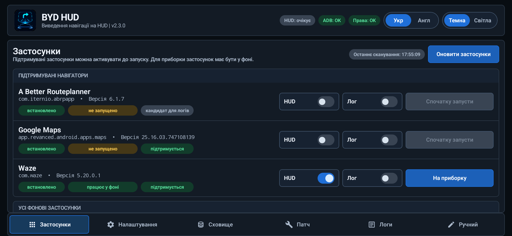</p>

## Навігаційні канали

BYD HUD використовує сумісний прямий канал вибраного навігатора. Accessibility і доступ до сповіщень можуть залишатися доступними для діагностики, але не постачають і не керують навігаційним виводом на HUD.

| Навігатор | Дані прямого каналу | Основні обмеження |
| --- | --- | --- |
| Google Maps ReVanced | Структурований маневр, відстань, дорога, смуги за наявності, відрендерене зображення маневру, час прибуття, залишок часу та залишок дистанції | Потребує сумісного патченого пакета ReVanced |
| Waze | Структуровані маневр, відстань, вулиця, смуги, попередження сесії та показники маршруту | Для повного виводу потрібна сумісна патчена в межах проєкту збірка |

За замовчуванням прямий канал не змінює екран навігатора, а навігаційні дані у фоновому режимі надсилаються в BYD HUD. Якщо увімкнено `Запускати з власним surface`, Waze і далі використовує звичайний екран для пошуку та вибору маршруту, а після початку навігації передає активну мапу й елементи керування в окремий маршрутний екран. Звичайний direct-вивід Waze залишається доступним під час запуску цього екрана; якщо він не готовий протягом п'яти секунд, BYD HUD зберігає вивід, не завершуючи маршрут. Google Maps завжди зберігає звичайний екран.

### Поточна сумісність навігаторів

| Сценарій | Пакет | Поточна підтримувана версія |
| --- | --- | --- |
| Прямий вивід і патчення Waze | `com.waze` | stock `4.95.0.3` або патчена в межах проєкту `5.20.0.1` |
| Прямий вивід і фіксоване завантаження Google Maps | `app.revanced.android.apps.maps` | Google Maps ReVanced `26.30.09.950492155` |

Патчер перевіряє цілісність і структурну сумісність вибраного пакета. Підпис проєкту чи репозиторію не є обов'язковим, а самого збігу номера версії недостатньо.

### Перемикання прямого каналу

- BYD HUD переходить на прямий канал одразу після отримання коректних даних.
- Якщо прямі оновлення припиняються, застарілий вивід очищується, а канал навігатора виконує власне відновлення.
- Accessibility, сповіщення та вміст екрана ніколи не замінюють прямий канал і не забирають у нього ownership.
- Статус `HUD` активний лише тоді, коли навігаційні підказки фактично надсилаються в автомобіль. Вибір навігатора без запуску маршруту залишає статус очікування.

## Використання вкладки «Застосунки»

Після початкового налаштування вкладка `Застосунки` є звичайним стартовим екраном.

Примітка вгорі містить підтримувані збірки навігаторів. Кожна дія `Скачати` отримує один фіксований файл із релізу проєкту, показує прогрес у рядку, перевіряє SHA-256, пакет, версію, version code і підпис, а потім пропонує системний інсталятор Android. Сумісна встановлена версія оновлюється штатно; видалення пропонується лише після явного підтвердження, якщо Android не може безпечно замінити встановлений підпис або версію.

1. Знайдіть Google Maps або Waze у розділі підтримуваних навігаційних застосунків.
2. Увімкніть `HUD` до або після запуску навігатора.
3. Запустіть маршрут у навігаторі.
4. Використовуйте `На приборку` або `На основний екран` лише тоді, коли застосунок запущений.
5. Увімкніть `Лог` лише тоді, коли потрібні розширені логи конкретної сесії застосунку. Базові щоденні події та навігаційні логи записуються незалежно від цього перемикача.

На цій вкладці також показані інші застосунки, які можна переміщувати між дисплеями, але аналіз навігації та вивід на HUD доступні лише для підтримуваних навігаторів.

### Індикатори стану

| Статус | Значення |
| --- | --- |
| `HUD: працює` | Навігаційні дані зараз надходять на HUD автомобіля |
| `HUD: очікує` | Навігаційні підказки зараз не надсилаються на HUD автомобіля |
| `HUD: помилка` | Спроба обов'язкового виводу на HUD завершилася помилкою; стани ADB і дозволів показуються окремо |
| `ADB: OK` | Потрібні налаштування й дозволи застосунку присутні; це не індикатор активного ADB-з'єднання |
| `ADB: не видано` | Відсутнє одне або кілька потрібних налаштувань чи дозволів застосунку |
| `Права: OK` | Потрібні дозволи й служби застосунку готові |
| `Права: немає` | Потрібно відновити один або кілька дозволів чи служб застосунку |

## Налаштування виводу навігації

Вкладка `Налаштування` керує даними, які надсилає BYD HUD. Зміна перемикача впливає на наступний стан HUD, але не змінює мапу всередині навігатора.

### Основний вивід навігації

| Налаштування | За замовчуванням | Коли увімкнено | Коли вимкнено |
| --- | --- | --- | --- |
| `Вивід PNG` | Увімкнено | Показує відрендерене зображення маневру або попередження | Приховує поле відрендереного зображення |
| `Вивід штатного маневру` | Увімкнено | Показує штатну динамічну стрілку автомобіля | Приховує поле штатної стрілки |
| `Вивід смуг` | Увімкнено | Показує рекомендовані смуги, коли вони доступні | Приховує підказки щодо смуг |
| `Вивід дистанції` | Увімкнено | Показує відстань до поточного маневру | Приховує відстань до маневру |
| `Вивід вулиці` | Увімкнено | Показує поточну дорогу або назву вулиці | Приховує текст вулиці |
| `Транслітерація тексту` | Вимкнено | Опційно перетворює українську або інші системи письма на латиницю для автомобільних дисплеїв, які не відображають їх коректно | Надсилає текст навігатора без змін |
| `Вивід напрямків текстом` | Увімкнено | Використовує підказку на кшталт `Прямуйте далі`, коли назва вулиці відсутня | Не підставляє текстову підказку замість відсутньої назви вулиці |

Текст вулиці має пріоритет над текстовим напрямком, оскільки обидва використовують одне поле автомобіля. Якщо обидва значення порожні, BYD HUD надсилає порожній заповнювач, щоб на екрані не залишався текст попереднього маневру.

Транслітерація має режими `Українська` для українських назв доріг і `Універсальна` для інших систем письма. Вона змінює лише текст, який надсилається в автомобіль, а не текст усередині навігатора.

<p align="center">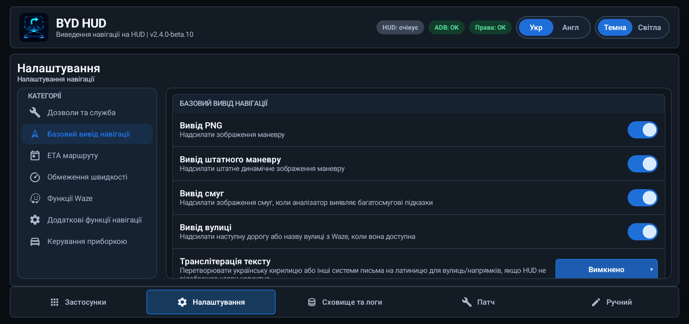</p>

### Показники маршруту

| Налаштування | За замовчуванням | Поведінка |
| --- | --- | --- |
| `Режим виводу ЕТА/часу/дистанції` | Вимкнений | Обирає `Вимкнений`, `До зупинки` або `Весь маршрут`; для всього маршруту Waze використовує кінцеву точку та окремо підставляє доступне значення до наступної зупинки, якщо потрібного показника немає |
| `Показувати час прибуття` | Вимкнено | Додає очікуваний час прибуття в поле вулиці |
| `Показувати залишок часу` | Вимкнено | Додає залишок часу поїздки в поле вулиці |
| `Показувати залишок дистанції` | Вимкнено | Додає залишок дистанції маршруту в поле вулиці |

Три перемикачі значень неактивні в режимі `Вимкнений`, але їхні збережені значення не скидаються.

Увімкнені показники додаються перед назвою вулиці або текстовою підказкою, наприклад:

```text
[ETA: 12:20 | 11 min | 5.1 km] Головна вулиця
```

Прямий канал Google Maps надає всі три показники. Патчена в межах проєкту Waze `5.20.0.1` надає ETA, залишок часу та залишок дистанції до наступної зупинки й для всього маршруту. У маршруті з кількома зупинками режим `Весь маршрут` використовує кінцеву точку; якщо окремий показник усього маршруту недоступний, BYD HUD використовує відповідне доступне значення до наступної зупинки.

<p align="center">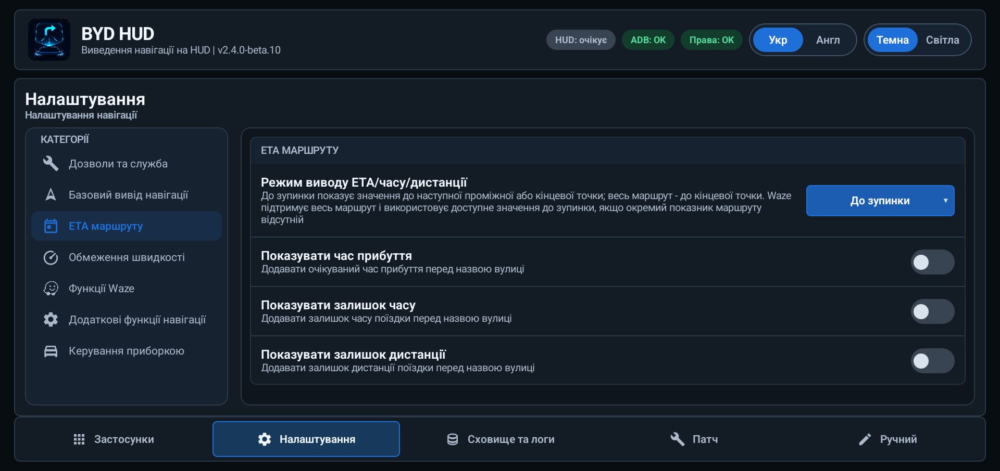</p>

### Обмеження швидкості

| Налаштування | За замовчуванням | Поведінка |
| --- | --- | --- |
| `Режим виводу обмеження швидкості` | Вимкнено | Обирає `Вимкнено`, `У полі з маневром`, `У полі зі смугами`, `У вільному полі` або `Композитний` |
| `Накладання у режимі «У вільному полі»` | Вимкнено | Коли обидва поля зайняті, опційно дозволяє тимчасово замінити поле маневру або смуг |
| `Час показу при накладанні` | 5 секунд | Установлює від 1 до 10 секунд для некомпозитного виводу поверх зайнятого поля |
| `Поле для виводу у композитному режимі` | Тільки маневру | Обирає `Тільки маневру`, `Тільки смуг`, `Вільне або маневру` чи `Вільне або смуг` |
| `Розмір знаку у полі маневру` | 64 px | Задає розмір композитного знака в зображенні маневру від 1 до 103 px |
| `Розмір знаку у полі для смуг` | 36 px | Задає розмір композитного знака в зображенні смуг від 1 до 36 px |

Попередження займає поле маневру з таким самим пріоритетом, як маршрутний маневр. Окремий знак у справді вільному полі залишається до зміни або очищення прямим джерелом; таймер діє лише тоді, коли некомпозитний вивід замінює зайняте поле маневру, попередження або смуг. У композитному режимі знак додається до вибраного зображення маневру або смуг без видалення наявної навігаційної підказки, тому таймер заміни не використовується. Функція потребує актуальної сумісної версії Google Maps або Waze, патченої в межах проєкту.

<p align="center">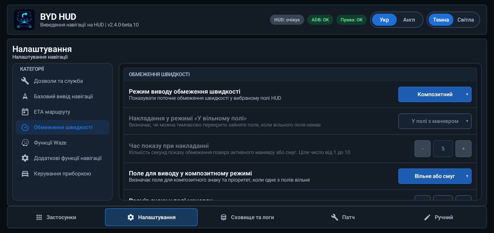</p>

### Додаткова поведінка навігації

| Налаштування | За замовчуванням | Поведінка |
| --- | --- | --- |
| `Обрізка малої дистанції` | Вимкнено | Замінює позитивні відстані менше ніж 11 м на 11 м, щоб уникнути некоректних символів на відповідних версіях HUD |
| `Формувати TBT-картку навіть для активної сесії навігатора без виводу на HUD` | Увімкнено | Передає direct-підказки на TBT-картку панелі приладів незалежно від вибору виводу на лобове HUD; пріоритет має навігатор з HUD, інакше використовується останній запущений маршрут |
| `Перемикатися на TBT-картку при початку виводу на HUD` | Увімкнено | Best-effort обирає TBT-режим панелі приладів при початку direct-виводу на HUD; помилка перемикання не блокує дані TBT або лобового HUD |

<p align="center">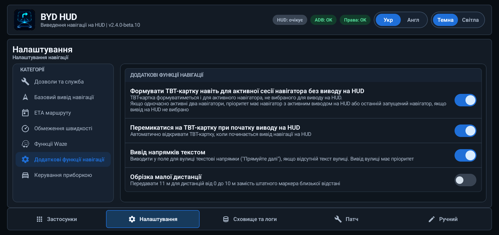</p>

### Функції Waze

| Налаштування | За замовчуванням | Поведінка |
| --- | --- | --- |
| `Показувати попередження Waze` | Увімкнено | Показує ближчий відомий об'єкт, коли конкурують маневр маршруту й попередження Waze; активне попередження використовує власне зображення, дистанцію й текст, зберігає смуги та приховує штатну маршрутну стрілку |
| `Запускати з власним surface` | Вимкнено | Фіксує значення на старті маршруту Waze, а потім відкриває надану Waze мапу в окремому маршрутному екрані; Back повертає звичайний екран Waze до завершення цього маршруту |

<p align="center">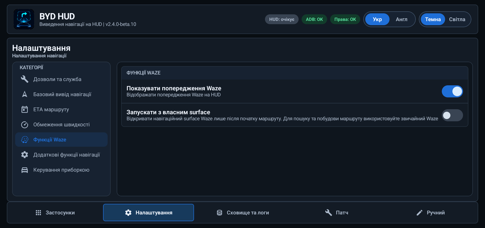</p>

Custom surface діє лише в межах маршруту. Зміна перемикача під час активного маршруту не замінює поточний екран маршруту. Якщо surface не готовий протягом п'яти секунд, BYD HUD залишає стандартний direct-вивід Waze активним і чекає наступного маршруту перед новою спробою. Повернення у Waze в межах того самого маршруту відновлює surface; завершення маршруту закриває його. Перемикач попереджень Waze керує лише попередженнями на лобовому HUD; попередження, які Waze передає в custom surface, залишаються видимими там.

Відновлення маршруту Waze не залежить від перемикача `HUD` або розміщення навігатора на панелі приладів. Маршрут можна почати до відкриття BYD HUD або з вимкненим виводом на лобове HUD, а після завершення попереднього маршруту можна запустити справді новий. Запізнілі оновлення старого маршруту ігноруються й не відкривають його повторно.

## Вивід на панель приладів

`На приборку` переміщує запущений застосунок на панель приладів. `На основний екран` повертає його на центральний дисплей.

| Налаштування | За замовчуванням | Поведінка |
| --- | --- | --- |
| `Режим екрану на приборці` | Повний | Вибирає `Немає`, `Частковий` або `Повний` режим після переміщення навігатора на приборку |
| `Ширина` | Повний 100%; Частковий 30% | Наживо змінює ширину вікна від 20% до 100% |
| `Висота` | Повний 75%; Частковий 75% | Наживо змінює висоту вікна від 20% до 100% |
| `Горизонтальне зміщення` | Повний 50%; Частковий 99% | Розміщує вікно у вільному просторі: 0% ліворуч, 50% по центру, 100% праворуч |
| `Масштаб` | Повний 100%; Частковий 50% | Наживо змінює масштаб вмісту навігатора всередині вікна від 20% до 150% |

Навігатор уже повинен бути запущений, а керування панеллю потребує авторизованого ADB. BYD HUD спочатку переміщує вікно навігатора та перевіряє його розміщення. `Немає` лише переміщує навігатор і залишає поточний режим панелі без змін; його повзунки геометрії приховані. Для режимів `Частковий` і `Повний` значення ширини, висоти, зміщення та масштабу зберігаються окремо, тому налаштування одного режиму не змінює інший. Відпускання повзунка одразу застосовує значення лише тоді, коли відповідний режим активний; інакше воно зберігається для наступного переміщення. Зміна списку сама по собі не надсилає команду автомобілю. Помилка запиту режиму залишає навігатор на приборці та показує помилку. Для повернення скористайтеся `На основний екран`. Під час активного маршруту з custom surface Waze маршрутний екран переміщується разом із Waze, тому екран налаштувань BYD HUD не переноситься помилково.

<p align="center">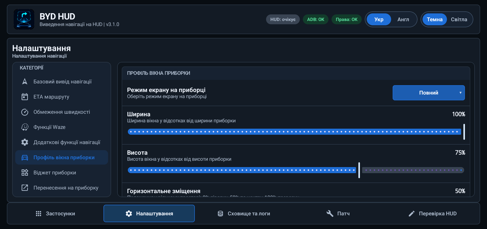</p>

<!-- Місце для фото: docs/screenshots/uk/dashboard.jpg
Використайте горизонтальне фото реальної панелі приладів. Розмістіть його тут.
Рекомендована розмітка:
<p align="center"></p>
-->

> Користуйтеся керуванням панеллю приладів лише під час стоянки. Деякі штатні режими додають темні області зверху та знизу. BYD HUD може змінити висоту вікна, але не може прибрати елементи, які малює прошивка автомобіля.

## Патчер навігаторів

Вкладка `Патч` опційна. Вона може додати прямий канал BYD HUD до структурно сумісного пакета Waze або Google Maps ReVanced, не завантажуючи APK на сервер.

<p align="center">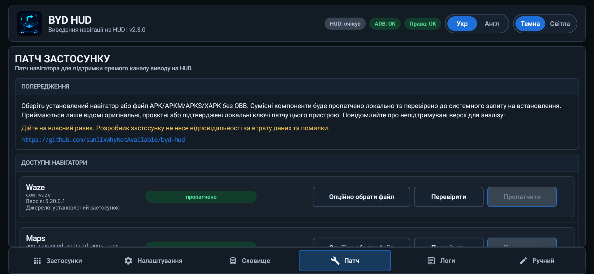</p>

### Підтримувані вхідні файли

- встановлений пакет `com.waze` або `app.revanced.android.apps.maps`;
- завантажений файл `.apk`;
- сумісний split-пакет `.apkm` або `.apks`;
- архів `.xapk`, який містить лише APK.

Офіційний пакет Google Maps `com.google.android.apps.maps`, пакети з OBB-даними та непідтримувані структури пакетів відхиляються. Наразі розпізнаються такі вхідні файли для патчення: Waze `4.95.0.3` / `5.20.0.1` та Google Maps ReVanced `25.16.03.747108139` / `26.30.09.950492155`.

### Як працює патчення

1. Виберіть встановлений навігатор або опційно оберіть завантажену версію.
2. Натисніть `Перевір`, щоб переконатися в цілісності пакета та відповідності його файлів і структури підтримуваній версії.
3. Перегляньте індикатори стану компонентів. Waze окремо показує прямий канал, смуги, стабільність і попередження. Google Maps окремо показує прямий канал, обробку діалогу служб Google, аудіо та PiP.
4. Натисніть `Пропатчити` та підтвердьте попередження.
5. BYD HUD повторює всі перевірки сумісності, змінює лише розпізнані частини застосунку, підписує повний набір пакетів ключем, створеним на цьому планшеті, та пропонує Android встановити його.

Для Waze прямий канал і смуги є обов'язковими, а стабільність і попередження залишаються опційними. Компоненти Google Maps Direct, обробка діалогу служб Google, Audio і PiP незалежні, тому один компонент не визначає роботу іншого. PiP вимикає режим «картинка в картинці», але не вимикає зміну розміру вікна на панелі приладів. Компонент Direct для Google Maps 26.30 отримує відрендерені Google зображення маневрів без потреби тримати картку маневру видимою. Попередження Waze наразі доступні лише для сумісної Waze 5.20.0.1.

`Перевір` і `Пропатчити` використовують постійні картки прогресу, які залишаються видимими під час перемикання вкладок. Waze і Google Maps можна перевіряти або готувати одночасно, але Android установлює їх по одному. Картки патчення розміщуються разом із прогресом архівації/надсилання та не перекривають одна одну. `Зупинити` доступне лише доти, доки операцію ще можна безпечно скасувати; завершену, скасовану або невдалу картку можна прибрати кнопкою `Закрити`.

### Підпис і дані застосунку

- Постійний ключ підпису створюється локально всередині BYD HUD.
- Наступний сумісний патч, підписаний тим самим ключем, зазвичай можна встановити як оновлення.
- Якщо встановлений застосунок має несумісний підпис, може знадобитися спочатку видалити навігатор, що видалить його локальні дані.
- Очищення даних або видалення BYD HUD також видаляє локальний ключ підпису.
- Сумісність визначається за самим обраним застосунком, а не за місцем завантаження файла. Android однаково перевіряє сумісність підпису під час оновлення встановленого застосунку.

Перед патченням створіть резервну копію важливих даних навігатора та увійдіть у свій обліковий запис. Патчер ніколи не надсилає вибрані APK на сервер. Окремі дії завантаження на вкладці `Застосунки` отримують лише фіксовані файли навігаторів, які зараз доступні на цій вкладці; патчення обраного користувачем джерела й далі виконується локально.

## Налаштування роботи й обслуговування

| Налаштування | За замовчуванням | Призначення |
| --- | --- | --- |
| `Авто-запуск` | Увімкнено | Перезапускає runtime BYD HUD після підтримуваних подій завантаження та оновлення |
| `Зберігати діагностичні скріншоти та розширені логи` | Вимкнено | Записує додаткові навігаційні дані; вмикайте лише для діагностики, оскільки вони займають більше місця |
| `Перевіряти оновлення` | Увімкнено | Перевіряє стабільний канал релізів GitHub |
| `Участь у бета-тестуванні` | Вимкнено | Включає попередні версії, які можуть працювати нестабільно або бути зламаними |

`Дозволи ADB` запускає налаштування дозволів, коли це потрібно. `Робота у фоні` відкриває системну сторінку BYD, де BYD HUD потрібно виключити з фонового блокування. `Вимкнути` зупиняє вивід на HUD та коректно завершує runtime.

<p align="center">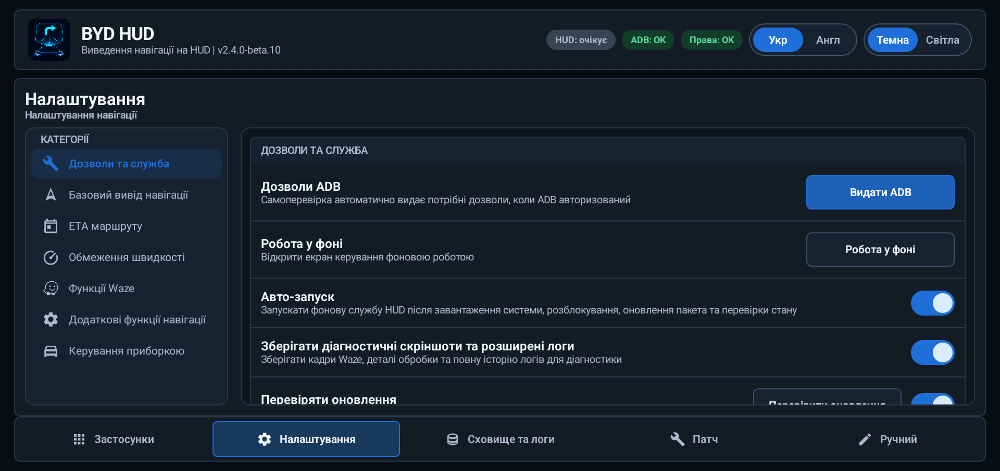</p>

## Сховище, логи та приватність

BYD HUD зберігає навігаційні дані в теках за днями, щоб можна було надіслати одну поїздку без розкриття даних за інші дні.

### Вкладка «Сховище та логи»

- показує поточний розмір логів та налаштоване обмеження;
- групує навігаційні логи, snapshots, скріншоти та опційний logcat за днями;
- показує розташування приватної та публічної тек із журналом навігації;
- надсилає або видаляє лише вибрані дні;
- перед створенням ZIP показує кількість файлів, розмір архіву та попередження про конфіденційні дані;
- використовує одну кнопку `Почати Logcat` / `Зупинити Logcat`, яка змінюється відповідно до стану запису системного журналу;
- надає `Поділитись конф-єю` для меншого діагностичного архіву з даними про пристрій, дозволи, мережу, патчер і налаштування навігаційного виводу.

<p align="center">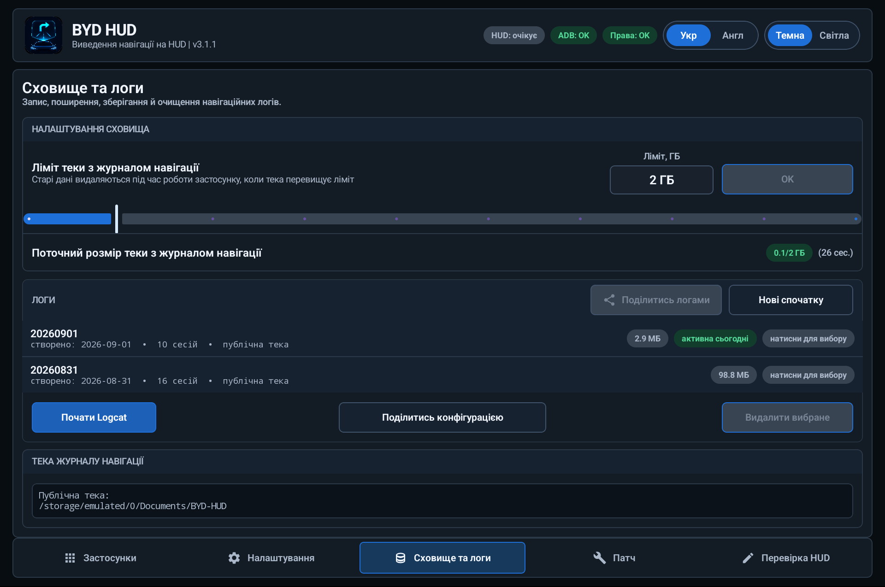</p>

Підготовка архіву відображається в постійній картці прогресу, яка залишається видимою на інших вкладках і яку можна безпечно зупинити. Вона розміщується разом із картками патчення Waze і Google Maps, не перекриваючи їх.

`Поділитися вибраним` пропонує два явні способи:

- `Інший застосунок` відкриває стандартне системне меню Android;
- `Надіслати розробнику` одноразово завантажує той самий вибраний ZIP у сервіс Sentry.

<p align="center">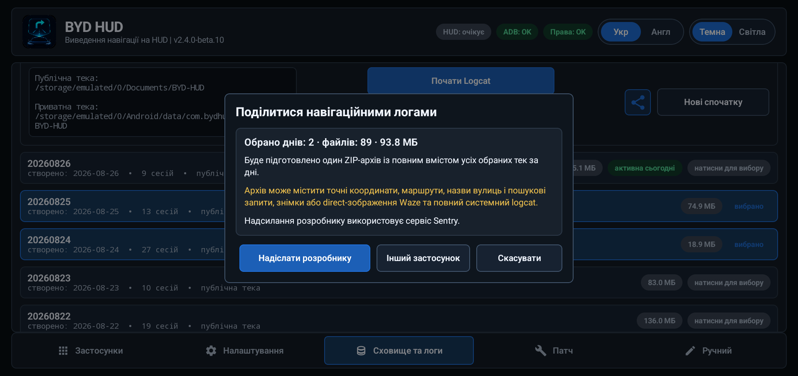</p>

Після успішного відкриття системного меню Android або успішного завершення `Надіслати розробнику` BYD HUD знімає вибір лише тих днів, які були зафіксовані для цього архіву. Помилка створення, відкриття меню, завантаження або скасування зберігає вибір. Дні, вибрані вже під час завантаження, залишаються вибраними.

З авторизованим ADB запуск Logcat записує всі системні буфери та фіксує початковий стан швидкодії, а зупинка додає підсумкові показники кадрів і системи. Без ADB та сама кнопка зі змінним станом записує доступні застосунку буфери й діагностику. Пресетів фіксованої тривалості немає. Надсилання конфігурації працює без ADB; уже авторизований міст лише додає більше системної діагностики для читання. Надсилання не запитує доступ ADB і не вмикає телеметрію.

BYD HUD не надсилає автоматично у сервіс Sentry звіти про збої, показники швидкодії, скріншоти, записи екрана або навігаційні логи. Повна політика наведена у файлі [PRIVACY](PRIVACY.uk.md).

## Перевірка HUD

Вкладка `Перевірка HUD` перевіряє підтримувані навігаційні дисплеї автомобіля без активного маршруту в Google Maps або Waze. Виберіть режим виводу та натисніть `Почати`; користуйтесь перевіркою на стоянці, а не як джерелом навігації.

- `Базовий вивід` має незалежні кнопки попереднього/наступного значення для маневрів, смуг, дистанцій, назв вулиць і прикладів світлофора. Для маневрів і смуг окремо доступні `Штатне` або `Bitmap`: штатні символи малює сам автомобіль, а Bitmap передає зображення, створене BYD HUD. Native-стрілка маневру завжди штатна. Дистанції перемикаються по колу: `1 / 11 / 20 / 55 / 155 / 1555 / 15555` метрів. Назви вулиць містять слова латиницею та кирилицею; локальний перемикач транслітерації перетворює кирилицю на латиницю, не змінюючи вибране слово чи налаштування звичайної навігації.
- `Розширений вивід` зберігає штатний маневр прямо, штатні смуги, `77 м` та `Continue straight`, поки змінюються додаткові поля: ETA, обмеження швидкості, мапи, камери, світлофори та інші. `Авто` змінює вибраний приклад кожні 500 мс; його вимкнення залишає поточний приклад і вмикає кнопки попереднього/наступного значення. Панель пояснює очікуваний вміст. Не кожний автомобіль підтримує кожне поле, а успішне надсилання не доводить, що автомобіль його відобразив.

`Зупинити`, вихід із вкладки, згортання BYD HUD або перемикання між базовим і розширеним виводом завершує перевірку та очищає її дані. Вивід із навігатора відновлюється, якщо його маршрут досі активний і має право на вивід. Повторний запуск зберігає вибраний приклад. Тестові значення не змінюють налаштування Waze чи Google Maps. Авторизований ADB вмикає додатковий автомобільний інтерфейс, потрібний на сумісних авто для штатних смуг та деяких інших полів; недоступність одного виходу не заважає перевірці інших. TBT-картка використовує власне розташування маневру й тексту, а не копію смуг або bitmap-зображення з HUD.

Нижче збережено зображення попереднього інтерфейсу перевірки; нові скріншоти вкладки «Перевірка HUD» очікуються.

<p align="center">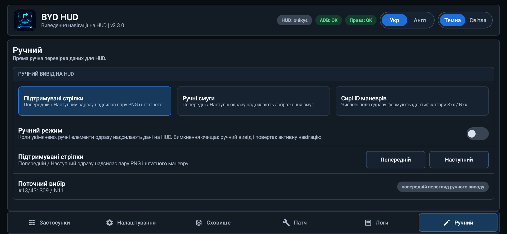</p>

## Встановлення

### Вимоги

- Android 10 або новіший;
- сумісний автомобіль BYD для китайського ринку та система DiLink;
- дозвіл на встановлення APK на планшеті;
- увімкнена опція `Navigation fusion` у налаштуваннях HUD автомобіля для показу штатних стрілок маневру;
- BYD HUD виключений із фонового блокування застосунків BYD.

### Перше налаштування

1. Завантажте актуальний APK із [GitHub Releases](https://github.com/sunlixWhyNotAvailable/byd-hud/releases/latest).
2. Встановіть його на планшет автомобіля та відкрийте BYD HUD.
3. Під час першого запуску перегляньте вкладку `Налаштування` та надайте потрібні базові дозволи.
4. Опційно підтвердьте запит RSA-ключа ADB для керування панеллю приладів, публічного сховища логів, автоматичного відновлення дозволів і розширеної діагностики.
5. Відкрийте системні налаштування BYD та встановіть `Disable background Apps -> BYD HUD` у стан `Off`.
6. Поверніться до `Застосунки`, увімкніть `HUD` для Google Maps або Waze та почніть навігацію.
7. Для сумісного навігатора прямий канал запускається автоматично, коли навігатор надає активний маршрут.

Якщо наявний RSA-ключ ADB авторизований, інтеграція з навігаційною карткою панелі приладів запускається автоматично разом із BYD HUD і не потребує окремого налаштування чи індикатора. Без авторизованого ADB сумісна пряма навігація й далі може надходити на лобове HUD, але навігаційна картка та керування переміщенням на панель приладів недоступні на перевіреній прошивці.

Коли `Вивід смуг` увімкнено і навігатор надає смуги, BYD HUD публікує підказку через усі підтримувані автомобільні навігаційні виходи. Авторизований ADB дає додатковий автомобільний інтерфейс смуг, потрібний деяким автомобілям; він не перетворює TBT-картку маневру на копію зображення смуг із HUD. Порожня або завершена навігаційна підказка очищає попередні смуги, щоб на екрані не залишалася застаріла інформація.

### Що потребує ADB

| Функція | Без ADB | З авторизованим ADB |
| --- | --- | --- |
| Сумісний прямий навігатор -> лобове HUD | Працює | Працює |
| Навігаційна картка панелі приладів | Недоступна на перевіреній прошивці | Доступна автоматично |
| Інтерфейс застосунку та налаштування навігації | Працюють | Працюють |
| Автоматичне відновлення дозволів | Обмежене | Доступне |
| Публічне сховище логів за днями | Обмежене дозволами Android | Доступне |
| Керування виводом на панель приладів | Недоступне на перевіреній прошивці | Доступне |
| Розширена діагностика конфігурації | Базовий звіт | Розширений звіт |
| Відновлення runtime після завершення процесу | Може знадобитися повторно відкрити застосунок | Налаштування запуску та runtime можуть відновити роботу |

## Усунення проблем

### HUD залишається у стані `очікує`

- Переконайтеся, що `HUD` увімкнено для правильного навігатора.
- Запустіть активний маршрут: сам вибір навігатора не створює дані для HUD.
- Перевірте, чи встановлена збірка навігатора підтримує прямий канал.
- Якщо відсутня лише штатна стрілка, переконайтеся, що в налаштуваннях HUD автомобіля увімкнено `Navigation fusion`.

### HUD показує `помилка`

- Відкрийте `Налаштування` та запустіть `Дозволи ADB`, якщо ADB доступний.
- Окремо перевірте індикатори `ADB` і `Права`.
- Переконайтеся, що BYD HUD дозволено працювати у фоновому режимі.

### Вивід блимає або чергується

Інший HUD-застосунок може одночасно надсилати навігаційні дані. Зупиніть його та повторіть перевірку.

## Як повідомити про проблему

Створіть [GitHub issue](https://github.com/sunlixWhyNotAvailable/byd-hud/issues) і додайте:

- версію BYD HUD;
- модель і рік випуску автомобіля, версію DiLink та прошивку планшета;
- назву й версію навігатора;
- очікувану поведінку та те, що з'явилося на планшеті й HUD;
- приблизний локальний час проблеми;
- архів за вибраний день, архів конфігурації або ідентифікатор звіту Sentry, якщо це доречно.

Для проблеми з навігаційним виводом:

1. За можливості відтворіть її з увімкненою опцією `Зберігати діагностичні скріншоти та розширені логи`.
2. Відкрийте `Сховище та логи` та виберіть лише день із проблемою.
3. Натисніть `Поділитися вибраним` і виберіть месенджер або `Надіслати розробнику`.
4. Після перевірки вимкніть розширену діагностику, щоб зменшити використання сховища.

Для проблеми з дозволами, пристроєм, патчером або запуском скористайтеся `Сховище та логи -> Поділитись конф-єю`.

> Навігаційні архіви можуть містити координати, знайдені пункти призначення, назви вулиць, текст сповіщень, скріншоти та ідентифікатори пристрою. Перед надсиланням прочитайте попередження та використовуйте лише мінімально потрібний день.

## Відомі обмеження

- Інші HUD-застосунки, які одночасно надсилають навігаційні дані, можуть спричиняти блимання або нестабільність.
- Патчер підтримує пакет Google Maps ReVanced `app.revanced.android.apps.maps`, а не офіційний `com.google.android.apps.maps`.
- Показники маршруту Waze залежать від оцінок до пунктів призначення, які надає підтримувана патчена в межах проєкту Waze `5.20.0.1`; недоступний показник усього маршруту замінюється відповідним значенням до наступної зупинки.
- Попередження Waze залежать від того, чи надає їх Waze, і доступні лише із сумісною Waze `5.20.0.1`.
- Custom surface Waze є опційним beta-шляхом. Він потребує робочого direct-каналу Waze і запускається лише після повідомлення Waze про активну навігацію; якщо surface не готовий, через п'ять секунд звичайний direct-вивід залишається активним.
- Штатна прошивка панелі приладів може додавати темні області до виведеного вікна.
- Непідтримувані багатофайлові пакети та XAPK із OBB-даними не можна пропатчити.
- Для штатних стрілок потрібна опція `Navigation fusion` у налаштуваннях HUD автомобіля.
- Деякі прошивки можуть завершувати процес без налаштування фонової роботи та запуску за допомогою ADB.

## Внесок і подяки

Issues та цільові pull requests вітаються. Перед пропозиціями змін для аналізу конкретного навігатора опишіть автомобіль, прошивку, версію навігатора та відтворювану видиму проблему.

- MaxTitan поділився початковою концепцією прямого каналу Waze та довідковими матеріалами для передавання підказок Waze в автомобілі BYD.
- Проєкт OpenBYD надихнув частину підходу до інтеграції з автомобілем для ширшої сумісності навігаційної картки та HUD. Реалізацію й поведінку BYD HUD було окремо перевірено на SL06 та SL07.
- Підхід до зміни розміру вікна на панелі приладів натхнений проєктом [BYD Mate](https://github.com/AndyShaman/BYDMate).
- Олексій (Oleksiy) надавав діагностику й логи та виконував тестування, верифікацію і перевірку роботи BYD HUD на BYD Sea Lion 06 EV.

## Перевірені пристрої

| Автомобіль | Ринок | DiLink | Стан |
| --- | --- | --- | --- |
| BYD Sea Lion 07 EV 2025 | Китай | 5.0 | Перевірено розробником |
| BYD Sea Lion 07 EV 2024 | Китай | 5.0 | Перевірено користувачем проєкту |
| BYD Sea Lion 06 EV | Китай | 5.0 | Перевірено користувачем проєкту |

Вивід на HUD підтверджено на перевіреній прошивці планшета починаючи з версії `2510`. Інші моделі, регіони, версії прошивки, роздільні здатності та панелі приладів можуть поводитися інакше.

## Ліцензія та застереження

BYD HUD розповсюджується за ліцензією [GNU Affero General Public License v3.0](LICENSE).

Це незалежний проєкт, який не пов'язаний із BYD, DiLink, Waze, Google, Google Maps або ABRP, не підтримується та не спонсорується ними. Усі назви продуктів і торговельні марки належать їхнім відповідним власникам.

Ви використовуєте програмне забезпечення на власний ризик. Зміна або заміна пакетів навігатора може видалити локальні дані застосунку або спричинити неочікувану поведінку. Дотримуйтеся місцевих законів, не відволікайтеся від дороги та налаштовуйте або діагностуйте систему лише під час стоянки.
