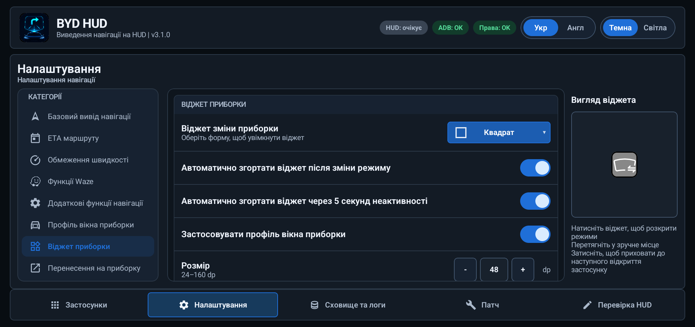
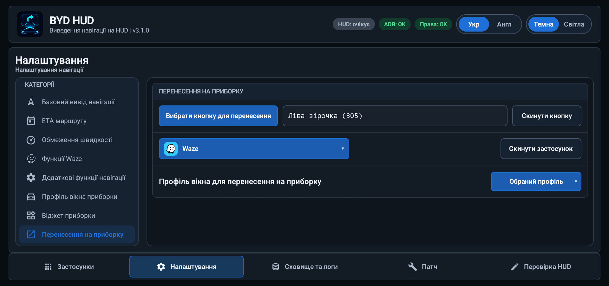
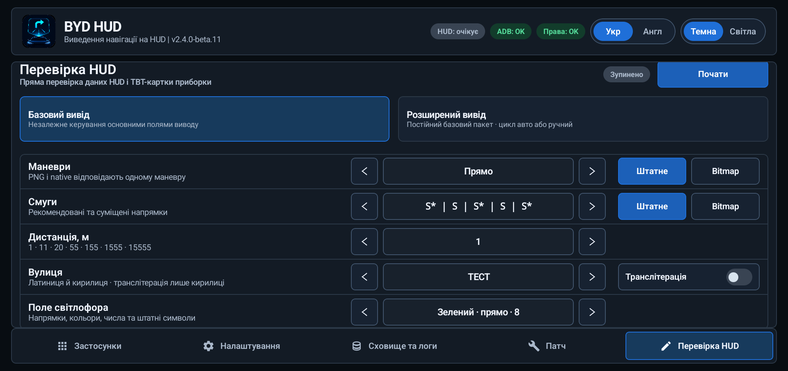
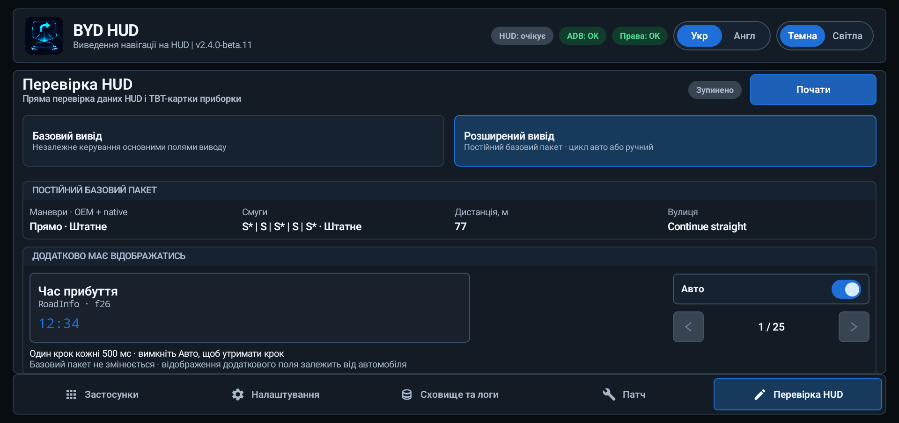

# BYD HUD

[English](README.md) | **Українська**


BYD HUD передає дані активного маршруту Google Maps або Waze у навігаційні поля, які вже є в сумісних автомобілях BYD для китайського ринку. Мапа залишається в навігаторі, а маневр, відстань, вулиця, смуги, попередження та опційні показники поїздки окремо надсилаються на HUD.

Застосунок також керує показом навігатора на панелі приладів, веде діагностичні логи за днями, завантажує перевірені збірки навігаторів і може локально пропатчити сумісний навігатор для роботи з BYD HUD.

- **Версія:** v3.2.3
- **Мови інтерфейсу:** українська, англійська й російська; опис оновлення показується вибраною мовою, а за відсутності перекладу — англійською.
- **Підтримувані навігатори:** Google Maps і Waze
- **Перевірена платформа:** Android 12 / DiLink 5.0
- **Початок роботи:** [завантажте останній реліз](https://github.com/sunlixWhyNotAvailable/byd-hud/releases/latest) і виконайте розділ [Встановлення](#встановлення)
- **Потрібна допомога:** прочитайте [Усунення проблем](#усунення-проблем), а потім [повідомте про проблему](#як-повідомити-про-проблему), додавши архів за потрібний день

> **Використання ШІ:** У цьому проєкті генеративні інструменти ШІ використовуються для аналізу коду й діагностичних логів, реалізації змін, тестування та підготовки документації.

BYD HUD не є заміною Android Auto. Google Maps і Waze й далі відповідають за пошук та вибір маршруту; опційний маршрутний екран Waze застосовується лише після початку навігації.

## Що робить BYD HUD

BYD HUD отримує активні навігаційні підказки з підтримуваного навігатора та передає корисні дані в автомобіль:

- поточний маневр і штатну динамічну стрілку;
- відстань до маневру;
- назву вулиці або текстовий напрямок;
- рекомендовані смуги, якщо джерело їх надає;
- попередження Waze, якщо активна сесія Waze їх надає;
- опційно час прибуття, залишок часу та залишок дистанції;
- опційно зображення навігатора на панелі приладів.

Google Maps і Waze продовжують відповідати за мапу та маршрут. BYD HUD лише координує навігаційні дані, вивід на HUD, відображення на панелі приладів, діагностику та опційне локальне патчення навігатора.

## Можливості

| Напрям | Що доступно |
| --- | --- |
| Вивід навігації | Зображення маневру, штатна стрілка, відстань, вулиця або текстова підказка, смуги та опційні показники маршруту |
| Прямі канали | Навігаційні підказки безпосередньо від сумісної патченої версії Google Maps або Waze |
| Керування панеллю приладів | Переміщення запущеного навігатора між дисплеями, вибір режиму екрану та налаштування вікна проєкції |
| Віджет приборки | Рухома кнопка для режимів IPC OFF, TBT, MINI та FULL з опційним застосуванням збережених профілів вікна |
| Завантаження навігаторів | Завантаження та перевірка фіксованих файлів навігаторів, доступних у вкладці `Застосунки` |
| Патчер навігаторів | Перевірка та локальне патчення сумісних пакетів Google Maps або Waze для підтримки прямого каналу |
| Сховище та логи | Запис діагностики й показників швидкодії, керування логами за днями та надсилання лише вибраних даних |
| Оновлення | Стабільні релізи за замовчуванням та опційний канал бета-версій |
| Перевірка HUD | Перевірка штатних і bitmap-підказок, тексту, дистанцій, світлофорів та додаткових полів автомобільних дисплеїв без навігатора |

Поки BYD HUD працює, перемикання вкладок або повернення з іншого застосунку відновлює вибрану вкладку та її положення прокручування. Кожний розділ налаштувань також зберігає власне положення. Після виходу, вимкнення або повного перезапуску застосунку інтерфейс відкривається заново.

<p align="center"></p>

## Навігаційні канали

BYD HUD отримує навігаційні підказки безпосередньо від сумісного навігатора. Дозволи спеціальних можливостей і доступу до сповіщень не замінюють сумісну збірку навігатора.

| Навігатор | Дані прямого каналу | Основні обмеження |
| --- | --- | --- |
| Google Maps ReVanced | Маневри, відстань, вулиця, смуги за наявності, час прибуття, залишок часу та залишок дистанції | Потребує сумісного патченого пакета ReVanced |
| Waze | Маневри, відстань, вулиця, смуги, попередження та показники маршруту | Для повного виводу потрібна сумісна патчена в межах проєкту збірка |

За замовчуванням екран навігатора не змінюється, а підказки у фоновому режимі надсилаються в BYD HUD. Якщо увімкнено `Запускати з власним surface`, Waze і далі використовує звичайний екран для пошуку та вибору маршруту, а після початку навігації відкриває окремий маршрутний екран. Якщо цей екран не відкриється, звичайний вивід на HUD продовжиться. Google Maps завжди зберігає звичайний екран.

### Поточна сумісність навігаторів

| Сценарій | Пакет | Поточна підтримувана версія |
| --- | --- | --- |
| Прямий вивід і патчення Waze | `com.waze` | stock `4.95.0.3` або патчена в межах проєкту `5.20.0.1` |
| Прямий вивід і фіксоване завантаження Google Maps | `app.revanced.android.apps.maps` | Google Maps ReVanced `26.30.09.950492155` |

Патчер перевіряє цілісність і структурну сумісність вибраного пакета. Підпис проєкту чи репозиторію не є обов'язковим, а самого збігу номера версії недостатньо.

### Перемикання прямого каналу

- Підказки з'являються, коли сумісний навігатор починає надавати дані маршруту.
- Якщо оновлення припиняються, застарілі підказки прибираються до появи свіжих даних.
- Статус `HUD` активний лише тоді, коли навігаційні підказки фактично надсилаються в автомобіль. Вибір навігатора без запуску маршруту залишає статус очікування.

## Використання вкладки «Застосунки»

Після початкового налаштування вкладка `Застосунки` є звичайним стартовим екраном.

Примітка вгорі групує підтримувані збірки в компактні секції навігаторів з окремим обрамленим рядком для кожної версії. Дія `Скачати` отримує запропоновану збірку з релізу проєкту, показує прогрес і перевіряє цілісність та сумісність завершеного файла. Невдала операція показує `Помилка`, що відкриває її причину, та `Повторити` в тому самому рядку. Очікування мережі залишає завантаження активним. `Встановити` відкриває системний інсталятор Android. `Встановлено` залишається активною: повторно встановлює збережений APK або спочатку завантажує його для встановлення наступним натисканням. Після видалення навігатора дія змінюється на `Встановити`, якщо перевірений APK залишився, інакше — на `Скачати`. Сумісна встановлена версія оновлюється штатно; видалення пропонується лише після явного підтвердження, якщо Android не може безпечно оновити встановлений застосунок.

1. Знайдіть Google Maps або Waze у розділі підтримуваних навігаційних застосунків.
2. Увімкніть `HUD` до або після запуску навігатора.
3. Запустіть маршрут у навігаторі.
4. Використовуйте `На приборку` або `На основний екран` лише тоді, коли застосунок запущений.
5. Увімкніть `Лог` лише тоді, коли потрібні розширені логи конкретної сесії застосунку. Базові щоденні події та навігаційні логи записуються незалежно від цього перемикача.

На цій вкладці також показані інші застосунки, які можна переміщувати між дисплеями, але аналіз навігації та вивід на HUD доступні лише для підтримуваних навігаторів.

### Індикатори стану

| Статус | Значення |
| --- | --- |
| `HUD: працює` | Навігаційні дані зараз надходять на HUD автомобіля |
| `HUD: очікує` | Навігаційні підказки зараз не надсилаються на HUD автомобіля |
| `HUD: помилка` | Спроба обов'язкового виводу на HUD завершилася помилкою; стани ADB і дозволів показуються окремо |
| `ADB: OK` | Потрібні налаштування й дозволи застосунку присутні; це не індикатор активного ADB-з'єднання |
| `ADB: не видано` | Відсутнє одне або кілька потрібних налаштувань чи дозволів застосунку |
| `Права: OK` | Потрібні дозволи й служби застосунку готові |
| `Права: немає` | Потрібно відновити один або кілька дозволів чи служб застосунку |

## Налаштування виводу навігації

Вкладка `Налаштування` керує даними, які надсилає BYD HUD. Зміна перемикача впливає на наступний стан HUD, але не змінює мапу всередині навігатора.

Заокруглена кнопка `?` біля базових налаштувань, ЕТА, обмежень швидкості та Waze відкриває схематичний передпоказ. Його елементи керування змінюють лише картинку, а не збережені налаштування чи HUD. Приклади відповідають мові застосунку, формату вулиці та вибраним кольорам. Експериментальні поля ЕТА/Waze використовують окремі області HUD. Деякі скріншоти нижче показують попередній вигляд інтерфейсу.

Для зменшення APK 82 ілюстрації довідки стиснуті у WebP (якість 60) з початковою роздільністю 2172×724. Позиції елементів і мовні варіанти збережені; стиснення не впливає на навігаційні картинки, які надсилаються на HUD.

### Основний вивід навігації

| Налаштування | За замовчуванням | Коли увімкнено | Коли вимкнено |
| --- | --- | --- | --- |
| `Вивід PNG` | Увімкнено | Показує відрендерене зображення маневру або попередження | Приховує поле відрендереного зображення |
| `Вивід штатного маневру` | Увімкнено | Показує штатну динамічну стрілку автомобіля | Приховує поле штатної стрілки |
| `Вивід смуг` | Увімкнено | Показує рекомендовані смуги, коли вони доступні | Приховує підказки щодо смуг |
| `Вивід дистанції` | Увімкнено | Показує відстань до поточного маневру | Надсилає нуль; на відповідних штатних HUD замість порожнього поля з'являється `现在` |
| `Обрізка малої дистанції` | Вимкнено | Замінює позитивні відстані менше ніж 11 м на 11 м | Залишає початкову дистанцію; налаштування неактивне при вимкненому виводі дистанції, без скидання збереженого значення |
| `Вивід вулиці` | Увімкнено | Показує поточну дорогу або назву вулиці | Приховує текст вулиці |
| `Транслітерація тексту` | Вимкнено | Опційно перетворює українську або інші системи письма на латиницю для автомобільних дисплеїв, які не відображають їх коректно | Надсилає текст навігатора без змін |
| `Вивід напрямків текстом` | Увімкнено | Використовує підказку на кшталт `Прямуйте далі`, коли назва вулиці відсутня | Не підставляє текстову підказку замість відсутньої назви вулиці |

Назва вулиці має пріоритет над текстовим напрямком. Якщо немає ні того, ні іншого, попередній текст прибирається.

Транслітерація має режими `Українська` для українських назв доріг і `Універсальна` для інших систем письма. Вона змінює лише текст, який надсилається в автомобіль, а не текст усередині навігатора.

<p align="center"></p>

### Показники маршруту

| Налаштування | За замовчуванням | Поведінка |
| --- | --- | --- |
| `Режим виводу ЕТА (час/дистанція)` | Вимкнений | Обирає `Вимкнений`, `До зупинки` або `Весь маршрут`; для всього маршруту Waze використовує кінцеву точку та окремо підставляє доступне значення до наступної зупинки, якщо потрібного показника немає |
| `Поле виводу ЕТА` | Вулиці | Використовує поле вулиці або окремий експериментальний блок праворуч на HUD |
| `Формат ЕТА у полі вулиці` | Приставити | Приставити додає блок у дужках перед вулицею; Замінити показує лише вибрані показники |
| `Дочікуватись повного показу тексту вулиці` | Увімкнено | Зберігає довгий текст ЕТА в полі вулиці до завершення оціненого першого проходження; застосовує лише останнє відкладене оновлення ЕТА, а зміна вулиці діє негайно |
| `Показувати час прибуття` | Вимкнено | Показує очікуваний час прибуття у вибраному полі |
| `Показувати залишок часу` | Вимкнено | Показує залишок часу поїздки у вибраному полі |
| `Показувати залишок дистанції` | Вимкнено | Показує залишок дистанції маршруту у вибраному полі |
| Кольори тексту показників | Білий | Незалежні кольори часу прибуття, залишку часу й дистанції для експериментального виводу |

Три перемикачі значень неактивні в режимі `Вимкнений`, але їхні збережені значення не скидаються. Формат, очікування й кольори залишаються видимими, коли недоступні: формат та очікування потребують поля Вулиці й активного режиму ЕТА; очікування підтримує і Приставити, і Замінити. Кожен колір потребує експериментального поля та ввімкненого відповідного показника.

Очікування повного тексту впливає лише на штатне поле вулиці SOME/IP. Короткий текст оновлюється одразу; маневр, дистанція, смуги й окремі bitmap-області залишаються актуальними, поки довгий текст ЕТА завершує перше проходження. Зміна вихідної вулиці перериває очікування навіть у режимі Замінити, де вулиця прихована. Вимкнення очікування пропускає найновіший текст. Інтервал є приблизним калібруванням Sea Lion 07, а не зворотним зв'язком від дисплея чи гарантією часу на інших прошивках. Instrument/AMap та експериментальний вивід ЕТА не змінюються. Див. [опис реалізації та перевірки](docs/eta-first-pass-wait.md).

Режим Приставити додає ввімкнені доступні показники перед вулицею або текстовою підказкою:

```text
[18:45 | 25 хв | 8,4 км] Головна вулиця
```

Режим Замінити показує `18:45 | 25 хв | 8,4 км` без вулиці та дужок. Недоступні значення пропускаються, а не замінюються нулями. Експериментальний вивід залишає вулицю без змін і показує показники окремо. Його розташування відкаліброване на Sea Lion 07 EV; живий вивід на інших авто ще потребує перевірки, без автоматичного повернення показників у поле вулиці.

Доступні показники залежать від поточної оцінки навігатора. Для Google Maps і Waze BYD HUD зберігає отримані час прибуття та залишок часу без змін. Якщо доступний лише один із них, другий обчислюється з точністю до хвилини; якщо немає обох — обидва залишаються прихованими. Вимкнений показ часу прибуття не заважає використати його для обчислення видимого залишку часу. Це діє для обох форматів у полі вулиці та Експериментального виводу, без зміни даних самого навігатора.

Відсутні значення доповнюються окремо для кожного пункту призначення. У маршруті з кількома зупинками режим `Весь маршрут` використовує кінцеву точку; якщо окремий показник усього маршруту недоступний, BYD HUD використовує відповідне доступне значення до наступної зупинки. Наявне очікування першого проходу тексту продовжує діяти для змін лише ETA у полі вулиці.

<p align="center"></p>

### Обмеження швидкості

| Налаштування | За замовчуванням | Поведінка |
| --- | --- | --- |
| `Режим виводу обмеження швидкості` | Вимкнено | Обирає `Вимкнено`, `У полі з маневром`, `У полі зі смугами`, `У вільному полі` або `Композитний` |
| `Накладання у режимі «У вільному полі»` | Вимкнено | Коли обидва поля зайняті, опційно дозволяє тимчасово замінити поле маневру або смуг |
| `Час показу при накладанні` | 5 секунд | Установлює від 1 до 10 секунд для некомпозитного виводу поверх зайнятого поля |
| `Поле для виводу у композитному режимі` | Тільки маневру | Обирає `Тільки маневру`, `Тільки смуг`, `Вільне або маневру` чи `Вільне або смуг` |
| `Розмір знаку у полі маневру` | 64 px | Задає розмір композитного знака в зображенні маневру від 1 до 103 px |
| `Розмір знаку у полі для смуг` | 36 px | Задає розмір композитного знака в зображенні смуг від 1 до 36 px |

У режимі спільного поля попередження займає поле маневру з таким самим пріоритетом, як маршрутний маневр. Окремий знак у справді вільному полі залишається до зміни або очищення прямим джерелом; таймер діє лише тоді, коли некомпозитний вивід замінює зайняте поле маневру, попередження або смуг. У композитному режимі знак додається до вибраного зображення маневру або смуг без видалення наявної навігаційної підказки, тому таймер заміни не використовується. Функція потребує актуальної сумісної версії Google Maps або Waze, патченої в межах проєкту.

<p align="center"></p>

### Додаткова поведінка навігації

| Налаштування | За замовчуванням | Поведінка |
| --- | --- | --- |
| `Формувати TBT-картку навіть для активної сесії навігатора без виводу на HUD` | Увімкнено | Передає direct-підказки на TBT-картку панелі приладів незалежно від вибору виводу на лобове HUD; пріоритет має навігатор з HUD, інакше використовується останній запущений маршрут |
| `Перемикатися на TBT-картку при початку виводу на HUD` | Увімкнено | Намагається показати TBT-картку на початку виводу на HUD; якщо картка не відкриється, вивід навігації продовжиться |

<p align="center"></p>

### Функції Waze

| Налаштування | За замовчуванням | Поведінка |
| --- | --- | --- |
| `Показувати попередження Waze` | Увімкнено | Вмикає доступні попередження Waze на HUD |
| `Поле виводу попередження Waze` | Маневру | Маневру показує ближчий відомий маневр або попередження; попередження використовує власні зображення, дистанцію й текст, зберігає смуги та приховує штатну стрілку. Експериментальне показує зображення й дистанцію попередження окремо, не замінюючи маршрутні підказки |
| Колір дистанції попередження | Жовтий | Задає колір тексту дистанції ввімкнених експериментальних попереджень; в інших режимах залишається видимим, але неактивним |
| `Запускати з власним surface` | Вимкнено | Відкриває окремий маршрутний екран на початку маршруту Waze; Back повертає звичайний екран Waze до завершення цього маршруту |

<p align="center"></p>

Виберіть опцію власного маршрутного екрана до початку маршруту: зміна перемикача під час навігації не замінює поточний екран. Якщо екран не відкриється, звичайний вивід на HUD продовжиться, а повторна спроба буде доступна на наступному маршруті. Повернення у Waze після іншого застосунку відновлює маршрутний екран; завершення маршруту закриває його. Перемикач попереджень Waze керує лише попередженнями на лобовому HUD, а не на маршрутному екрані.

Ви можете почати маршрут Waze до відкриття BYD HUD та ввімкнути `HUD` до або після початку навігації, зокрема коли Waze перебуває на приборці.

## Вивід на панель приладів

`На приборку` переміщує запущений застосунок на панель приладів. `На основний екран` повертає його на центральний дисплей.

Після повернення застосунку BYD HUD зберігає проєкцію для повторного використання й малює чорне тло всередині її віртуального дисплея, замінюючи залишкове зображення застосунку. Чорне вікно прибирається перед наступним перенесенням, яке повторно використовує придатні ресурси та підтверджує видиме розміщення застосунку. До перемальовування застосунку можливий короткий показ попереднього кадру. Повне вимкнення BYD HUD звільняє збережену проєкцію.

Повний і частковий режими мають окремий вибір «Спосіб встановлення формату екрану»: «Штатний» використовує штатне перемикання, «Альтернативний» — AutoContainer. За замовчуванням для повного режиму вибрано штатний спосіб, для часткового — альтернативний. Бажаний спосіб — штатний; якщо він не працює на вашому авто, виберіть альтернативний. Штатний спосіб не потребує додаткової команди звільнення після дії «На основний екран», залишаючи чорну область проєкції. Альтернативний звільняє підключення AutoContainer при поверненні застосунку або виході з цього способу. Повернення автоматично не вмикає TBT. Наявне налаштування автоматичного TBT діє на старті навігації, зокрема з повноекранного режиму; кнопки TBT та IPC OFF віджету явно змінюють режим.

Режим екрану та геометрія доступні у `Налаштування → Профіль вікна приборки`.

| Налаштування | За замовчуванням | Поведінка |
| --- | --- | --- |
| `Режим екрану на приборці` | Повний | Вибирає `Немає`, `Частковий` або `Повний` режим після переміщення навігатора на приборку |
| `Спосіб встановлення формату екрану` | Повний — штатний; частковий — альтернативний | Зберігає незалежний вибір для кожного режиму; застосовує з наступного перенесення або MINI/FULL |
| `Ширина` | Повний 100%; Частковий 30% | Наживо змінює ширину вікна від 20% до 100% |
| `Висота` | Повний 75%; Частковий 75% | Наживо змінює висоту вікна від 20% до 100% |
| `Горизонтальне зміщення` | Повний 50%; Частковий 99% | Розміщує вікно у вільному просторі: 0% ліворуч, 50% по центру, 100% праворуч |
| `Масштаб` | Повний 100%; Частковий 50% | Наживо змінює масштаб вмісту навігатора всередині вікна від 20% до 150% |

Навігатор уже повинен бути запущений, а керування панеллю потребує авторизованого ADB. `Немає` лише переміщує навігатор і залишає поточний режим панелі без змін; його вибір способу та повзунки геометрії приховані. Для режимів `Частковий` і `Повний` значення ширини, висоти, зміщення та масштабу зберігаються окремо, тому налаштування одного режиму не змінює інший. Відпускання повзунка одразу застосовує значення лише тоді, коли відповідний режим активний; інакше воно зберігається для наступного переміщення. Сам вибір режиму або способу не перемикає приборку. Віджет завжди використовує вибраний спосіб для MINI/FULL; прапорець «Застосовувати профіль вікна приборки» керує лише геометрією. Повернення звільняє фактично застосований спосіб, навіть якщо збережений вибір уже змінено. Якщо змінити відображення не вдалося, навігатор залишається на приборці, а застосунок показує повідомлення про помилку; автоматичного переходу на інший спосіб немає. Для повернення скористайтеся `На основний екран`. Під час маршруту з власним екраном Waze цей екран переміщується разом із навігатором.

<p align="center"></p>

<!-- Місце для фото: docs/screenshots/uk/dashboard.jpg
Використайте горизонтальне фото реальної панелі приладів. Розмістіть його тут.
Рекомендована розмітка:
<p align="center"></p>
-->

> Користуйтеся керуванням панеллю приладів лише під час стоянки. Деякі штатні режими додають темні області зверху та знизу. BYD HUD може змінити висоту вікна, але не може прибрати елементи, які малює прошивка автомобіля.

### Віджет приборки

Відкрийте `Налаштування → Віджет приборки` та виберіть квадрат або коло, щоб увімкнути плаваючий віджет. За потреби надайте дозвіл `Показ поверх інших застосунків`. Віджет доступний поверх інших застосунків та власної сторінки налаштувань; фіксований зразок показує його вигляд під час редагування.

Натисніть, щоб розкрити чотири картинки режимів: IPC OFF, TBT, MINI та FULL. Хрестик згортає меню, перетягування змінює позицію, а затискання тимчасово приховує віджет. Відкриття BYD HUD повертає ввімкнений віджет згорнутим. `Викл.` вимикає сам віджет, не змінюючи режим приборки. Якщо біля краю екрана бракує місця, меню розкривається у вільний бік, а сама кнопка залишається на місці.

| Налаштування | За замовчуванням | Варіанти |
| --- | --- | --- |
| Форма віджета | Викл. | Викл., квадрат, коло |
| Розмір | 32 dp | 24–160 dp, крок 1 |
| Напрямок розкриття віджета | Вниз | Вгору, вправо, вниз, вліво |
| Автоматично згортати після зміни режиму | Увімкнено | Вимкніть, щоб залишати меню відкритим |
| Автоматично згортати після неактивності | Увімкнено | Згортає розкритий віджет через п'ять секунд без взаємодії |
| Застосовувати профіль вікна приборки | Увімкнено | MINI/FULL застосовують відповідний збережений профіль до вже наявної проєкції BYD HUD |
| Заокруглення кутів | 0 dp | Лише для квадрата; від 0 до половини вибраного розміру віджета |
| Прозорість | 0% | 0% — видимий, 100% — невидимий |
| Колір | Синій `#2F86F6` | Готові кольори або синхронізоване введення HEX/RGB |
| Розмір і колір рамки | 2 dp, чорний `#000000` | 0–16 dp; 0 прибирає рамку; готові кольори або синхронізоване введення HEX/RGB |

Кнопки режимів потребують авторизованого ADB. Вони надсилають запит зміни відображення без перенесення, запуску чи повернення навігатора. Якщо застосування профілю вимкнено або проєкції BYD HUD немає, запитується лише зміна режиму. Вибір профілю через віджет не змінює режим, збережений для наступної дії `На приборку`. Кнопки є командами перемикання, а не індикаторами поточного режиму.

Вигляд і позиція зберігаються між перезапусками. Автоматичний запуск залежить від `Авто-запуск`; тимчасово прихований віджет залишається прихованим до відкриття BYD HUD. `Вимкнути` також прибирає віджет до наступного відкриття застосунку. Приховування прибирає і його область дотику, не залишаючи невидимого вікна.

<p align="center"></p>

### Перенесення кнопкою керма

Відкрийте `Налаштування → Налаштування перенесення на приборку` та натисніть `+ Створити профіль`. Визначте кнопку, виберіть `Одиночне`, `Утримання` або `Подвійне`, встановлений застосунок і `Поточний профіль`, `Тільки частковий` або `Тільки повний`. `Поточний профіль` використовує режим приборки, збережений на момент натискання кнопки. Збереження доступне після вибору кнопки й застосунку, якщо інший профіль ще не використовує ту саму кнопку та тип натискання.

Збережіть зміни або скасуйте їх. Олівець відкриває редагування профілю, а видалення потребує підтвердження. Профілі зберігаються між перезапусками, а наявні призначення кнопок — під час оновлення застосунку.

Вибраний застосунок уже повинен бути запущений, а перенесення на приборку потребує авторизованого ADB. Кожне нове натискання перевіряє його поточне вікно й дисплей: з основного екрана застосунок переноситься на приборку з вибраним профілем, а з приборки чи іншого дисплея повертається на основний екран. Вкладка «Застосунки» також пропонує повернення, якщо навігатор перенесено на інший дисплей. Якщо запущене вікно неможливо підтвердити, нічого не переноситься й не запускається. Повторні натискання під час перенесення ігноруються й не додаються в чергу. Невдале перенесення супроводжується повідомленням.

Навчання та перехоплення кнопки потребують увімкненої служби спеціальних можливостей. BYD HUD поглинає доставлені натискання й відпускання призначеної кнопки, навіть якщо жест не має профілю, застосунок закритий або перенесення неможливе. Невідповідні натискання не передаються звичайним застосункам. Це не скасовує дію, яку вже обробила прошивка або інша служба спеціальних можливостей. Щоб BYD HUD перестав поглинати кнопку, видаліть усі її профілі. Розподіл жестів однієї кнопки між незалежними застосунками не узгоджується: подвійне натискання тут може також спричинити дві одиночні дії в іншому застосунку.

Одиночне натискання спрацьовує після відпускання й завершення інтервалу подвійного натискання, навіть якщо призначено лише одиночне. Подвійне спрацьовує після другого короткого натискання. Для зірочки, мікрофона та попереднього/наступного треку доставлений відомий штатний довгий код одразу означає утримання. Інакше утримання визначається за системним інтервалом від початкового звичайного натискання; панорама й коліщатко також використовують цей таймер. Якщо обидва сигнали описують одне натискання, дія утримання виконується один раз. Жест визначається до вибору профілю: подвійне без відповідного профілю не стає двома одиночними, а відпускання після утримання не запускає одиночну дію. Прошивка має доставити придатний сигнал службі спеціальних можливостей; ця зміна не обходить блокування кодів треку прошивкою. Підтримувані кнопки та жести ще потребують перевірки на авто.

<p align="center"></p>

## Патчер навігаторів

Вкладка `Патч` опційна. Вона може додати прямий канал BYD HUD до структурно сумісного пакета Waze або Google Maps ReVanced, не завантажуючи APK на сервер.

<p align="center"></p>

### Підтримувані вхідні файли

- встановлений пакет `com.waze` або `app.revanced.android.apps.maps`;
- завантажений файл `.apk`;
- сумісний split-пакет `.apkm` або `.apks`;
- архів `.xapk`, який містить лише APK.

Офіційний пакет Google Maps `com.google.android.apps.maps`, пакети з OBB-даними та непідтримувані структури пакетів відхиляються. Наразі розпізнаються такі вхідні файли для патчення: Waze `4.95.0.3` / `5.20.0.1` та Google Maps ReVanced `25.16.03.747108139` / `26.30.09.950492155`.

### Як працює патчення

1. Виберіть встановлений навігатор або опційно оберіть завантажену версію.
2. Натисніть `Перевір`, щоб переконатися в цілісності пакета та відповідності його файлів і структури підтримуваній версії.
3. Перегляньте індикатори стану компонентів. Waze окремо показує прямий канал, смуги, стабільність і попередження. Google Maps окремо показує прямий канал, обробку діалогу служб Google, аудіо та PiP.
4. Натисніть `Пропатчити` та підтвердьте попередження.
5. BYD HUD повторює всі перевірки сумісності, змінює лише розпізнані частини застосунку, підписує повний набір пакетів ключем, створеним на цьому планшеті, та пропонує Android встановити його.

Для Waze прямий канал і смуги є обов'язковими, а стабільність і попередження залишаються опційними. Компоненти Google Maps Direct, обробку діалогу служб Google, Audio і PiP можна вибирати окремо. PiP вимикає режим «картинка в картинці», але не вимикає зміну розміру вікна на панелі приладів. Попередження Waze наразі доступні лише для сумісної Waze 5.20.0.1.

`Перевір` і `Пропатчити` використовують постійні картки прогресу, які залишаються видимими під час перемикання вкладок. Waze і Google Maps можна перевіряти або готувати одночасно, але Android установлює їх по одному. Картки патчення розміщуються разом із прогресом архівації/надсилання та не перекривають одна одну. `Зупинити` доступне лише доти, доки операцію ще можна безпечно скасувати; завершену, скасовану або невдалу картку можна прибрати кнопкою `Закрити`.

### Підпис і дані застосунку

- Постійний ключ підпису створюється локально всередині BYD HUD.
- Наступний сумісний патч, підписаний тим самим ключем, зазвичай можна встановити як оновлення.
- Якщо встановлений застосунок має несумісний підпис, може знадобитися спочатку видалити навігатор, що видалить його локальні дані.
- Очищення даних або видалення BYD HUD також видаляє локальний ключ підпису.
- Сумісність визначається за самим обраним застосунком, а не за місцем завантаження файла. Android однаково перевіряє сумісність підпису під час оновлення встановленого застосунку.

Перед патченням створіть резервну копію важливих даних навігатора та увійдіть у свій обліковий запис. Патчер ніколи не надсилає вибрані APK на сервер. Окремі дії завантаження на вкладці `Застосунки` отримують лише фіксовані файли навігаторів, які зараз доступні на цій вкладці; патчення обраного користувачем джерела й далі виконується локально.

## Налаштування роботи й обслуговування

| Налаштування | За замовчуванням | Призначення |
| --- | --- | --- |
| `Авто-запуск` | Увімкнено | Автоматично запускає BYD HUD після підтримуваних перезапусків планшета й оновлень застосунку |
| `Зберігати діагностичні скріншоти та розширені логи` | Вимкнено | Записує додаткові навігаційні дані; вмикайте лише для діагностики, оскільки вони займають більше місця |
| `Перевіряти оновлення` | Увімкнено | Перевіряє стабільний канал релізів GitHub |
| `Віджет-підказка нової версії` | Увімкнено | Показує десятисекундну підказку оновлення, коли BYD HUD у фоні; шестерня відкриває налаштування вигляду |
| `Участь у бета-тестуванні` | Вимкнено | Включає попередні версії, які можуть працювати нестабільно або бути зламаними |

`Дозволи ADB` запускає налаштування дозволів, коли це потрібно. `Робота у фоні` відкриває системну сторінку BYD, де BYD HUD потрібно виключити з фонового блокування. `Вимкнути` зупиняє вивід на HUD та фонову роботу.

Вимкнення `Авто-запуску` забороняє автоматичний запуск, а не навігацію, яку ви запустили самі. Ви можете відкрити BYD HUD і користуватися виводом навігації або перевіркою HUD із вимкненою опцією.

Коли автоматична перевірка оновлень увімкнена, BYD HUD перевіряє їх невдовзі після запуску, зокрема дозволеного фонового запуску. Доступне оновлення показується звичайною пропозицією у відкритому BYD HUD або десятисекундною підказкою, коли він у фоні. Натискання підказки відкриває налаштування й отриману пропозицію оновлення; червоний хрестик закриває її. Відхилення пропозиції або вихід із застосунку не відтворюють підказку з кешу. Наступна штатна перевірка може знову запропонувати ту саму новішу версію. За потреби можна перевірити оновлення вручну, зокрема після невдалої перевірки.

Шестерня підказки відкриває редактор зі зразком у натуральному розмірі: прозорість, заокруглення, ширина й колір рамки та розмір. Налаштування зберігаються; типово це 0% прозорості, заокруглення 18 dp, синя рамка 1 dp і розмір 100%. Із сумісними версіями BYD Extend та BYD Collector підказки розміщуються у верхньому лівому кутку за порядком надходження. За потреби вони займають додаткові стовпці й тимчасово зменшуються, а після закриття підказки використовують звільнене місце. Рух і зміна розміру не поновлюють десятисекундний строк. Старі незалежні підказки не беруть участі в узгодженні до оновлення відповідних застосунків. Без дозволу на накладання залишається звичайна пропозиція оновлення всередині застосунку.

<p align="center"></p>

## Сховище, логи та приватність

BYD HUD зберігає навігаційні дані в теках за днями, щоб можна було надіслати одну поїздку без розкриття даних за інші дні.

### Вкладка «Сховище та логи»

- одразу показує чернетку обмеження під час руху слайдера та застосовує її лише після `OK`;
- групує навігаційні логи, snapshots, скріншоти та опційний logcat за днями;
- показує доступні шляхи до тек журналу навігації;
- надсилає або видаляє лише вибрані дні;
- перед створенням ZIP показує кількість файлів, розмір архіву та попередження про конфіденційні дані;
- використовує одну кнопку `Почати Logcat` / `Зупинити Logcat`, яка змінюється відповідно до стану запису системного журналу;
- надає `Експортувати конфігурацію` для діагностичного архіву з доступними налаштуваннями HUD і приборки, розміщенням вікон, даними про дозволи та служби, стан навігаційного виводу, прошивку, звук і стан системи.

`Поділитись логами` і сортування залишаються вгорі секції `Логи`; картки днів із відступами прокручуються окремо, тому нижні кнопки залишаються доступними. Внизу секції розташовані `Почати Logcat` / `Зупинити Logcat`, `Експортувати конфігурацію` та `Видалити вибране`. Доступні шляхи показано нижче в секції `Тека журналу навігації`. Експорт конфігурації не потребує вибраних днів.

Експорт зчитує доступну діагностику без перемикання режимів автомобіля чи відновлення дозволів. Він включає повні потрібні APK навігації та приборки зі split APK, зокрема CarSettingsPlugins, реалізації транспорту BYD, код framework і вибрану конфігурацію. Загальні системні бібліотеки та не пов’язані зі шляхом HUD пакети камер, ADAS, акаунтів і налаштувань залишаються метаданими, без суцільного копіювання. Уже авторизоване ADB надає ширший доступ; без нього залишаються доступні локальні файли та базовий звіт.

Прозора картка в кутку показує етап, тривалість і поточний шлях; кількості файлів є лише в `Деталях`. Перелік файлів і причини недоступності записуються в `manifest.json`. Підготовку можна скасувати або залишити працювати під час перемикання вкладок. Експортер перевіряє розміри та ідентичність джерел під час копіювання, записує ZIP один раз, без SHA-256 вмісту та повторного читання всього архіву.

Великий ZIP ділиться на томи до 1 ГБ (1 000 000 000 байтів). `Поділитися` одразу відкриває системне меню Android: один файл передається одним вкладенням, кілька томів — пакетом. Експорт конфігурації не використовує Sentry. Строк зберігання — 15 хвилин після завершення формування; повна дата й час зберігаються та показуються в картці й деталях. Поділитися, повторна спроба та Закрити не подовжують строк. Закриття приховує картку, тому для нового надсилання треба сформувати архів знову. Очищення працює незалежно від HUD, наздоганяє пропущені видалення після перезапуску та охоплює старі власні архіви. Якщо Android призупинив застосунок або авто вимкнене, прострочені файли видаляються за наступного дозволеного виконання. Отримувач, який не відкрив том із черги до завершення строку, може втратити можливість його прочитати.

Чутливі значення текстової діагностики й конфігурації та мережеві адреси маскуються. Бінарні файли прошивки копіюються без змін і можуть містити вбудовані виробником дані. Сторонні застосунки та приватні дані застосунків не збираються. Перегляньте попередження й передавайте архів лише довіреному отримувачу; без вашого вибору нічого не надсилається.

<p align="center"></p>

Кожен експорт конфігурації та надсилання логів за вибрані дні зберігає власну картку протягом підготовки, надсилання й показу результату. Картки розміщуються разом із картками патчення Waze і Google Maps, не перекриваючи їх. Під час надсилання `Закрити` приховує цю картку без скасування завантаження; прогрес не відкриває її повторно, а результат зберігається в діагностиці. Підготовку можна скасувати. Наступний пакет Sentry можна формувати після 30-секундного інтервалу, навіть якщо попереднє надсилання ще триває; кожне має власний результат. Одночасно формується лише один архів.

`Поділитись логами` пропонує два явні способи:

- `Інший застосунок` відкриває стандартне системне меню Android;
- `Надіслати розробнику` відкриває необов’язкове поле коментаря; `Ок` починає одноразове надсилання вибраного ZIP у Sentry.

Порожній коментар не додається. Введений коментар супроводжує звіт, а його коротка форма відображається в заголовку разом із версією застосунку. Без коментаря заголовок містить версію та дату й час підтвердження надсилання. Сформований заголовок доступний у `Деталях` картки прогресу. Back із модалки коментаря повертає до вибору способу надсилання без завантаження.

BYD HUD надсилає через Sentry ZIP розміром менше 39 МБ (39 000 000 байтів). BYD HUD перевіряє готовий ZIP, не відхиляючи вибір за розміром вихідних нестиснених файлів. Якщо ліміт досягнуто або перевищено, `Інший застосунок` передає той самий готовий архів, а `Скасувати` одразу видаляє його зі збереженням вибраних днів. 30-секундний інтервал починається, коли `Ок` допускає формування; він не обмежує тривалість надсилання.

<p align="center"></p>

Після успішного відкриття системного меню Android або успішного завершення `Надіслати розробнику` BYD HUD знімає вибір надісланих днів, лише якщо користувач не змінював і не надсилав цей вибір повторно від початку операції. Помилка або скасування зберігає вибір. Старе надсилання ніколи не очищає новий вибір.

З авторизованим ADB Logcat записує повний системний журнал і додаткову діагностику швидкодії. Без ADB він записує лише журнали й діагностику, доступні застосунку. Експорт конфігурації не запитує доступ ADB, не відновлює дозволи та не вмикає автоматичне надсилання звітів.

Logcat читає безперервний потік в один файл до зупинки, замість повторного зчитування вибірок, що перекриваються. Повний системний запис зберігає всі буфери журналу та системні метрики до й після запису. Якщо ADB від’єднується, результат позначає обмежений перехід до журналів, доступних застосунку, та відомі переривання або втрати. Окремого ліміту розміру запису немає, тому тривалі записи займають більше місця; звичайні налаштування зберігання журналів продовжують діяти.

BYD HUD не надсилає автоматично у сервіс Sentry звіти про збої, показники швидкодії, скріншоти, записи екрана або навігаційні логи. Повна політика наведена у файлі [PRIVACY](PRIVACY.uk.md).

## Перевірка HUD

Вкладка `Перевірка HUD` перевіряє підтримувані навігаційні дисплеї автомобіля без активного маршруту в Google Maps або Waze. Виберіть режим виводу та натисніть `Почати`; користуйтесь перевіркою на стоянці, а не як джерелом навігації.

- `Базовий вивід` має незалежні кнопки попереднього/наступного значення для маневрів, смуг, дистанцій, назв вулиць і прикладів світлофора. Для маневрів і смуг окремо доступні `Штатне` або `Bitmap`: штатні символи малює сам автомобіль, а Bitmap передає зображення, створене BYD HUD. Native-стрілка маневру завжди штатна. Дистанції перемикаються по колу: `1 / 11 / 20 / 55 / 155 / 1555 / 15555` метрів. Назви вулиць містять слова латиницею та кирилицею; локальний перемикач транслітерації перетворює кирилицю на латиницю, не змінюючи вибране слово чи налаштування звичайної навігації.
- `Розширений вивід` зберігає штатний маневр прямо, штатні смуги, `77 м` та `Continue straight`, поки змінюються додаткові поля: ETA, обмеження швидкості, мапи, камери, світлофори та інші. `Авто` змінює вибраний приклад кожні 500 мс; його вимкнення залишає поточний приклад і вмикає кнопки попереднього/наступного значення. Панель пояснює очікуваний вміст. Не кожний автомобіль підтримує кожне поле, а успішне надсилання не доводить, що автомобіль його відобразив.

`Зупинити`, вихід із вкладки, згортання BYD HUD або перемикання між базовим і розширеним виводом завершує перевірку та очищає її дані. Вивід із навігатора відновлюється, якщо його маршрут досі активний і має право на вивід. Повторний запуск зберігає вибраний приклад. Тестові значення не змінюють налаштування Waze чи Google Maps. Авторизований ADB вмикає додатковий автомобільний інтерфейс, потрібний на сумісних авто для штатних смуг та деяких інших полів; недоступність одного виходу не заважає перевірці інших. TBT-картка використовує власне розташування маневру й тексту, а не копію смуг або bitmap-зображення з HUD.

### Базовий вивід

<p align="center"></p>

### Розширений вивід

<p align="center"></p>

## Встановлення

### Вимоги

- Android 10 або новіший;
- сумісний автомобіль BYD для китайського ринку та система DiLink;
- дозвіл на встановлення APK на планшеті;
- увімкнена опція `Navigation fusion` у налаштуваннях HUD автомобіля для показу штатних стрілок маневру;
- BYD HUD виключений із фонового блокування застосунків BYD.

### Перше налаштування

1. Завантажте актуальний APK із [GitHub Releases](https://github.com/sunlixWhyNotAvailable/byd-hud/releases/latest).
2. Встановіть його на планшет автомобіля та відкрийте BYD HUD.
3. Під час першого запуску перегляньте вкладку `Налаштування` та надайте потрібні базові дозволи.
4. Опційно підтвердьте запит RSA-ключа ADB для керування панеллю приладів, публічного сховища логів, автоматичного відновлення дозволів і розширеної діагностики.
5. Відкрийте системні налаштування BYD та встановіть `Disable background Apps -> BYD HUD` у стан `Off`.
6. Поверніться до `Застосунки`, увімкніть `HUD` для Google Maps або Waze та почніть навігацію.
7. Для сумісного навігатора прямий канал запускається автоматично, коли навігатор надає активний маршрут.

З авторизованим доступом ADB навігаційна картка панелі приладів працює з BYD HUD без додаткового налаштування. Без авторизованого ADB сумісна навігація й далі може надходити на лобове HUD, але навігаційна картка та керування переміщенням на панель приладів недоступні на перевіреній прошивці.

Коли `Вивід смуг` увімкнено і навігатор надає смуги, BYD HUD публікує підказку через усі підтримувані автомобільні навігаційні виходи. Авторизований ADB дає додатковий автомобільний інтерфейс смуг, потрібний деяким автомобілям; він не перетворює TBT-картку маневру на копію зображення смуг із HUD. Порожня або завершена навігаційна підказка очищає попередні смуги, щоб на екрані не залишалася застаріла інформація.

### Що потребує ADB

| Функція | Без ADB | З авторизованим ADB |
| --- | --- | --- |
| Сумісний прямий навігатор -> лобове HUD | Працює | Працює |
| Навігаційна картка панелі приладів | Недоступна на перевіреній прошивці | Доступна автоматично |
| Інтерфейс застосунку та налаштування навігації | Працюють | Працюють |
| Автоматичне відновлення дозволів | Обмежене | Доступне |
| Публічне сховище логів за днями | Обмежене дозволами Android | Доступне |
| Керування виводом на панель приладів | Недоступне на перевіреній прошивці | Доступне |
| Розширена діагностика конфігурації | Базовий звіт | Розширений звіт |
| Відновлення фонової роботи, якщо Android закрив застосунок | Може знадобитися повторно відкрити застосунок | Налаштування фонової роботи й автозапуску можуть відновити роботу |

## Усунення проблем

### HUD залишається у стані `очікує`

- Переконайтеся, що `HUD` увімкнено для правильного навігатора.
- Запустіть активний маршрут: сам вибір навігатора не створює дані для HUD.
- Перевірте, чи встановлена збірка навігатора підтримує прямий канал.
- Якщо відсутня лише штатна стрілка, переконайтеся, що в налаштуваннях HUD автомобіля увімкнено `Navigation fusion`.

### HUD показує `помилка`

- Відкрийте `Налаштування` та запустіть `Дозволи ADB`, якщо ADB доступний.
- Окремо перевірте індикатори `ADB` і `Права`.
- Переконайтеся, що BYD HUD дозволено працювати у фоновому режимі.

### Вивід блимає або чергується

Інший HUD-застосунок може одночасно надсилати навігаційні дані. Зупиніть його та повторіть перевірку.

## Як повідомити про проблему

Створіть [GitHub issue](https://github.com/sunlixWhyNotAvailable/byd-hud/issues) і додайте:

- версію BYD HUD;
- модель і рік випуску автомобіля, версію DiLink та прошивку планшета;
- назву й версію навігатора;
- очікувану поведінку та те, що з'явилося на планшеті й HUD;
- приблизний локальний час проблеми;
- архів за вибраний день, архів конфігурації або ідентифікатор звіту Sentry, якщо це доречно.

Для проблеми з навігаційним виводом:

1. За можливості відтворіть її з увімкненою опцією `Зберігати діагностичні скріншоти та розширені логи`.
2. Відкрийте `Сховище та логи` та виберіть лише день із проблемою.
3. Натисніть `Поділитись логами` і виберіть месенджер або `Надіслати розробнику`.
4. Після перевірки вимкніть розширену діагностику, щоб зменшити використання сховища.

Для проблеми з дозволами, пристроєм, патчером або запуском скористайтеся `Сховище та логи -> Логи -> Експортувати конфігурацію`.

> Навігаційні архіви можуть містити координати, знайдені пункти призначення, назви вулиць, текст сповіщень, скріншоти та ідентифікатори пристрою. Перед надсиланням прочитайте попередження та використовуйте лише мінімально потрібний день.

## Відомі обмеження

- Інші HUD-застосунки, які одночасно надсилають навігаційні дані, можуть спричиняти блимання або нестабільність.
- Патчер підтримує пакет Google Maps ReVanced `app.revanced.android.apps.maps`, а не офіційний `com.google.android.apps.maps`.
- Показники маршруту Waze залежать від оцінок до пунктів призначення, які надає підтримувана патчена в межах проєкту Waze `5.20.0.1`; недоступний показник усього маршруту замінюється відповідним значенням до наступної зупинки.
- Попередження Waze залежать від того, чи надає їх Waze, і доступні лише із сумісною Waze `5.20.0.1`.
- Власний маршрутний екран Waze є експериментальною опцією та потребує сумісної збірки навігатора. Він відкривається лише після початку навігації; якщо екран не відкриється, звичайний вивід на HUD продовжиться.
- Штатна прошивка панелі приладів може додавати темні області до виведеного вікна.
- Непідтримувані багатофайлові пакети та XAPK із OBB-даними не можна пропатчити.
- Для штатних стрілок потрібна опція `Navigation fusion` у налаштуваннях HUD автомобіля.
- Деякі прошивки можуть зупиняти застосунок, якщо фонову роботу й автозапуск не налаштовано за допомогою ADB.

## Внесок і подяки

Issues та цільові pull requests вітаються. Перед пропозиціями змін для аналізу конкретного навігатора опишіть автомобіль, прошивку, версію навігатора та відтворювану видиму проблему.

- MaxTitan поділився початковою концепцією прямого каналу Waze та довідковими матеріалами для передавання підказок Waze в автомобілі BYD.
- Проєкт OpenBYD надихнув частину підходу до інтеграції з автомобілем для ширшої сумісності навігаційної картки та HUD. Реалізацію й поведінку BYD HUD було окремо перевірено на SL06 та SL07.
- Підхід до зміни розміру вікна на панелі приладів натхнений проєктом [BYD Mate](https://github.com/AndyShaman/BYDMate).
- Олексій (Oleksiy) надавав діагностику й логи та виконував тестування, верифікацію і перевірку роботи BYD HUD на BYD Sea Lion 06 EV.

## Перевірені пристрої

| Автомобіль | Ринок | DiLink | Стан |
| --- | --- | --- | --- |
| BYD Sea Lion 07 EV 2025 | Китай | 5.0 | Перевірено розробником |
| BYD Sea Lion 07 EV 2024 | Китай | 5.0 | Перевірено користувачем проєкту |
| BYD Sea Lion 06 EV | Китай | 5.0 | Перевірено користувачем проєкту |

Вивід на HUD підтверджено на перевіреній прошивці планшета починаючи з версії `2510`. Інші моделі, регіони, версії прошивки, роздільні здатності та панелі приладів можуть поводитися інакше.

## Ліцензія та застереження

BYD HUD розповсюджується за ліцензією [GNU Affero General Public License v3.0](LICENSE).

Картинки режимів приборки залишаються власністю їхнього автора BYD; походження наведено в [повідомленнях про сторонні матеріали](THIRD_PARTY_NOTICES.md).

Це незалежний проєкт, який не пов'язаний із BYD, DiLink, Waze, Google, Google Maps або ABRP, не підтримується та не спонсорується ними. Усі назви продуктів і торговельні марки належать їхнім відповідним власникам.

Ви використовуєте програмне забезпечення на власний ризик. Зміна або заміна пакетів навігатора може видалити локальні дані застосунку або спричинити неочікувану поведінку. Дотримуйтеся місцевих законів, не відволікайтеся від дороги та налаштовуйте або діагностуйте систему лише під час стоянки.
