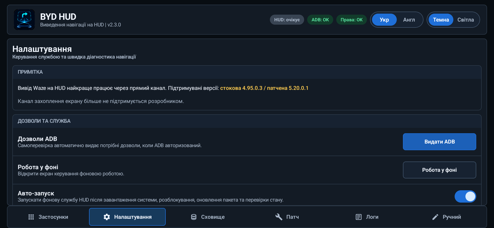
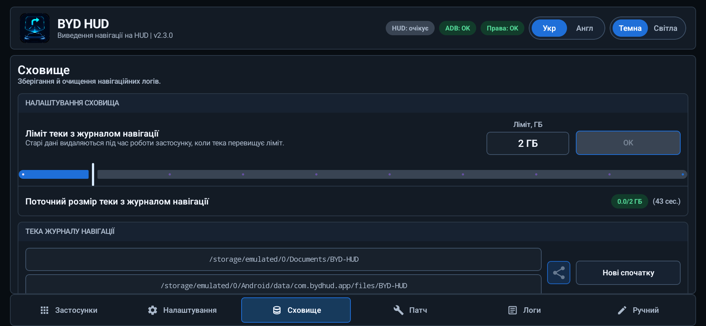
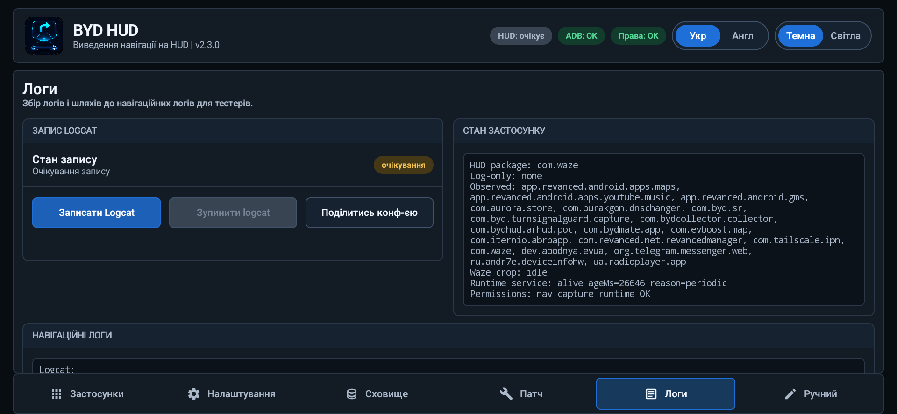

# BYD HUD

[English](README.md) | **Українська**


BYD HUD передає дані активного маршруту Google Maps або Waze у навігаційні поля, які вже є в сумісних автомобілях BYD для китайського ринку. Мапа залишається в навігаторі, а маневр, відстань, вулиця, смуги, попередження та опційні показники поїздки окремо надсилаються на HUD.

Застосунок також керує показом навігатора на панелі приладів, веде діагностичні логи за днями, може завантажити фіксовані перевірені збірки навігаторів і локально підготувати сумісний пакет для роботи через структурований прямий канал.

- **Підтримувані навігатори:** Google Maps і Waze
- **Перевірена платформа:** Android 12 / DiLink 5.0
- **Початок роботи:** [завантажте останній реліз](https://github.com/sunlixWhyNotAvailable/byd-hud/releases/latest) і виконайте розділ [Встановлення](#встановлення)
- **Потрібна допомога:** прочитайте [Усунення проблем](#усунення-проблем), а потім [повідомте про проблему](#як-повідомити-про-проблему), додавши архів за потрібний день

> **Використання ШІ:** У цьому проєкті генеративні інструменти ШІ використовуються для аналізу коду й діагностичних логів, реалізації змін, тестування та підготовки документації.

BYD HUD не є заміною Android Auto. Звичайні activity навігаторів і далі відповідають за пошук та вибір маршруту; опційний custom surface Waze застосовується лише після початку навігації.

## Що робить BYD HUD

BYD HUD отримує активні навігаційні підказки з підтримуваного навігатора та передає корисні дані в автомобіль:

- поточний маневр і штатну динамічну стрілку;
- відстань до маневру;
- назву вулиці або текстовий напрямок;
- рекомендовані смуги, якщо джерело їх надає;
- попередження Waze, якщо активна сесія Waze їх надає;
- опційно час прибуття, залишок часу та залишок дистанції;
- опційно зображення навігатора на панелі приладів.

Google Maps і Waze продовжують відповідати за мапу та маршрут. BYD HUD лише координує навігаційні дані, вивід на HUD, відображення на панелі приладів, діагностику та опційне локальне патчення навігатора.

## Можливості

| Напрям | Що доступно |
| --- | --- |
| Вивід навігації | Зображення маневру, штатна стрілка, відстань, вулиця або текстова підказка, смуги та опційні показники маршруту |
| Прямі канали | Структуровані дані з малою затримкою від сумісної патченої версії Google Maps або Waze |
| Опційні legacy-канали | Accessibility, сповіщення або візуальний аналіз після окремого увімкнення відповідних налаштувань і служб |
| Керування панеллю приладів | Переміщення запущеного навігатора між дисплеями та зміна висоти його вікна на панелі приладів |
| Завантаження навігаторів | Завантаження та перевірка підтримуваних збірок Waze і Google Maps із фіксованого релізу проєкту |
| Патчер навігаторів | Перевірка та локальне патчення сумісних пакетів Google Maps або Waze для підтримки прямого каналу |
| Логи та сховище | Запис діагностики, керування логами за днями та надсилання лише вибраних даних |
| Оновлення | Стабільні релізи за замовчуванням та опційний канал бета-версій |
| Ручне тестування | Надсилання окремих полів HUD та ID символів для діагностики |

<p align="center"></p>

## Навігаційні канали

BYD HUD надає перевагу сумісному прямому каналу вибраного навігатора. Legacy-канали опційні, вимкнені після чистого встановлення та стають доступними лише після увімкнення їхніх налаштувань, дозволів і служб.

| Навігатор | Основний прямий канал | Опційний legacy-канал | Основні обмеження |
| --- | --- | --- | --- |
| Google Maps | Структурований маневр, відстань, дорога, відрендерене зображення маневру, час прибуття, залишок часу та залишок дистанції | Дані Accessibility і сповіщень після надання дозволів та підключення служб захоплення | Legacy-канал не має смуг і може містити обмежені дані про маневр |
| Waze | Структуровані маневр, відстань, вулиця, смуги, попередження сесії та показники маршруту з патченої cluster-сесії | Захоплення екрана та візуальний аналіз після увімкнення `Канал захоплення екрану (сумісність)` | Legacy-канал вимкнений за замовчуванням, залежить від розмітки екрана та більше не підтримується розробником |

За замовчуванням прямий канал не змінює activity навігатора, а навігаційні дані у фоновому режимі надсилаються в BYD HUD. Якщо увімкнено `Start with custom surface`, Waze і далі використовує звичайну activity для пошуку та вибору маршруту, а після початку навігації передає активну мапу й елементи керування в окремий surface BYD HUD. Звичайний direct-вивід Waze залишається доступним під час запуску surface; якщо surface не готовий протягом п'яти секунд, BYD HUD зберігає цей вивід, не завершуючи маршрут. Google Maps завжди зберігає звичайну activity.

### Поточна сумісність навігаторів

| Сценарій | Пакет | Поточний підтримуваний профіль |
| --- | --- | --- |
| Прямий вивід і патчення Waze | `com.waze` | stock `4.95.0.3` або патчена в межах проєкту `5.20.0.1` |
| Прямий вивід і патчення Google Maps | `app.revanced.android.apps.maps` | Google Maps ReVanced `25.16.03.747108139`; `26.30.09.950492155` підготовлена як candidate для перевірки на авто |
| Лише legacy-канал офіційного Google Maps | `com.google.android.apps.maps` | Захоплення через Accessibility/сповіщення після увімкнення служб; патчер не приймає цей пакет |

Патчер додатково перевіряє точний пакет, підпис, split-файли та структури DEX. Самого збігу номера версії недостатньо.

### Перемикання прямого каналу

- BYD HUD переходить на прямий канал одразу після отримання коректних даних.
- П'ятисекундний таймаут кадру прямого каналу дозволяє перейти на legacy-канал, лише якщо цей канал уже увімкнений і готовий.
- Для legacy fallback Google Maps потрібні видані дозволи та підключені служби захоплення Accessibility/сповіщень. Для legacy fallback Waze додатково потрібен непідтримуваний перемикач `Канал захоплення екрану (сумісність)`, який за замовчуванням вимкнений.
- Без цих передумов після таймауту fallback не запускається. Після повернення коректних прямих даних BYD HUD очищає стан legacy-каналу та одразу повертається на прямий канал.
- Статус `HUD` активний лише тоді, коли навігаційні дані фактично надсилаються в автомобіль. Вибір навігатора без запуску маршруту залишає статус очікування.

## Використання вкладки «Застосунки»

Після початкового налаштування вкладка `Застосунки` є звичайним стартовим екраном.

Примітка вгорі містить підтримувані збірки навігаторів. Кожна дія `Скачати` отримує один фіксований файл із релізу проєкту, показує прогрес у рядку, перевіряє SHA-256, пакет, версію, version code і підпис, а потім пропонує системний інсталятор Android. Сумісна встановлена версія оновлюється штатно; видалення пропонується лише після явного підтвердження, якщо Android не може безпечно замінити встановлений підпис або версію.

1. Знайдіть Google Maps або Waze у розділі підтримуваних навігаційних застосунків.
2. Увімкніть `HUD` до або після запуску навігатора.
3. Запустіть маршрут у навігаторі.
4. Використовуйте `На приборку` або `На основний екран` лише тоді, коли застосунок запущений.
5. Увімкніть `Лог` лише тоді, коли потрібні розширені логи конкретної сесії застосунку. Базові щоденні події та навігаційні логи записуються незалежно від цього перемикача.

На цій вкладці також показані інші застосунки, які можна переміщувати між дисплеями, але аналіз навігації та вивід на HUD доступні лише для підтримуваних навігаторів.

### Індикатори стану

| Статус | Значення |
| --- | --- |
| `HUD: працює` | Навігаційні дані зараз надходять на HUD автомобіля |
| `HUD: очікує` | Вивід на HUD вибраний, але актуальних навігаційних даних немає |
| `HUD: помилка` | Потрібний дозвіл або служба недоступні |
| `ADB: OK` | Локальний ADB-міст авторизований і доступний |
| `ADB: не видано` | Функції обслуговування, які залежать від ADB, недоступні |
| `Права: OK` | Необхідні базові дозволи надані |
| `Права: немає` | Потрібно відновити один або кілька базових дозволів |

## Налаштування виводу навігації

Вкладка `Налаштування` керує даними, які надсилає BYD HUD. Зміна перемикача впливає на наступний стан HUD, але не змінює мапу всередині навігатора.

<p align="center"></p>

### Основний вивід навігації

| Налаштування | За замовчуванням | Коли увімкнено | Коли вимкнено |
| --- | --- | --- | --- |
| `Вивід PNG` | Увімкнено | Показує відрендерене зображення маневру або попередження | Приховує поле відрендереного зображення |
| `Вивід штатного маневру` | Увімкнено | Показує штатну динамічну стрілку автомобіля | Приховує поле штатної стрілки |
| `Вивід смуг` | Увімкнено | Показує рекомендовані смуги, коли вони доступні | Приховує підказки щодо смуг |
| `Вивід дистанції` | Увімкнено | Показує відстань до поточного маневру | Приховує відстань до маневру |
| `Вивід вулиці` | Увімкнено | Показує поточну дорогу або назву вулиці | Приховує текст вулиці |
| `Вивід напрямків текстом` | Увімкнено | Використовує підказку на кшталт `Прямуйте далі`, коли назва вулиці відсутня | Не підставляє текстову підказку замість відсутньої назви вулиці |

Текст вулиці має пріоритет над текстовим напрямком, оскільки обидва використовують одне поле HUD автомобіля.

### Показники маршруту

| Налаштування | За замовчуванням | Поведінка |
| --- | --- | --- |
| `Режим виводу ЕТА/часу/дистанції` | Вимкнений | Обирає `Вимкнений`, `До зупинки` або `Весь маршрут`; для всього маршруту Waze використовує кінцеву точку та окремо підставляє доступне значення до наступної зупинки, якщо потрібного показника немає |
| `Показувати час прибуття` | Вимкнено | Додає очікуваний час прибуття в поле вулиці |
| `Показувати залишок часу` | Вимкнено | Додає залишок часу поїздки в поле вулиці |
| `Показувати залишок дистанції` | Вимкнено | Додає залишок дистанції маршруту в поле вулиці |

Три перемикачі значень неактивні в режимі `Вимкнений`, але їхні збережені значення не скидаються.

Увімкнені показники додаються перед назвою вулиці або текстовою підказкою, наприклад:

```text
[ETA: 12:20 | 11 min | 5.1 km] Головна вулиця
```

Прямий канал Google Maps надає повний набір показників. Патчена в межах проєкту Waze `5.20.0.1` надає ETA, залишок часу та залишок дистанції до наступної зупинки й для всього маршруту. У маршруті з кількома зупинками режим `Весь маршрут` використовує кінцеву точку; якщо окремий показник усього маршруту недоступний, BYD HUD використовує відповідне доступне значення до наступної зупинки.

### Обмеження швидкості

| Налаштування | За замовчуванням | Поведінка |
| --- | --- | --- |
| `Режим виводу обмеження швидкості` | Вимкнено | Обирає `Вимкнено`, `У полі з маневром`, `У полі зі смугами`, `У вільному полі` або `Композитний` |
| `Накладання у режимі «У вільному полі»` | Вимкнено | Коли обидва поля зайняті, опційно дозволяє тимчасово замінити поле маневру або смуг |
| `Час показу при накладанні` | 5 секунд | Установлює від 1 до 10 секунд для некомпозитного виводу поверх зайнятого поля |
| `Поле для виводу у композитному режимі` | Тільки маневру | Обирає `Тільки маневру`, `Тільки смуг`, `Вільне або маневру` чи `Вільне або смуг` |
| `Розмір знаку у полі маневру` | 64 px | Задає розмір композитного знака в зображенні маневру від 1 до 103 px |
| `Розмір знаку у полі для смуг` | 36 px | Задає розмір композитного знака в зображенні смуг від 1 до 36 px |

Попередження займає поле маневру з таким самим пріоритетом, як маршрутний маневр. Окремий знак у справді вільному полі залишається до зміни або очищення direct-джерелом; таймер діє лише тоді, коли некомпозитний вивід замінює зайняте поле маневру, попередження або смуг. У композитному режимі знак додається до вибраного зображення маневру або смуг без видалення наявної навігаційної підказки, тому таймер заміни не використовується. Функція потребує актуального direct-профілю Google Maps або Waze, патченого в межах проєкту.

### Додаткова поведінка навігації

| Налаштування | За замовчуванням | Поведінка |
| --- | --- | --- |
| `Обрізка малої дистанції` | Вимкнено | Замінює позитивні відстані менше ніж 11 м на 11 м, щоб уникнути некоректних символів на відповідних версіях HUD |
| `Лівосторонній рух на кільці` | Вимкнено | Використовує символи кільця для лівостороннього руху в legacy-візуальному аналізаторі |
| `Формувати TBT-картку навіть для активної сесії навігатора без виводу на HUD` | Увімкнено | Передає direct-підказки на TBT-картку панелі приладів незалежно від вибору виводу на лобове HUD; пріоритет має навігатор з HUD, інакше використовується останній запущений маршрут |
| `Перемикатися на TBT-картку при початку виводу на HUD` | Увімкнено | Best-effort обирає TBT-режим панелі приладів при початку direct-виводу на HUD; помилка перемикання не блокує дані TBT або лобового HUD |

### Функції Waze

| Налаштування | За замовчуванням | Поведінка |
| --- | --- | --- |
| `Показувати попередження Waze` | Увімкнено | Зберігає надане Waze попередження, поки відстань, вулиця, смуги та відповідний штатний маневр продовжують оновлюватися |
| `Start with custom surface` | Вимкнено | Фіксує значення на старті маршруту Waze, а потім відкриває надану Waze мапу в окремому surface; Back повертає звичайну activity Waze до завершення цього маршруту |

Custom surface діє лише в межах маршруту. Зміна перемикача під час активного маршруту не перемикає сесію наживо. Якщо surface не готовий протягом п'яти секунд, BYD HUD залишає стандартний direct-вивід Waze активним і не повторює спробу до наступного маршруту. Повернення у Waze в межах того самого активного маршруту відновлює surface; reason codes завершення закривають його лише для термінальних подій. Перемикач попереджень Waze керує лише виводом попереджень на HUD; попередження, які Waze передає в custom surface, залишаються видимими там.

## Вивід на панель приладів

`На приборку` переміщує запущений застосунок на панель приладів. `На основний екран` повертає його на центральний дисплей.

| Налаштування | За замовчуванням | Поведінка |
| --- | --- | --- |
| `Повний екран приборки` | Увімкнено | Використовує повноекранний режим навігації на панелі приладів; вимкнення обирає компактну мапу |
| `Висота` | 100% | Наживо змінює висоту вікна від 20% до 100% |

Навігатор уже повинен бути запущений. Перед переміщенням BYD HUD надсилає OEM-команду `30011` для вибраного повного або компактного режиму, а потім перевіряє, що task застосунку потрапив на потрібний дисплей. Під час активного маршруту з custom surface Waze окремий task surface переміщується разом із task навігатора, тому екран налаштувань BYD HUD не переміщується помилково. Застосунок не може прочитати фактичний fullscreen/partial-стан панелі приладів і не має watchdog, який повторно застосовує цей режим. Тому перемикач показує запитаний режим, а не достовірно прочитаний стан автомобіля. На перевіреній прошивці керування панеллю приладів потребує авторизованого ADB.

<!-- Місце для фото: docs/screenshots/uk/dashboard.jpg
Використайте горизонтальне фото реальної панелі приладів. Розмістіть його тут.
Рекомендована розмітка:
<p align="center"></p>
-->

> Користуйтеся керуванням панеллю приладів лише під час стоянки. Деякі штатні режими додають темні області зверху та знизу. BYD HUD може змінити висоту вікна, але не може прибрати елементи, які малює прошивка автомобіля.

## Патчер навігаторів

Вкладка `Патч` опційна. Вона може додати прямий канал BYD HUD до структурно сумісного пакета Waze або Google Maps ReVanced, не завантажуючи APK на сервер.

<p align="center"></p>

### Підтримувані вхідні файли

- встановлений пакет `com.waze` або `app.revanced.android.apps.maps`;
- завантажений файл `.apk`;
- сумісний split-пакет `.apkm` або `.apks`;
- архів `.xapk`, який містить лише APK.

Офіційний пакет Google Maps `com.google.android.apps.maps`, пакети з OBB-даними та непідтримувані структури feature-split відхиляються. Поточні захищені профілі патчера: Waze `4.95.0.3` / `5.20.0.1` та Google Maps ReVanced `25.16.03.747108139`; `26.30.09.950492155` доступна як підготовлений candidate, що очікує перевірки на авто.

### Як працює патчення

1. Виберіть встановлений навігатор або опційно оберіть завантажену версію.
2. Натисніть `Перевірити`, щоб перевірити назву пакета, підпис, split-файли та точні структури DEX.
3. Перегляньте індикатори стану компонентів. Waze окремо показує прямий канал, стабільну сесію та попередження Waze; Google Maps окремо показує прямий канал, аудіоканал і PiP.
4. Натисніть `Пропатчити` та підтвердьте попередження.
5. BYD HUD повторює всі структурні перевірки, змінює лише відомі цілі, підписує повний набір пакетів ключем, створеним на цьому планшеті, та пропонує Android встановити його.

Для Waze шар прямого каналу є обов'язковим, а стабільна сесія та попередження залишаються опційними. Для Google Maps компоненти Direct, Audio і PiP незалежні, тому можна застосувати будь-який структурно сумісний компонент, зокрема окремий PiP-патч. Компонент PiP вимикає режим «картинка в картинці» Google Maps під час навігації, не змінюючи підтримку зміни розміру activity. Шар стабільної сесії Waze охоплює життєвий цикл маршруту, пряме отримання обмеження швидкості та показники cluster-маршруту. Alert-hook Waze наразі обмежений структурно сумісною версією Waze 5.20.0.1.

### Підпис і дані застосунку

- Постійний ключ підпису створюється локально всередині BYD HUD.
- Наступний сумісний патч, підписаний тим самим ключем, зазвичай можна встановити як оновлення.
- Якщо встановлений застосунок має несумісний підпис, може знадобитися спочатку видалити навігатор, що видалить його локальні дані.
- Очищення даних або видалення BYD HUD також видаляє локальний ключ підпису.
- Невідомі підписи видавця відхиляються.

Перед патченням створіть резервну копію важливих даних навігатора та увійдіть у свій обліковий запис. Патчер ніколи не надсилає вибрані APK на сервер. Окремі дії завантаження на вкладці `Застосунки` отримують лише три зафіксовані вище navigator assets; патчення обраного користувачем джерела й далі виконується локально.

## Налаштування роботи й обслуговування

| Налаштування | За замовчуванням | Призначення |
| --- | --- | --- |
| `Авто-запуск` | Увімкнено | Перезапускає runtime BYD HUD після підтримуваних подій завантаження та оновлення |
| `Зберігати діагностичні скріншоти та розширені логи` | Вимкнено | Записує додаткові навігаційні дані; вмикайте лише для діагностики, оскільки вони займають більше місця |
| `Перевіряти оновлення` | Увімкнено | Перевіряє стабільний канал релізів GitHub |
| `Участь у бета-тестуванні` | Вимкнено | Включає попередні версії, які можуть працювати нестабільно або бути зламаними |

`Дозволи ADB` запускає налаштування дозволів, коли це потрібно. `Робота у фоні` відкриває системну сторінку BYD, де BYD HUD потрібно виключити з фонового блокування. `Вимкнути` зупиняє вивід на HUD та коректно завершує runtime.

## Логи, сховище та приватність

BYD HUD зберігає навігаційні дані в теках за днями, щоб можна було надіслати одну поїздку без розкриття даних за інші дні.

<p align="center"></p>

<p align="center"></p>

### Вкладка «Сховище»

- показує поточний розмір логів та налаштоване обмеження;
- групує навігаційні логи, snapshots, скріншоти та опційний logcat за днями;
- надсилає або видаляє лише вибрані дні;
- перед створенням ZIP показує кількість файлів, розмір архіву та попередження про конфіденційні дані.

`Поділитися вибраним` пропонує два явні способи:

- `Інший застосунок` відкриває стандартне системне меню Android;
- `Надіслати розробнику` одноразово завантажує той самий вибраний ZIP у сервіс Sentry.

### Вкладка «Логи»

- `Записати Logcat` починає явний запис системного журналу;
- `Зупинити logcat` завершує поточний запис;
- `Поділитись конф-єю` створює менший діагностичний архів із даними про пристрій, дозволи, мережу, патчер і налаштування SOME/IP.

Надсилання конфігурації працює без ADB. Якщо локальний ADB-міст уже авторизований, архів також міститиме додаткову системну діагностику лише для читання. Надсилання не запитує доступ ADB і не вмикає телеметрію.

BYD HUD не надсилає автоматично у сервіс Sentry збої, ANR, сесії, breadcrumbs, traces, скріншоти, записи екрана або навігаційні логи. Повна політика наведена у файлі [PRIVACY](PRIVACY.uk.md).

## Ручне тестування HUD

Вкладка `Ручний` є діагностичним інструментом. Вона може надсилати окремі значення тексту, відстані, смуг, PNG і штатної стрілки без запуску маршруту. Це корисно для перевірки відповідності символів автомобіля, але не повинно використовуватися як джерело навігації.

<p align="center"></p>

## Встановлення

### Вимоги

- Android 10 або новіший;
- сумісний автомобіль BYD для китайського ринку та система DiLink;
- дозвіл на встановлення APK на планшеті;
- увімкнена опція `Navigation fusion` у налаштуваннях HUD автомобіля для показу штатних стрілок маневру;
- BYD HUD виключений із фонового блокування застосунків BYD.

### Перше налаштування

1. Завантажте актуальний APK із [GitHub Releases](https://github.com/sunlixWhyNotAvailable/byd-hud/releases/latest).
2. Встановіть його на планшет автомобіля та відкрийте BYD HUD.
3. Під час першого запуску перегляньте вкладку `Налаштування` та надайте потрібні базові дозволи.
4. Опційно підтвердьте запит RSA-ключа ADB для керування панеллю приладів, публічного сховища логів, автоматичного відновлення дозволів і розширеної діагностики.
5. Відкрийте системні налаштування BYD та встановіть `Disable background Apps -> BYD HUD` у стан `Off`.
6. Поверніться до `Застосунки`, увімкніть `HUD` для Google Maps або Waze та почніть навігацію.
7. Для сумісного навігатора прямий канал запускається автоматично. Legacy-канал запускається лише тоді, коли його налаштування захоплення, дозволи та служби були окремо увімкнені. Канал захоплення екрана Waze вимкнений за замовчуванням і більше не підтримується розробником.

### Що потребує ADB

| Функція | Без ADB | З авторизованим ADB |
| --- | --- | --- |
| Сумісний прямий навігатор -> SOME/IP -> HUD | Працює | Працює |
| Інтерфейс застосунку та налаштування навігації | Працюють | Працюють |
| Автоматичне відновлення дозволів | Обмежене | Доступне |
| Публічне сховище логів за днями | Обмежене дозволами Android | Доступне |
| Керування виводом на панель приладів | Недоступне на перевіреній прошивці | Доступне |
| Розширена діагностика конфігурації | Базовий звіт | Розширений звіт |
| Відновлення runtime після завершення процесу | Може знадобитися повторно відкрити застосунок | Налаштування запуску та runtime можуть відновити роботу |

## Усунення проблем

### HUD залишається у стані `очікує`

- Переконайтеся, що `HUD` увімкнено для правильного навігатора.
- Запустіть активний маршрут: сам вибір навігатора не створює дані для HUD.
- Перевірте, чи навігатор використовує прямий або legacy-канал.
- Якщо відсутня лише штатна стрілка, переконайтеся, що в налаштуваннях HUD автомобіля увімкнено `Navigation fusion`.

### HUD показує `помилка`

- Відкрийте `Налаштування` та запустіть `Дозволи ADB`, якщо ADB доступний.
- Окремо перевірте індикатори `ADB` і `Права`.
- Переконайтеся, що BYD HUD дозволено працювати у фоновому режимі.

### Вивід блимає або чергується

Інший застосунок може одночасно писати в той самий SOME/IP-канал HUD. Зупиніть інший HUD-застосунок і повторіть перевірку.

### Опційний legacy-вивід Waze затримується або працює неправильно

Непідтримуваний аналізатор захоплення екрана залежить від розмітки Waze, роздільної здатності, мови та тимчасових рядків на кшталт `No GPS`. Увімкніть розширену діагностику для однієї відтворюваної поїздки та надішліть відповідний день.

### Опційний legacy-вивід Google Maps не показує смуги

Це очікувана поведінка. Fallback через Accessibility і сповіщення не надає смуги. Використовуйте сумісну пряму збірку, якщо потрібні структуровані смуги або повні показники маршруту.

## Як повідомити про проблему

Створіть [GitHub issue](https://github.com/sunlixWhyNotAvailable/byd-hud/issues) і додайте:

- версію BYD HUD;
- модель і рік випуску автомобіля, версію DiLink та прошивку планшета;
- назву й версію навігатора, а також використаний прямий або legacy-вивід;
- очікувану поведінку та те, що з'явилося на планшеті й HUD;
- приблизний локальний час проблеми;
- архів за вибраний день, архів конфігурації або ідентифікатор event/trace сервісу Sentry, якщо це доречно.

Для проблеми з навігаційним виводом:

1. За можливості відтворіть її з увімкненою опцією `Зберігати діагностичні скріншоти та розширені логи`.
2. Відкрийте `Сховище` та виберіть лише день із проблемою.
3. Натисніть `Поділитися вибраним` і виберіть месенджер або `Надіслати розробнику`.
4. Після перевірки вимкніть розширену діагностику, щоб зменшити використання сховища.

Для проблеми з дозволами, пристроєм, патчером або запуском скористайтеся `Логи -> Поділитись конф-єю`.

> Навігаційні архіви можуть містити координати, знайдені пункти призначення, назви вулиць, текст сповіщень, скріншоти та ідентифікатори пристрою. Перед надсиланням прочитайте попередження та використовуйте лише мінімально потрібний день.

## Відомі обмеження

- Інші застосунки, які використовують той самий SOME/IP-вивід, можуть спричиняти блимання або нестабільність HUD.
- Legacy-аналіз вимкнений, доки не активовані його налаштування та служби захоплення. Після цього він залежить від інтерфейсу навігатора, мови, структури сповіщень і роздільної здатності екрана.
- Legacy-канал Google Maps не має смуг і може надавати неповні дані про маневр.
- Вивід Waze через захоплення екрана вимкнений за замовчуванням і більше не підтримується розробником.
- Патчер підтримує пакет Google Maps ReVanced `app.revanced.android.apps.maps`, а не офіційний `com.google.android.apps.maps`.
- Показники маршруту Waze залежать від оцінок до пунктів призначення, які надає підтримувана патчена в межах проєкту Waze `5.20.0.1`; недоступний показник усього маршруту замінюється відповідним значенням до наступної зупинки.
- Попередження Waze залежать від того, чи надає їх Waze; вбудований alert-hook доступний лише для підтримуваної структури Waze 5.20.0.1.
- Custom surface Waze є опційним beta-шляхом. Він потребує робочого direct-каналу Waze і запускається лише після повідомлення Waze про активну навігацію; якщо surface не готовий, через п'ять секунд звичайний direct-вивід залишається активним.
- Штатна прошивка панелі приладів може додавати темні області до виведеного вікна.
- Непідтримувані структури split-пакетів та XAPK із OBB-даними не можна пропатчити.
- Для штатних стрілок потрібна опція `Navigation fusion` у налаштуваннях HUD автомобіля.
- Деякі прошивки можуть завершувати процес без налаштування фонової роботи та запуску за допомогою ADB.

## Внесок і подяки

Issues та цільові pull requests вітаються. Перед пропозиціями змін для аналізу конкретного навігатора опишіть автомобіль, прошивку, версію навігатора та відтворювану видиму проблему.

- MaxTitan поділився початковою концепцією прямого каналу Waze та довідковими вихідними матеріалами, які продемонстрували міст між AndroidX Car App host і BYD SOME/IP HUD.
- Проєкт OpenBYD підказав використання сумісної з BYD обгортки системного контексту та оголошення стану навігації для ширшої сумісності TBT/HUD. Точні контракти й поведінку життєвого циклу було окремо перевірено на SL06 та SL07.
- Підхід до зміни розміру вікна на панелі приладів натхнений проєктом [BYD Mate](https://github.com/AndyShaman/BYDMate).
- Додаткові символи маневрів і смуг Waze для fallback-аналізатора створені спеціально для цього проєкту.

## Перевірені пристрої

| Автомобіль | Ринок | DiLink | Стан |
| --- | --- | --- | --- |
| BYD Sea Lion 07 EV 2025 | Китай | 5.0 | Перевірено розробником |
| BYD Sea Lion 07 EV 2024 | Китай | 5.0 | Перевірено користувачем проєкту |

Вивід на HUD підтверджено на перевіреній прошивці планшета починаючи з версії `2510`. Інші моделі, регіони, версії прошивки, роздільні здатності та панелі приладів можуть поводитися інакше.

## Ліцензія та застереження

BYD HUD розповсюджується за ліцензією [GNU Affero General Public License v3.0](LICENSE).

Це незалежний проєкт, який не пов'язаний із BYD, DiLink, Waze, Google, Google Maps або ABRP, не підтримується та не спонсорується ними. Усі назви продуктів і торговельні марки належать їхнім відповідним власникам.

Ви використовуєте програмне забезпечення на власний ризик. Зміна або заміна пакетів навігатора може видалити локальні дані застосунку або спричинити неочікувану поведінку. Дотримуйтеся місцевих законів, не відволікайтеся від дороги та налаштовуйте або діагностуйте систему лише під час стоянки.
