# BYD HUD

[English](README.md) | **Українська**


BYD HUD виводить підказки Google Maps і Waze на проєкційний дисплей сумісних BYD для китайського ринку: маневри, дистанцію, назви вулиць, смуги, дані поїздки та, із сумісним патченим навігатором, живу мапу. Також застосунок може переносити запущений застосунок на панель приладів.

Пошук і вибір маршруту залишаються в навігаторі. Інтерфейс BYD HUD доступний українською, англійською та російською.

[Завантажити](https://github.com/sunlixWhyNotAvailable/byd-hud/releases/latest) · [Встановлення](#встановлення) · [Налаштування мапи](#показ-мапи) · [Усунення проблем](#усунення-проблем) · [Повідомити про проблему](#як-повідомити-про-проблему)

> **Використання ШІ:** у проєкті застосовуються інструменти генеративного ШІ для аналізу коду й діагностичних логів, реалізації, тестування та документації.

## Сумісність

Потрібні Android 10 або новіший, сумісна система DiLink і можливість встановлювати APK. Прошивка автомобіля визначає, які поля HUD та режими приборки доступні.

| Навігатор | Доступні підказки |
| --- | --- |
| Сумісний Google Maps ReVanced | Маневри, дистанція, вулиця, смуги за наявності, час прибуття та залишок часу/відстані поїздки |
| Сумісний Waze | Маневри, дистанція, вулиця, смуги, дані поїздки, обмеження швидкості й попередження за наявності |

**Google Maps наразі не передає BYD HUD дані обмеження швидкості.** Для показу мапи потрібна сумісна патчена збірка з підтримкою картинки мапи; старого патчу лише для прямого каналу недостатньо. Скористайтеся пакетами у вкладці `Застосунки` або [вбудованим патчером](#патчер-навігаторів).

Вивід на HUD підтверджено на Sea Lion 07 EV (2024/2025) та Sea Lion 06 EV для китайського ринку з DiLink 5.0, зокрема на перевірених прошивках планшета від `2510`. Це не гарантує роботу кожної функції на цих автомобілях або підтримку інших прошивок. Картинки-підказки показують окремі моделі HUD; ваш екран може відрізнятися.

## Встановлення

Налаштовуйте застосунок на припаркованому автомобілі.

1. Завантажте APK BYD HUD із [GitHub Releases](https://github.com/sunlixWhyNotAvailable/byd-hud/releases/latest), встановіть на планшет автомобіля та відкрийте.
2. У `Налаштуваннях` надайте потрібні дозволи. Підтвердьте запит RSA-ключа ADB, якщо потрібні керування приборкою та додаткові можливості налаштування й діагностики.
3. У системних налаштуваннях BYD встановіть `Disable background Apps → BYD HUD` у стан `Off`, щоб дозволити фонову роботу.
4. Встановіть сумісний навігатор із вкладки `Застосунки` або підготуйте його у вкладці `Патч`. Якщо Android вимагає замінити встановлений навігатор, перед підтвердженням прочитайте попередження про втрату даних.
5. У налаштуваннях HUD автомобіля увімкніть `Navigation fusion` для штатних стрілок маневру.
6. У вкладці `Застосунки` увімкніть `HUD` для потрібного навігатора, потім запустіть маршрут у ньому.

HUD можна увімкнути до або після початку маршруту. Саме відкриття навігатора без активної навігації не створює вивід.

| Функція | Чи потрібен авторизований ADB? |
| --- | --- |
| Сумісний навігатор → проєкційний HUD | Ні, для базового підтримуваного виводу |
| Навігаційна картка приборки та перенесення застосунків між екранами | Так, на перевірених прошивках |
| Деякі додаткові поля автомобіля, зокрема штатні смуги | Так, залежно від автомобіля |
| Автоматичне налаштування дозволів і розширена діагностика | Так |

Служба спеціальних можливостей і доступ до сповіщень не замінюють сумісну збірку навігатора. Служба спеціальних можливостей також потрібна для кнопок керма, описаних нижче.

<details>
<summary>Скріншот: Дозволи та служба</summary>

<p align="center">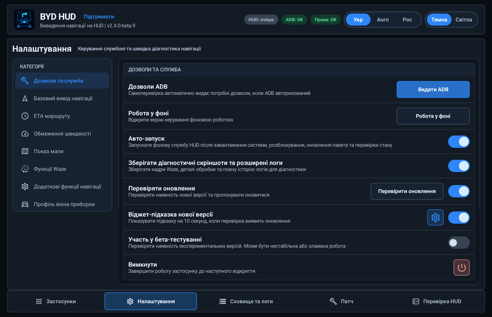</p>

</details>

## Щоденне використання

У вкладці `Застосунки` увімкніть перемикач `HUD` потрібного навігатора та почніть навігацію. BYD HUD може працювати, поки відкритий навігатор або інший застосунок, якщо дозволена фонова робота.

У блоці завантаження навігаторів послідовно доступні `Завантажити` та `Встановити`. Кнопкою `Встановлено` можна також перевстановити запропонований пакет. Перед встановленням застосунок перевіряє завантажені файли. У разі невдачі відкрийте `Помилка`, щоб прочитати причину, та скористайтеся повторною спробою.

`На приборку` та `На основний екран` переносять уже запущений застосунок між дисплеями. Можна переносити й інші встановлені застосунки, але навігаційні дані для HUD надходять лише від підтримуваних навігаторів.

<p align="center">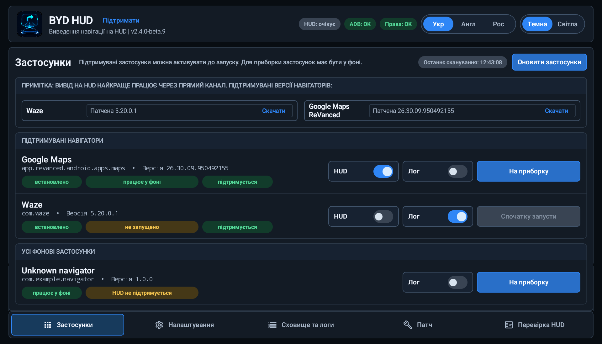</p>

| Індикатор | Значення |
| --- | --- |
| `HUD: працює` | BYD HUD надсилає навігаційні дані; що саме з'явиться, визначає автомобіль |
| `HUD: очікує` | Навігаційні дані зараз не надсилаються |
| `HUD: помилка` | Обов'язкова операція виводу завершилася помилкою |
| `ADB: OK` | Потрібні налаштування й дозволи присутні; це не індикатор активного з'єднання |
| `Права: немає` | Відкрийте налаштування та відновіть відсутні дозволи або служби |

## Налаштування HUD

У `Налаштуваннях` виберіть потрібні поля. Кнопки `?` показують ілюстрації без зміни збережених налаштувань і без надсилання даних автомобілю. Скріншоти показують темний інтерфейс Preview; окремі елементи можуть відрізнятися від встановленого релізу.

### Маневри, смуги та текст

- `Вивід PNG` показує картинку маневру або попередження; `Вивід штатного маневру` керує власною стрілкою автомобіля. Ці режими налаштовуються окремо.
- Для смуг, дистанції та вулиці є окремі перемикачі. Смуги з'являються лише тоді, коли навігатор їх передає.
- `Вивід напрямків текстом` підставляє підказку на кшталт «Рухайтесь прямо», якщо назви вулиці немає.
- Використовуйте українську або універсальну транслітерацію, якщо автомобіль не відображає початкові символи.
- `Обрізка малої дистанції` замінює додатні відстані менше ніж 11 м на 11 м. На деяких HUD вимкнення дистанції показує штатний напис «зараз» замість порожнього поля.

<p align="center">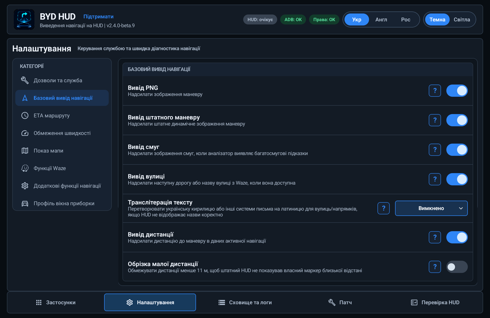</p>

### Час прибуття та залишок поїздки

У параметрах ETA виберіть наступну зупинку або весь маршрут, потім увімкніть час прибуття, залишок часу та/або відстані. Якщо значення для всього маршруту недоступне, використовується наявне значення для наступної зупинки.

У полі вулиці показники можна додати перед назвою, наприклад `[18:45 | 25 хв | 8,4 км] Головна вулиця`, або замінити ними назву. Очікування повного тексту дає довгому рядку прокрутитися до оновлення лише ETA. Експериментальний вивід розміщує показники в окремій області HUD з індивідуальними кольорами; підтримка залежить від автомобіля. Відсутні значення не показуються.

<details>
<summary>Скріншот: ETA маршруту</summary>

<p align="center">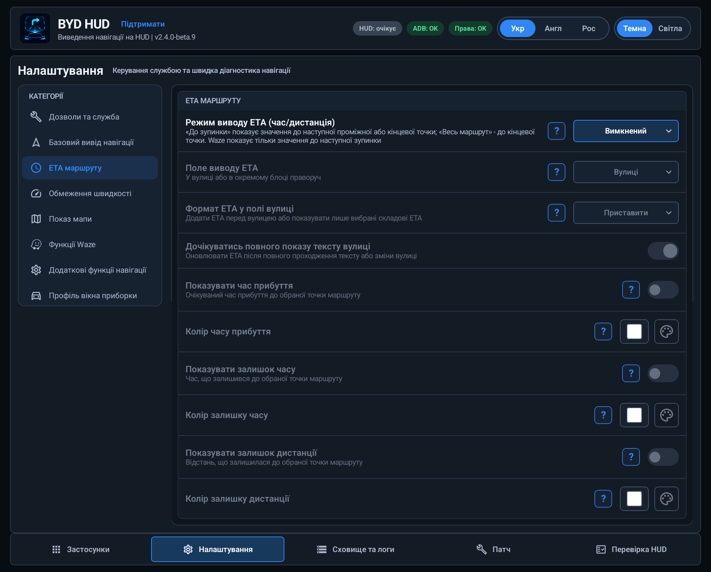</p>

</details>

### Обмеження швидкості

Виберіть місце показу обмеження, яке передає навігатор:

| Режим | Результат |
| --- | --- |
| Вимкнено | BYD HUD не показує навігаційне обмеження |
| Штатний/ADAS | Надсилає значення у штатне поле знака та перевіряє, чи воно прийняте |
| У полі маневру / смуг | Використовує вибране поле картинки |
| У вільному полі | Використовує вільне поле, за потреби — з тимчасовою заміною, коли обидва зайняті |
| Композитний | Додає знак до картинки маневру або смуг |

Для `Штатного/ADAS` виберіть запасний режим на випадок, коли штатне поле не оновлюється. Додаткова затримка зміни зменшує швидкі заміни знака, розпізнаного ADAS. Штатний вивід підтримує обмеження від 5 до 130 км/год із кроком 5, але автомобіль може відкласти або проігнорувати зміну. **BYD HUD не очищує штатний знак після завершення навігації або зникнення даних обмеження від навігатора.**

Для режимів із картинкою доступні відповідні налаштування розміру знака, поля та перекриття. Google Maps наразі не передає обмеження швидкості; ці налаштування не створюють ліміт, якщо його немає у даних навігатора.

<details>
<summary>Скріншот: Обмеження швидкості</summary>

<p align="center">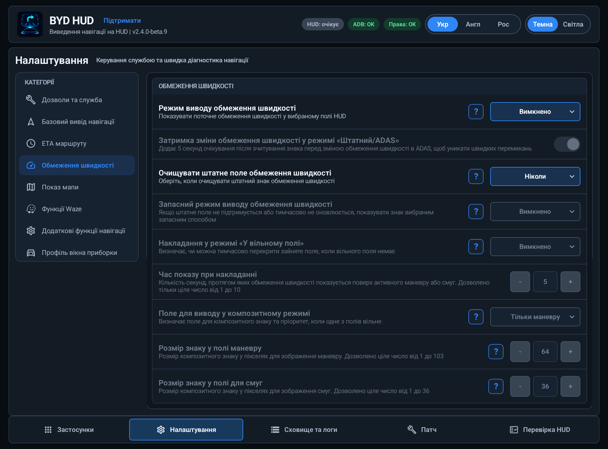</p>

</details>

### Показ мапи

**Спочатку встановіть сумісний патчений навігатор із підтримкою картинки мапи.** Якщо використовуєте патчер, переконайтеся, що компонент `Мапа` готовий. Підтримка лише прямого каналу навігації не включає картинку мапи.

| Режим | Призначення |
| --- | --- |
| Вимкнено | Без картинки мапи |
| Штатний | Окреме поле мапи автомобіля; картинка-підказка показує приклад Denza N9 |
| Експериментальний | Мапа, складена між полями картинок; розташування базується на Sea Lion 07 і налаштовується |

Картинка оновлюється до п'яти разів на секунду, коли змінюється, та раз на секунду, коли показаний фрагмент незмінний. Якщо свіжі кадри перестають надходити, мапа зникає, а інші навігаційні підказки продовжуються. Наявність штатного поля та підтримка полів картинок для експериментального режиму залежать від автомобіля.

#### Профілі картинки навігатора

Спочатку ввімкніть штатний або експериментальний показ мапи; у вимкненому режимі налаштування профілів недоступні. Для кожного джерела доступний один збережений профіль. Наявний профіль можна змінити кнопкою редагування або видалити відповідною кнопкою з підтвердженням.

1. Натисніть `+ Додати профіль` і виберіть Google Maps, Waze без Surface або Waze із Surface. Перелік залежить від встановлених навігаторів; два режими Waze мають окремі профілі.
2. Натисніть `Показати мапу`, потім за потреби відкрийте вибраний навігатор. Калібрування продовжується, коли BYD HUD у фоні.
3. Змініть горизонтальне/вертикальне положення картинки та масштаб (20–300%), щоб потрібна частина мапи потрапила у preview. Ці регулятори змінюють кадрування **всередині** області HUD, а не розташування самої області.
4. Натисніть `Зберегти`, щоб залишити профіль. Збереження не закриває редактор і доступне для нового профілю або після зміни збереженого. `Закрити` відкидає зміни після останнього збереження. `Прибрати мапу` або закриття редактора завершує калібрування та дозволяє повернутися до звичайного навігаційного виводу.

| Налаштування профілю | Що змінює |
| --- | --- |
| Картинка вліво–вправо | Горизонтальне кадрування, від −100 до +100%; мінус рухає картинку вправо, плюс — вліво |
| Картинка вгору–вниз | Вертикальне кадрування, від −100 до +100%; мінус рухає картинку вгору, плюс — вниз |
| Масштаб картинки | Розмір картинки всередині незмінної області HUD, 20–300%; зменшіть його, щоб вмістити більше мапи або зменшити великі написи |

Використовуйте слайдер, введення числа або кнопки `−` / `+` із кроком 0,1 та `--` / `++` із кроком 1. Десятковим роздільником може бути крапка або кома; кнопка «Готово»/галочка на клавіатурі завершує введення. Під час калібрування зміни видно у preview та на HUD ще до збереження. У списку збережених профілів показано X, Y та масштаб кожного джерела.

Preview показує фрагмент, який надсилається на HUD. Без актуального кадру він чорний. Профілі окремі для трьох режимів навігатора; збережені значення переживають оновлення. Кадрування ручне: воно не знаходить машинку автоматично й не компенсує різний масштаб навігатора у розгорнутому та згорнутому стані.

#### Розташування мапи та смуг на HUD

В експериментальному режимі виберіть `Більша праворуч` або `Власний` для розташування на HUD. Шість регуляторів окремо змінюють горизонтальне положення, вертикальне положення й масштаб області мапи та смуг. Ці налаштування спільні для профілів усіх навігаторів. На відміну від кадрування картинки, горизонтальний мінус рухає область HUD вліво, плюс — вправо; вертикальний мінус рухає вгору, плюс — вниз. Смуги переміщуються в межах власного рядка.

Тут також доступні дробове введення та кнопки з кроком 0,1 / 1. Зміна готового розташування перемикає його на «Власний», зберігаючи поточні позиції та розміри. Зміни розташування зберігаються одразу; кнопка збереження в редакторі картинки до них не стосується.

`Живий показ` перевіряє це розташування на тестовій картинці та прикладах навігації згідно з вашими налаштуваннями; `Показати мапу` всередині профілю використовує справжню картинку навігатора. Зміни розташування видно одразу. Живий показ продовжується після виходу з налаштувань або згортання BYD HUD. Завершіть його кнопкою зупинки; вихід з експериментального режиму, запуск іншої перевірки HUD або вимкнення служби теж завершують показ. Після цього може відновитися активна звичайна навігація, тому наявність виводу не завжди означає, що тест ще працює.

<details>
<summary>Скріншот: Показ мапи</summary>

<p align="center">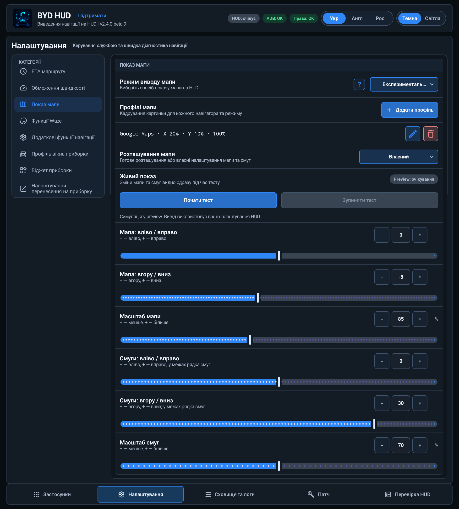</p>

</details>

<details>
<summary>Скріншот: Профіль картинки мапи</summary>

<p align="center">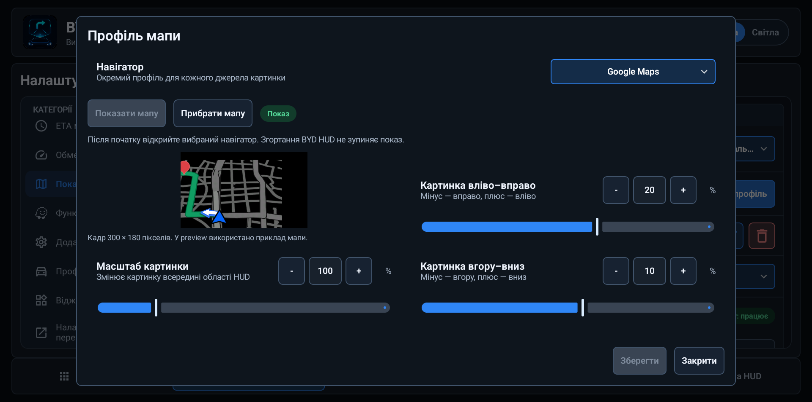</p>

</details>

### Попередження й маршрутний екран Waze

Попередження Waze можуть замінювати поле маневру, якщо попередження ближче, або використовувати окрему експериментальну область. Доступність залежить від сумісної збірки Waze та даних, які вона передає.

`Запускати з власним surface` відкриває додатковий експериментальний екран Waze після початку навігації. Налаштуйте опцію до запуску маршруту. Пошук і вибір маршруту залишаються на звичайному екрані Waze; кнопка «Назад» повертає туди до кінця маршруту. Якщо власний екран не відкриється, звичайні підказки HUD продовжаться.

<details>
<summary>Скріншот: Функції Waze</summary>

<p align="center">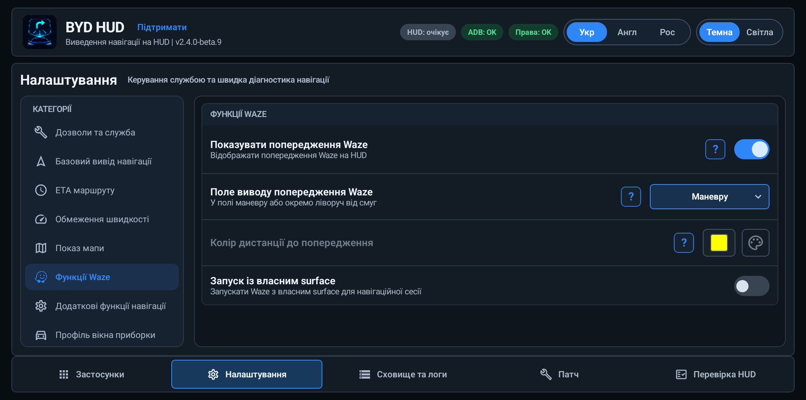</p>

</details>

## Вивід на панель приладів

З авторизованим ADB натисніть `На приборку`, щоб перенести запущений застосунок на панель приладів, або `На основний екран`, щоб повернути його.

У `Налаштування → Профіль вікна приборки` виберіть Немає, Частковий або Повний. Немає залишає поточне компонування приборки. Частковий і Повний зберігають окремі ширину, висоту, положення й масштаб. Почніть зі штатного способу встановлення формату; спробуйте альтернативний, якщо штатний не працює на вашому автомобілі. Сам вибір режиму не переносить застосунок.

### Частковий та повний профілі вікна

Виберіть режим, який налаштовуєте, і змініть його параметри. Повторіть для іншого режиму, якщо користуєтеся обома. Зміни зберігаються одразу; окремої кнопки збереження на цій сторінці немає.

| Налаштування | Дія |
| --- | --- |
| Спосіб встановлення формату екрану | Штатний або альтернативний, окремо для кожного режиму |
| Ширина / Висота | 20–100% від розмірів приборки; визначає розмір вікна |
| Горизонтальне зміщення | Положення у вільному просторі: 0% ліворуч, 50% по центру, 100% праворуч |
| Масштаб | 20–150%; змінює проєктований вміст усередині вікна |

Спочатку задайте область вікна, потім підберіть масштаб вмісту для читабельних написів мапи та кнопок. Профілі перенесення використовують ці збережені налаштування для вибраного режиму. Віджет також може застосовувати їх, якщо ввімкнено `Застосовувати профіль вікна приборки`.

<details>
<summary>Скріншот: Частковий профіль вікна</summary>

<p align="center">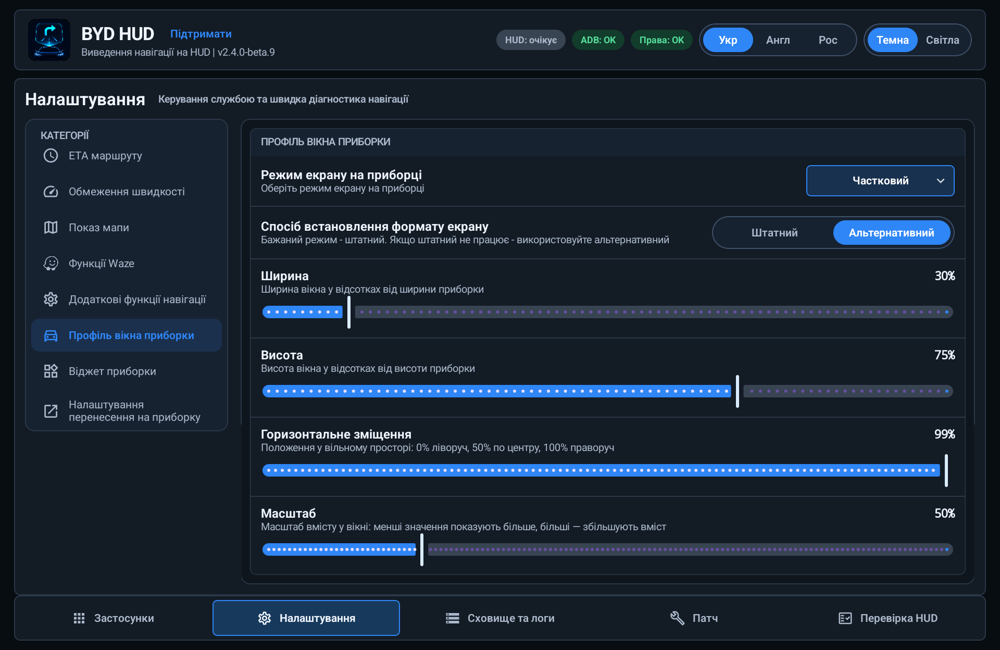</p>

</details>

<details>
<summary>Скріншот: Повний профіль вікна</summary>

<p align="center">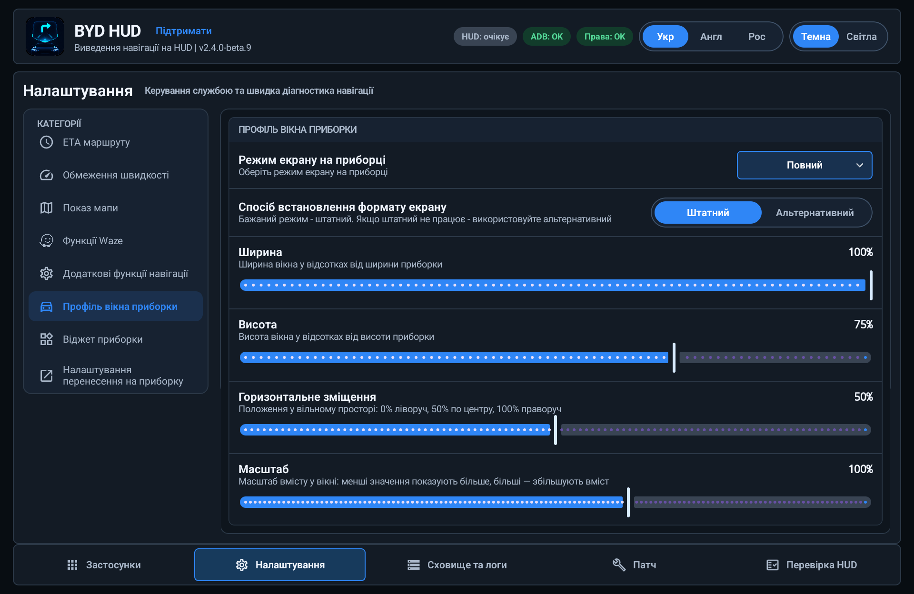</p>

</details>

Після повернення навігатора може залишитися темна область; деякі прошивки також додають темні смуги, які BYD HUD не може прибрати. Якщо зміна компонування не вдалася, поверніть застосунок кнопкою `На основний екран`.

Додаткові навігаційні налаштування окремо керують TBT-карткою покрокових підказок на приборці: чи створювати її для активного навігатора та чи перемикатися на неї при початку виводу на HUD.

<details>
<summary>Скріншот: Додаткові функції навігації</summary>

<p align="center">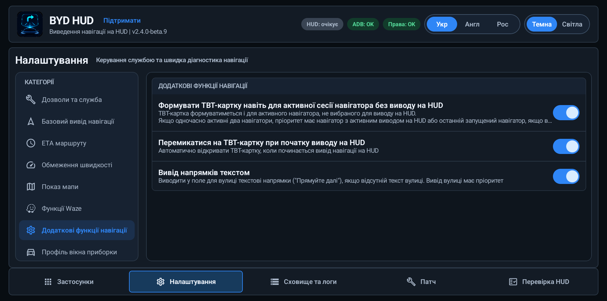</p>

</details>

### Плаваючий віджет

У `Налаштування → Віджет приборки` виберіть квадрат або коло й дозвольте показ поверх інших застосунків. Натисніть віджет для IPC OFF, TBT, MINI та FULL; перетягніть для переміщення або утримуйте, щоб тимчасово приховати. Відкриття BYD HUD повертає увімкнений прихований віджет.

Кнопки змінюють компонування приборки, а не запущений застосунок чи його дисплей. MINI/FULL можуть застосовувати відповідний збережений профіль вікна. Розмір, вигляд, напрямок відкриття та автоматичне згортання налаштовуються. Для зміни режимів потрібен ADB.

<details>
<summary>Скріншот: Віджет приборки</summary>

<p align="center">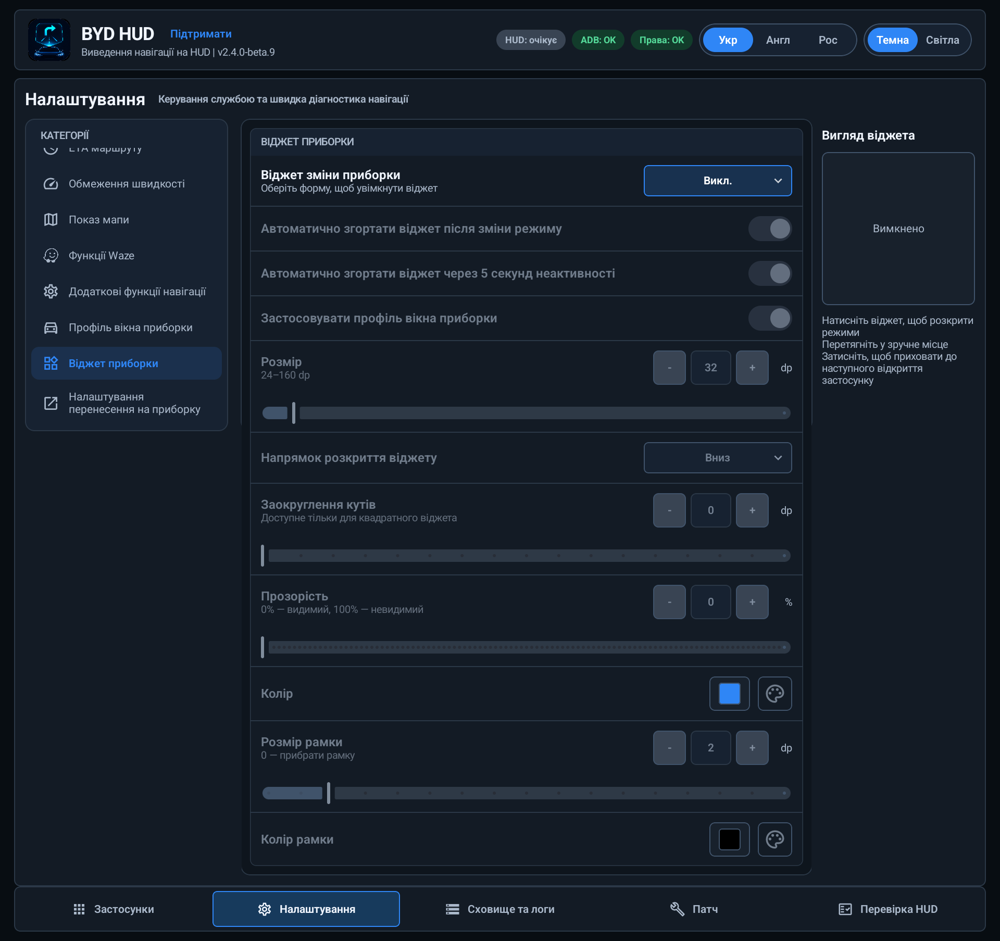</p>

</details>

### Кнопки керма

У `Налаштування → Налаштування перенесення на приборку` кожен профіль пов'язує кнопку керма й тип натискання із застосунком та режимом вікна.

1. Натисніть `+ Створити профіль`, потім `Вибрати кнопку`. Натисніть фізичну кнопку, коли цього попросить вікно навчання; її визначена назва з'явиться в редакторі.
2. Виберіть `Одиночне`, `Утримання` або `Подвійне`. Одна кнопка може мати окремий профіль для кожного жесту.
3. Виберіть застосунок для перенесення. Він має бути вже запущений під час використання кнопки; закритий застосунок вона не запускає.
4. Виберіть профіль перенесення на приборку з варіантів нижче та натисніть `Зберегти`.

| Варіант вікна | Дія |
| --- | --- |
| Поточний профіль | Використовує режим із налаштувань вікна приборки **на момент натискання**, а не його копію на момент збереження прив'язки |
| Тільки частковий | Використовує збережені налаштування часткового вікна незалежно від поточного вибраного режиму |
| Тільки повний | Використовує збережені налаштування повного вікна незалежно від поточного вибраного режиму |

Ширина, висота, горизонтальне зміщення й масштаб задаються у [профілях вікна вище](#частковий-та-повний-профілі-вікна). Кнопка переносить застосунок з основного екрана на приборку; повторне використання повертає його на основний екран.

Для збереження потрібно вибрати кнопку й застосунок. Якщо профіль для тієї самої кнопки й типу натискання вже існує, редактор показує конфлікт і блокує збереження. Виберіть інший жест/кнопку або відредагуйте наявний профіль. `Скасувати` залишає збережені налаштування без змін. Профілі можна редагувати або видаляти зі списку; у редакторі також є видалення з підтвердженням.

<details>
<summary>Скріншот: Редактор профілю перенесення</summary>

<p align="center">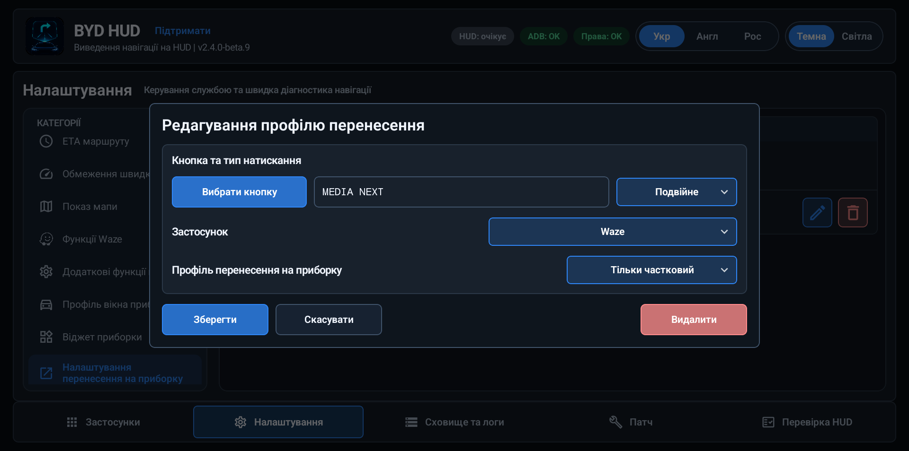</p>

</details>

<details>
<summary>Скріншот: Навчання кнопки керма</summary>

<p align="center">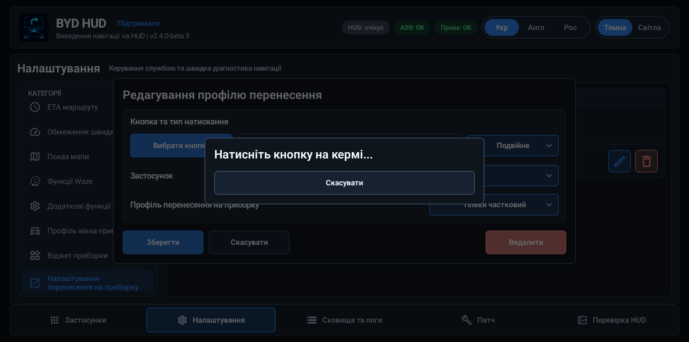</p>

</details>

Увімкніть службу спеціальних можливостей для навчання та перехоплення кнопок. **Призначення кнопки поглинає її отримані натискання, включно з жестами без відповідного профілю.** Видаліть усі профілі цієї кнопки, щоб звільнити її. Прошивка автомобіля або інший застосунок налаштування кнопок можуть окремо реагувати на цей натиск; жести, розподілені між різними застосунками, не узгоджуються. Доступні кнопки й жести залежать від автомобіля.

<details>
<summary>Скріншот: Налаштування перенесення на приборку</summary>

<p align="center">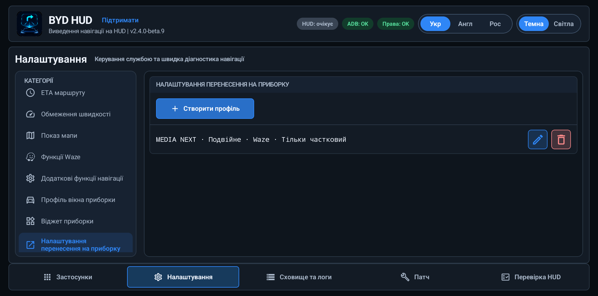</p>

</details>

## Патчер навігаторів

Додаткова вкладка `Патч` готує підтримувані пакети навігаторів локально; APK нікуди не завантажуються. Простіший варіант — встановити готовий пакет із вкладки `Застосунки`.

Підтримуються встановлені сумісні навігатори, APK, архіви APKM/APKS та XAPK лише з APK. XAPK з даними OBB і непідтримувані структури пакетів не патчаться. Google Maps має бути пакетом ReVanced `app.revanced.android.apps.maps`, а не офіційним `com.google.android.apps.maps`.

| Навігатор | Розпізнавані версії | Патч картинки мапи |
| --- | --- | --- |
| Waze | 4.95.0.3, 5.20.0.1 | 5.20.0.1 |
| Google Maps ReVanced | 25.16.03.747108139, 26.30.09.950492155 | 26.30.09.950492155 |

Сам збіг номера версії не гарантує сумісність; скористайтеся перевіркою.

1. Виберіть встановлений навігатор або завантажений пакет.
2. Натисніть `Перевір` і перегляньте результати для компонентів.
3. Виберіть доступні додаткові компоненти, натисніть `Пропатчити` та прочитайте попередження.
4. Дочекайтеся підготовки, потім підтвердьте встановлення в Android.

Підтримка мапи додається автоматично за наявності сумісності; окремого перемикача немає. Якщо компонент мапи додати не вдалося, перевірений патч прямого каналу навігації все одно можна встановити. Прочитайте результат: частковий успіх не означає доступність усіх функцій. Старіші підтримувані версії не отримують захоплення мапи. Прогрес доступний і після переходу на іншу вкладку.

**Збережіть важливі дані навігатора перед заміною застосунку.** Інший ключ підпису може вимагати видалення встановленого навігатора разом із його локальними даними. Патчі використовують ключ, який зберігається всередині BYD HUD; очищення даних BYD HUD або його видалення прибирає цей ключ і може вплинути на наступні оновлення без перевстановлення.

Кожна перевірка й спроба патчення зберігає окремий діагностичний звіт. Повна історія звітів додається до поширення логів та експорту конфігурації незалежно від вибраних дат і перемикачів журналювання.

<details>
<summary>Скріншот: Патчер навігаторів</summary>

<p align="center">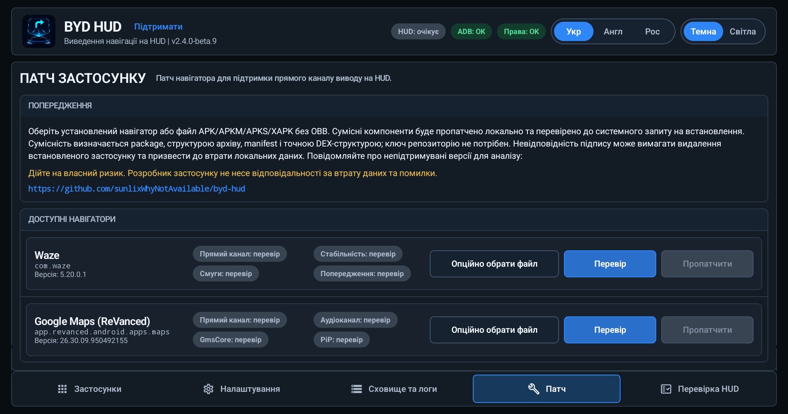</p>

</details>

## Автозапуск та оновлення

`Авто-запуск` увімкнений за замовчуванням. Його вимкнення прибирає автоматичний запуск; BYD HUD залишається доступним вручну. Виключіть застосунок із блокування фонової роботи BYD. `Вимкнути` зупиняє фонову роботу та вивід на HUD.

`Перевіряти оновлення` увімкнено за замовчуванням для стабільних релізів. Увімкніть `Участь у бета-тестуванні`, щоб отримувати також пре-релізи. Додатковий віджет-підказка показує оновлення, коли BYD HUD у фоні; натискання відкриває пропозицію оновлення. Перевірити вручну теж можна в налаштуваннях.

### Віджет-підказка оновлення

У `Налаштування → Дозволи та служба` увімкніть `Віджет-підказка нової версії` та натисніть іконку налаштувань поруч. Редактор має передпоказ 1:1 і регулятори прозорості (0% — видимий, 100% — невидимий), заокруглення країв, ширини й кольору рамки та розміру віджета. Ширина рамки 0 прибирає її. Зміни вигляду зберігаються одразу; `Закрити` завершує редагування. Це налаштування сповіщення про оновлення, окреме від віджета керування приборкою.

<details>
<summary>Скріншот: Налаштування віджета-підказки оновлення</summary>

<p align="center">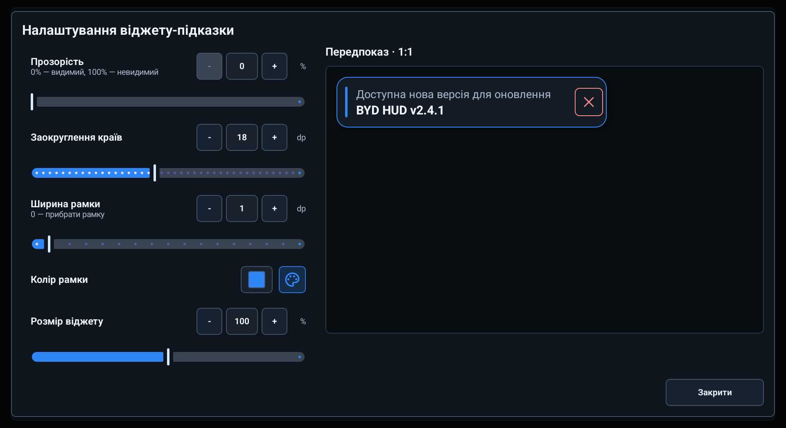</p>

</details>

## Перевірка HUD

Використовуйте `Перевірку HUD` на припаркованому автомобілі, щоб визначити доступні поля:

- **Базовий вивід:** вибір прикладів маневру, смуг, дистанції, вулиці та світлофора. Штатний режим використовує символи автомобіля; Bitmap надсилає картинку.
- **Розширений вивід:** перевірка додаткових полів — ETA, обмежень швидкості, мап, камер і світлофорів. Автоматичний режим перебирає приклади; вимкніть його для ручного вибору.
- **Тест у Шанхаї:** з авторизованим ADB імітує маршрут для штатного навігатора. Змінює GPS-координати та призначений для діагностики.

Базовий і розширений вивід завершуються після виходу з вкладки, згортання BYD HUD або натискання зупинки. Їхні приклади не змінюють звичайних налаштувань навігації. Не всі поля підтримуються; прийняте надсилання не доводить, що дані з'явилися на фізичному HUD.

Для Шанхая натисніть його кнопку старту, потім протягом початкових 15 секунд відкрийте штатний навігатор і запустіть маршрут із виводом на HUD. Повний прогін триває 4 хвилини 55 секунд разом із початковим очікуванням та продовжується під час роботи з іншими застосунками. BYD HUD призупиняє власний вивід на HUD/TBT на час цього тесту.

Шанхай завжди записує Logcat. Запис, який працював до тесту, продовжується після нього; інакше тест сам керує записом. Вибір режиму перевірки HUD і кнопка Logcat заблоковані до завершення.

`Скинути штучні координати` прибирає поточну імітацію GPS, **зокрема запущену іншим застосунком**. Автоматичне відновлення після перерваної сесії BYD HUD очищує лише власну імітацію при наступному відкритті/увімкненні BYD HUD. Якщо очищення не вдалося, повторіть скидання. Повернення до реальної GPS-позиції може потребувати часу.

<details>
<summary>Скріншот: Перевірка HUD: базовий вивід</summary>

<p align="center">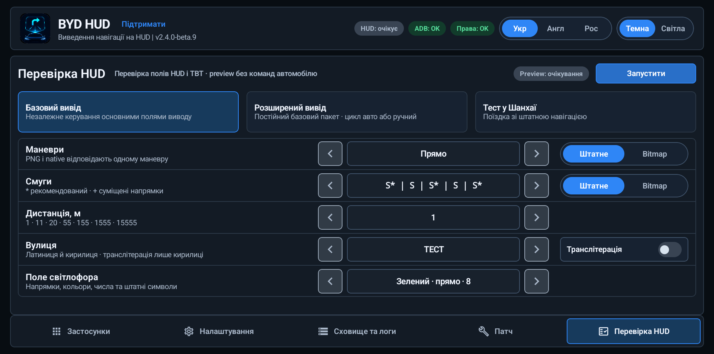</p>

</details>

<details>
<summary>Скріншот: Перевірка HUD: розширений вивід</summary>

<p align="center">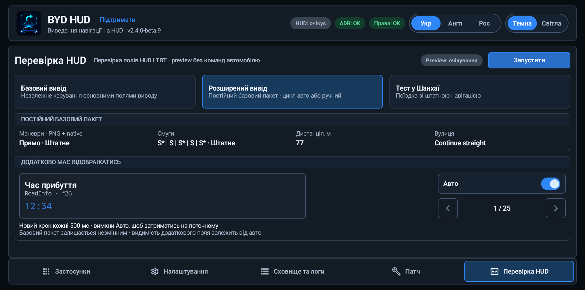</p>

</details>

<details>
<summary>Скріншот: Перевірка HUD: тест у Шанхаї</summary>

<p align="center">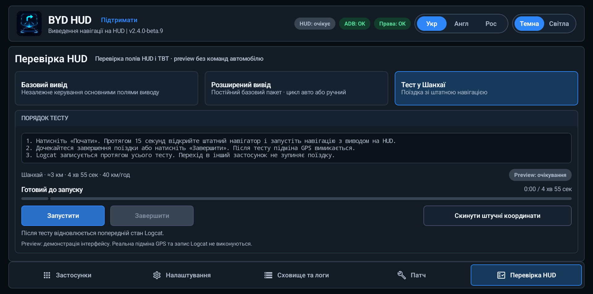</p>

</details>

## Логи та приватність

Базова навігаційна діагностика записується локально за днями. У `Сховище та логи` налаштуйте ліміт сховища, виберіть дні для поширення чи видалення або скористайтеся експортом конфігурації для звіту про пристрій і налаштування.

Вмикайте `Зберігати діагностичні скріншоти та розширені логи` лише за потреби. Опція може зберігати скріншоти та унікальні обрізані картинки мапи, надіслані на HUD. Захоплення мапи не зберігає повні вихідні кадри й повтори однакових фрагментів; із вимкненими розширеними логами воно не зберігає картинки мапи. Ручний Logcat працює окремо й за тривалого запису може займати багато місця.

`Поділитись логами` пропонує поширення засобами Android через інший застосунок або явне надсилання розробнику з необов'язковим коментарем. Завеликі для надсилання розробнику архіви можна передати іншим застосунком. Автоматичних завантажень діагностики немає.

**Вибрані дні обмежують навігаційні логи, але історія звітів патчера додається повністю.** Експорт конфігурації також включає цю історію та доступне програмне забезпечення/конфігурацію автомобіля для діагностики. Такі архіви можуть бути великими, за потреби розділяються на частини, а тимчасові файли для поширення видаляються після 15 хвилин; передайте всі частини своєчасно.

Архіви можуть містити координати, пункти призначення, назви вулиць, скріншоти та відомості про пристрій. Прочитайте попередження перед поширенням і вибирайте довіреного одержувача. Докладніше — у [політиці приватності](PRIVACY.uk.md).

<p align="center">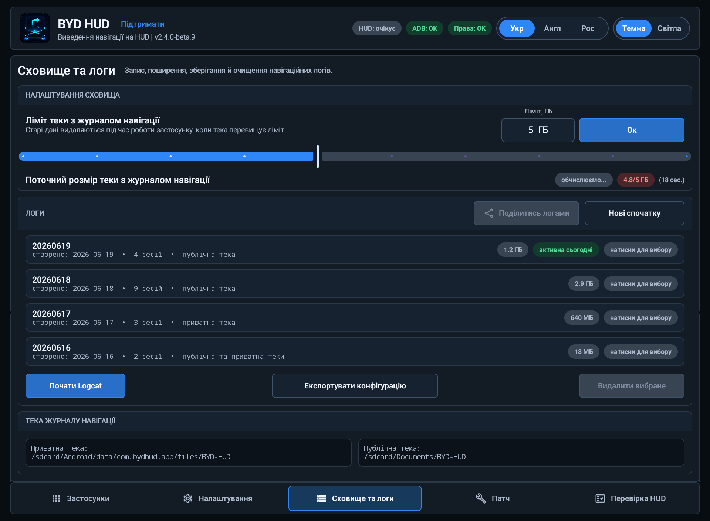</p>

## Усунення проблем

| Проблема | Що перевірити |
| --- | --- |
| HUD залишається в очікуванні | Увімкніть HUD для правильного навігатора, використовуйте сумісну збірку та запустіть маршрут |
| HUD повідомляє про помилку | Перевірте дозволи, запустіть `Дозволи ADB` за наявності та дозвольте фонову роботу |
| Немає лише штатної стрілки | Увімкніть `Navigation fusion` у налаштуваннях HUD автомобіля |
| Підказки є, а мапи немає | Перевірте підтримку мапи у навігаторі, виберіть режим показу та профіль картинки; старого Direct-патчу недостатньо |
| Мапа зміщена або завелика | Налаштуйте профіль картинки навігатора; окремо використовуйте регулятори розташування області HUD |
| Після зупинки калібрування вивід залишається | Активний маршрут міг відновити звичайний вивід; для перевірки завершіть маршрут або вимкніть його HUD |
| Вивід блимає або чергується | Зупиніть інші застосунки, які надсилають навігацію на HUD |
| GPS залишається у штучній точці | Завершіть тест у Шанхаї або скиньте штучні координати; також перевірте інші застосунки імітації GPS |

## Як повідомити про проблему

Створіть [GitHub issue](https://github.com/sunlixWhyNotAvailable/byd-hud/issues): вкажіть версії застосунку й навігатора, модель/рік автомобіля, DiLink/прошивку, очікуваний і фактичний результат та приблизний місцевий час.

Для проблем навігації чи мапи за можливості відтворіть ситуацію з розширеними логами, потім поділіться потрібним днем із вкладки `Сховище та логи`. Опишіть, що було видно на фізичному HUD; може допомогти фото або коротке відео. Після цього вимкніть розширене журналювання. Для проблем налаштування чи патчення додайте експорт конфігурації або ідентифікатор звіту після надсилання розробнику. Переглядайте архіви перед публікацією.

## Підтримати проєкт

Донати — це добровільна підтримка розробки та вдосконалення BYD HUD і застосунків для автомобілів BYD.

**Номер картки Банки — основний спосіб підтримки:**

```text
4874 1000 3354 3078
```

Скопіюйте номер і скористайтеся переказом на картку у своєму банку. Для цього способу застосунок mono не потрібен; доступність, ліміти та комісія залежать від вашого банку або платіжного сервісу. Перед підтвердженням перевірте дані отримувача.

<details>
<summary>Альтернатива: посилання на Банку mono та QR-код</summary>

[Відкрити Банку для підтримки](https://send.monobank.ua/jar/bKFV15i9e) або відсканувати QR-код:

<p><a href="https://send.monobank.ua/jar/bKFV15i9e"></a></p>

</details>

## Подяки

- MaxTitan поділився початковою концепцією прямого каналу Waze та довідковими матеріалами.
- OpenBYD надихнув частину підходу до інтеграції з автомобілем.
- [BYD Mate](https://github.com/AndyShaman/BYDMate) надихнув зміну розмірів вікна приборки.
- Олексій надав діагностику Sea Lion 06 EV і проводив перевірки на автомобілі.

## Ліцензія

BYD HUD ліцензовано за [GNU Affero General Public License v3.0](LICENSE). Ілюстрації режимів приборки містять оригінальні зображення BYD, права на які залишаються у їхніх власників.

Цей незалежний проєкт не пов'язаний із BYD, DiLink, Waze, Google, Google Maps або ABRP і не схвалений ними. Торговельні марки належать їхнім власникам. Використовуйте на власний ризик, дотримуйтеся місцевих законів і не відволікайтеся від дороги.
